Getting an overview of the data

## 0. Libraries

```r
library(tidyverse)
```

```
## -- Attaching packages ---------------------------------------------------------------------------------------------------------------------- tidyverse 1.2.1 --
```

```
## v ggplot2 2.2.1     v purrr   0.2.4
## v tibble  1.4.2     v dplyr   0.7.6
## v tidyr   0.8.1     v stringr 1.3.1
## v readr   1.1.1     v forcats 0.3.0
```

```
## -- Conflicts ------------------------------------------------------------------------------------------------------------------------- tidyverse_conflicts() --
## x dplyr::filter() masks stats::filter()
## x dplyr::lag()    masks stats::lag()
```

```r
library(readxl)
library(pander)
```

## 1. Folders and files    
Content of folders (see code)  

```r
dir("Datasett")
```

```
## [1] "Bløtbunn"              "Eksempel datafil.xlsx" "hardbunn_kopi"        
## [4] "hydrografi"            "Plankton"              "River data (from OKA)"
```

```r
dir("Datasett/River data (from OKA)")
```

```
## [1] "Annual mean flows"                   
## [2] "Concentrations (individual samples)" 
## [3] "Monthly flow-weighted concentrations"
## [4] "Monthly loads"
```

```r
dir("Datasett/hydrografi")
```

```
## [1] "Arendal_allvars_1990_2016.csv"   "Arendal_allvars_1990_2016.Rdata"
## [3] "R scripts"                       "Rådata"
```

```r
dir("Datasett/Bløtbunn")
```

```
## [1] "Beskrivelse av bløtbunndata.docx"                   
## [2] "Klimaoverblikk bløtbunn_data til Helene og Dag.xlsx"
```

```r
dir("Datasett/hardbunn_kopi")
```

```
## [1] "HBanalysesett.csv" "other docs"        "r workspace"
```

```r
dir("Datasett/Plankton")
```

```
## [1] "Beskrivelse av planktondata.docx" "Planteplankton Arendal.xlsx"
```

## 2. River data   
Content of folders (see code)

```r
dir("Datasett/River data (from OKA)/Annual mean flows")
```

```
## [1] "Mean annual flow.xlsx"
```

```r
dir("Datasett/River data (from OKA)/Monthly loads")
```

```
## [1] "Gjerstadelva_Nidelva_monthly loads.xlsx"
## [2] "RIDx5_monthly loads.xlsx"               
## [3] "Storelva_monthly loads.xlsx"
```

```r
dir("Datasett/River data (from OKA)/Concentrations (individual samples)")
```

```
## [1] "Gjerstadelva_Nidelva_conc.xlsx" "RIDx5_conc.xlsx"               
## [3] "Storelva_conc.xlsx"
```

```r
dir("Datasett/River data (from OKA)/Monthly flow-weighted concentrations")
```

```
## [1] "Gjerstadelva_Nidelva_flow-weighted mean_month.xlsx"
## [2] "RIDx5_flow-weighted mean_month.xlsx"               
## [3] "Storelva_flow-weighted mean_month.xlsx"
```

### a. Data; example: Storelva loads

```r
df <- read_excel("Datasett/River data (from OKA)/Monthly loads/Storelva_monthly loads.xlsx")  
# df <- read_excel("Datasett/River data (from OKA)/Monthly loads/Storelva_monthly loads.xlsx", skip = 1)  
# summary(df)

df <- as.data.frame(df)[-1,]
# colnames(df) %>% dput()
vars <- c("TrspTot TOTN", "TrspTot NO3-N", "TrspTot NH4-N", "TrspTot TOTP", 
          "TrspTot TOC", "TrspTot ALK", "TrspTot Ca", "DisTot")
for (var in vars)
  df[,var] <- as.numeric(df[,var])
df$Time <- with(df, lubridate::ymd(paste(Year, Month, "15")))

# Add "_" in column names (TrspTot Ca -> TrspTot_Ca)
colnames(df) <- sub(" ", "_", colnames(df), fixed = TRUE)

tb <- df %>% 
  gather("Variable", Value, TrspTot_TOTN:DisTot) %>%
  filter(!is.na(Value)) %>%
  xtabs(~Year + Variable, .)
pandoc.table(tb, style = "rmarkdown")
```

 
 
 |  &nbsp;  | DisTot | TrspTot_ALK | TrspTot_Ca | TrspTot_NH4-N |
 |:--------:|:------:|:-----------:|:----------:|:-------------:|
 | **1990** |   12   |      0      |     0      |       0       |
 | **1991** |   12   |      0      |     0      |       0       |
 | **1992** |   12   |      0      |     0      |       0       |
 | **1993** |   12   |      0      |     12     |       0       |
 | **1994** |   12   |      0      |     12     |       0       |
 | **1995** |   12   |      0      |     12     |       0       |
 | **1996** |   12   |      4      |     12     |       0       |
 | **1997** |   12   |     12      |     12     |       0       |
 | **1998** |   12   |     12      |     12     |       0       |
 | **1999** |   12   |     12      |     12     |       0       |
 | **2000** |   12   |     12      |     12     |       0       |
 | **2001** |   12   |     12      |     12     |       0       |
 | **2002** |   12   |     12      |     12     |       0       |
 | **2003** |   12   |     12      |     12     |       0       |
 | **2004** |   12   |     12      |     12     |       0       |
 | **2005** |   12   |     12      |     12     |      12       |
 | **2006** |   12   |     12      |     12     |       5       |
 | **2007** |   12   |     12      |     12     |       0       |
 | **2008** |   12   |     12      |     12     |       0       |
 | **2009** |   12   |     12      |     12     |       0       |
 | **2010** |   12   |     12      |     12     |       0       |
 | **2011** |   12   |     12      |     12     |       0       |
 | **2012** |   12   |     12      |     12     |       0       |
 | **2013** |   12   |     12      |     12     |       0       |
 | **2014** |   12   |     12      |     12     |       0       |
 | **2015** |   12   |     12      |     12     |       0       |
 
Table: Table continues below
 
  
 
 |  &nbsp;  | TrspTot_NO3-N | TrspTot_TOC | TrspTot_TOTN | TrspTot_TOTP |
 |:--------:|:-------------:|:-----------:|:------------:|:------------:|
 | **1990** |       0       |      0      |      0       |      0       |
 | **1991** |       0       |      0      |      0       |      0       |
 | **1992** |       0       |      0      |      0       |      0       |
 | **1993** |      12       |     12      |      12      |      11      |
 | **1994** |      12       |     12      |      12      |      12      |
 | **1995** |      12       |     12      |      12      |      12      |
 | **1996** |      12       |     12      |      12      |      12      |
 | **1997** |      12       |     12      |      12      |      12      |
 | **1998** |      12       |     12      |      12      |      12      |
 | **1999** |      12       |     12      |      12      |      12      |
 | **2000** |      12       |     12      |      12      |      12      |
 | **2001** |      12       |     12      |      12      |      12      |
 | **2002** |      12       |     12      |      12      |      12      |
 | **2003** |      12       |     12      |      12      |      12      |
 | **2004** |      12       |     12      |      12      |      12      |
 | **2005** |      12       |     12      |      12      |      12      |
 | **2006** |      12       |     12      |      12      |      12      |
 | **2007** |      12       |     12      |      12      |      12      |
 | **2008** |      12       |     12      |      12      |      12      |
 | **2009** |      12       |     12      |      12      |      12      |
 | **2010** |      12       |     12      |      12      |      12      |
 | **2011** |      12       |     12      |      12      |      12      |
 | **2012** |      12       |     12      |      12      |      12      |
 | **2013** |      12       |     12      |      12      |      12      |
 | **2014** |      12       |     12      |      12      |      12      |
 | **2015** |      12       |     12      |      12      |      12      |


### b. Plot Storelva loads  

```r
gg <- df %>%
  gather("Variable", Value,  TrspTot_TOTN:DisTot) %>%
  ggplot(aes(Time, Value)) + 
    geom_line() +
    facet_wrap(~Variable, scales = "free_y")
gg
```

```
## Warning: Removed 12 rows containing missing values (geom_path).
```

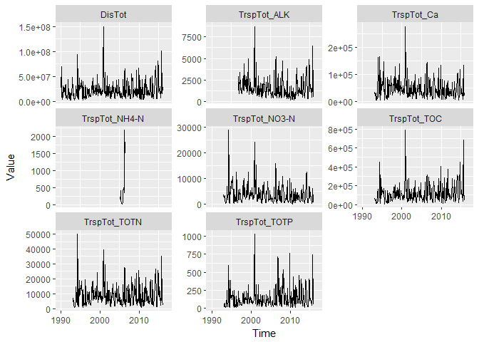<!-- -->

### c. Plot annual flow  

```r
df <- read_excel("Datasett/River data (from OKA)/Annual mean flows/Mean annual flow.xlsx")
# df <- read_excel("Datasett/River data (from OKA)/Monthly loads/Storelva_monthly loads.xlsx", skip = 1)  
# summary(df)

df <- as.data.frame(df)[-1,]
colnames(df) <- sub(" ", "_", colnames(df), fixed = TRUE)
# colnames(df) %>% dput()
vars <- c("DisMean")
for (var in vars)
  df[,var] <- as.numeric(df[,var])

ggplot(df, aes(Year, DisMean)) + geom_line() + facet_wrap(~Station_name)
```

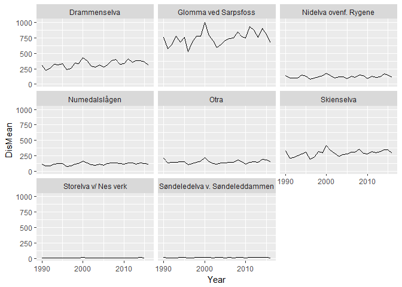<!-- -->

## 3. Hydrografi  
### a. Data  
Tables of coverages of depth and seasons  

```r
load("Datasett/Hydrografi/Arendal_allvars_1990_2016.Rdata")
Df.Arendal$Month <- Df.Arendal$Dato %>% as.character() %>% substr(6,7) %>% as.numeric()
Df.Arendal$Year <- Df.Arendal$Dato %>% as.character() %>% substr(1,4) %>% as.numeric()

# summary(Df.Arendal)
tb <- xtabs(~Depth + Month, Df.Arendal)
pandoc.table(tb, style = "rmarkdown")
```


| &nbsp; | 1  | 2  | 3  | 4  | 5  | 6  | 7  | 8  | 9  | 10 | 11 | 12 |
|:------:|:--:|:--:|:--:|:--:|:--:|:--:|:--:|:--:|:--:|:--:|:--:|:--:|
| **0**  | 40 | 47 | 55 | 45 | 53 | 51 | 49 | 56 | 48 | 57 | 50 | 36 |
| **5**  | 40 | 47 | 55 | 45 | 53 | 51 | 49 | 56 | 48 | 57 | 50 | 36 |
| **10** | 40 | 47 | 55 | 45 | 53 | 51 | 49 | 56 | 48 | 57 | 50 | 36 |
| **20** | 40 | 47 | 55 | 45 | 53 | 51 | 49 | 56 | 48 | 57 | 50 | 36 |
| **30** | 40 | 47 | 55 | 45 | 53 | 51 | 49 | 56 | 48 | 57 | 50 | 36 |
| **50** | 40 | 47 | 55 | 45 | 53 | 51 | 49 | 56 | 48 | 55 | 50 | 36 |
| **75** | 40 | 47 | 55 | 45 | 53 | 51 | 48 | 56 | 48 | 55 | 50 | 36 |

```r
tb <- xtabs(~Year + Month, Df.Arendal)
pandoc.table(tb, style = "rmarkdown")
```


|  &nbsp;  | 1  | 2  | 3  | 4  | 5  | 6  | 7  | 8  | 9  | 10 | 11 | 12 |
|:--------:|:--:|:--:|:--:|:--:|:--:|:--:|:--:|:--:|:--:|:--:|:--:|:--:|
| **1990** | 7  | 7  | 7  | 14 | 7  | 14 | 7  | 14 | 7  | 14 | 14 | 7  |
| **1991** | 14 | 7  | 14 | 7  | 14 | 14 | 14 | 14 | 7  | 21 | 7  | 14 |
| **1992** | 14 | 14 | 14 | 14 | 14 | 14 | 14 | 14 | 14 | 14 | 14 | 7  |
| **1993** | 14 | 14 | 14 | 7  | 14 | 14 | 14 | 14 | 7  | 14 | 14 | 14 |
| **1994** | 14 | 14 | 14 | 14 | 7  | 14 | 7  | 21 | 7  | 14 | 14 | 14 |
| **1995** | 7  | 7  | 14 | 14 | 14 | 14 | 14 | 14 | 14 | 14 | 14 | 14 |
| **1996** | 14 | 21 | 7  | 14 | 14 | 14 | 7  | 14 | 14 | 14 | 14 | 7  |
| **1997** | 14 | 14 | 14 | 14 | 14 | 14 | 14 | 14 | 7  | 14 | 14 | 7  |
| **1998** | 7  | 14 | 14 | 14 | 7  | 14 | 7  | 21 | 14 | 21 | 7  | 7  |
| **1999** | 7  | 14 | 14 | 7  | 14 | 14 | 20 | 14 | 14 | 7  | 14 | 14 |
| **2000** | 7  | 7  | 14 | 7  | 21 | 14 | 14 | 14 | 7  | 31 | 14 | 14 |
| **2001** | 21 | 7  | 14 | 14 | 14 | 7  | 14 | 14 | 14 | 14 | 14 | 7  |
| **2002** | 7  | 21 | 14 | 14 | 7  | 7  | 14 | 14 | 14 | 14 | 14 | 7  |
| **2003** | 14 | 14 | 14 | 7  | 21 | 7  | 14 | 14 | 14 | 14 | 14 | 7  |
| **2004** | 14 | 7  | 14 | 7  | 14 | 14 | 7  | 14 | 14 | 14 | 14 | 7  |
| **2005** | 7  | 14 | 14 | 14 | 14 | 14 | 14 | 14 | 14 | 14 | 7  | 14 |
| **2006** | 7  | 14 | 21 | 7  | 14 | 14 | 14 | 14 | 14 | 14 | 7  | 14 |
| **2007** | 7  | 14 | 21 | 7  | 14 | 14 | 14 | 14 | 14 | 14 | 14 | 7  |
| **2008** | 14 | 7  | 21 | 14 | 14 | 14 | 7  | 14 | 14 | 7  | 14 | 14 |
| **2009** | 14 | 14 | 14 | 14 | 14 | 14 | 14 | 14 | 14 | 14 | 14 | 7  |
| **2010** | 7  | 0  | 14 | 7  | 21 | 14 | 14 | 14 | 14 | 14 | 14 | 7  |
| **2011** | 7  | 14 | 14 | 14 | 14 | 14 | 14 | 14 | 14 | 14 | 21 | 7  |
| **2012** | 7  | 14 | 14 | 14 | 14 | 14 | 14 | 14 | 14 | 14 | 14 | 7  |
| **2013** | 7  | 14 | 14 | 14 | 14 | 14 | 14 | 14 | 14 | 14 | 14 | 7  |
| **2014** | 7  | 14 | 14 | 14 | 14 | 14 | 14 | 14 | 14 | 14 | 14 | 7  |
| **2015** | 7  | 14 | 14 | 14 | 14 | 14 | 14 | 14 | 14 | 14 | 14 | 7  |
| **2016** | 14 | 14 | 14 | 14 | 14 | 14 | 14 | 14 | 14 | 14 | 7  | 7  |


### b. Plot salinity, depth 10 m

```r
ggplot(Df.Arendal %>% filter(Depth == 10), aes(Dato, Salt)) +
  geom_line() + geom_point()
```

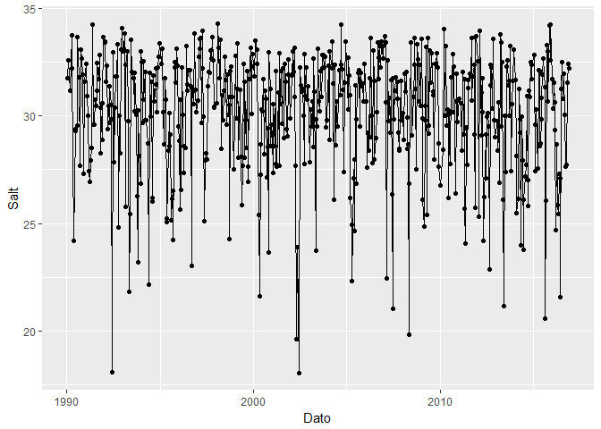<!-- -->

### c. Salinity, time series by month and depth

```r
Df.Arendal %>%
  group_by(Year, Month, Depth) %>%
  summarise_all(mean) %>%
  ggplot(aes(Year, Salt)) + 
    geom_line() + 
    facet_grid(Month~Depth)
```

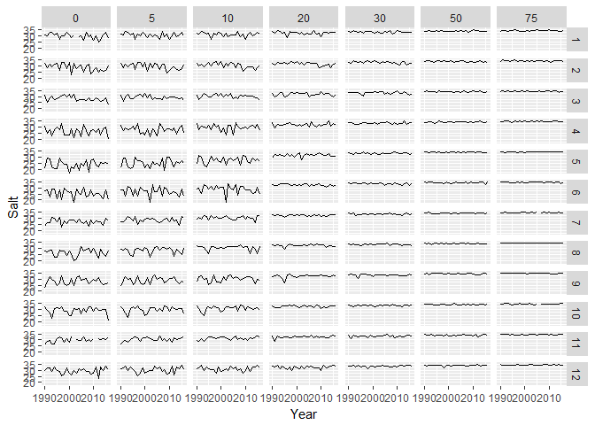<!-- -->


## 4. Soft bottom fauna  
### a. Data

```r
df_blot_b35 <- read_excel("Datasett/Bløtbunn/Klimaoverblikk bløtbunn_data til Helene og Dag.xlsx", sheet = "B35_artsliste")
colnames(df_blot_b35)[1] <- "Species"

df_blot_b05 <- read_excel("Datasett/Bløtbunn/Klimaoverblikk bløtbunn_data til Helene og Dag.xlsx", sheet = "B05_artsliste")
colnames(df_blot_b05)[1] <- "Species"

df_blot_ind <- read_excel("Datasett/Bløtbunn/Klimaoverblikk bløtbunn_data til Helene og Dag.xlsx", sheet = "indekser_sedimentparametere")

cat("Number of species:", nrow(df_blot_b35), "\nNumber of years:", ncol(df_blot_b35), "\n")
```

```
## Number of species: 266 
## Number of years: 28
```

### b. Station B35, boxplot of the 10% most abundant species   

```r
df <- df_blot_b35 %>%
  gather("Year", "N", -Species) %>%
  mutate(N = ifelse(is.na(N),0,N)) %>%
  group_by(Species) %>%
  mutate(Median_per_species = median(N))

cat("Percentiles of median abundance per species:\n")
```

```
## Percentiles of median abundance per species:
```

```r
quantile(df$Median_per_species, (0:10)/10, na.rm = TRUE)
```

```
##   0%  10%  20%  30%  40%  50%  60%  70%  80%  90% 100% 
##    0    0    0    0    0    0    0    0    0    2  261
```

```r
df %>%
  filter(Median_per_species >= 2) %>%
  ggplot(aes(Species, N)) + geom_boxplot() + theme(axis.text.x = element_text(angle = 90, hjust = 1))
```

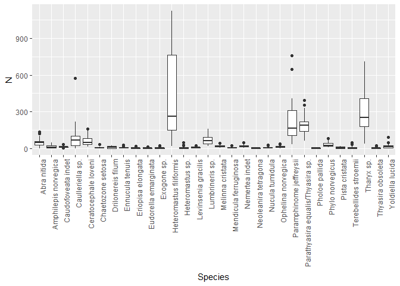<!-- -->
 
## 5. Hard-bottom fauna  
### a. Data (already chewed a bit on)

```r
# dir("Datasett/hardbunn_kopi")
# readLines("Datasett/hardbunn_kopi/HBanalysesett.csv", 2)
df <- readr::read_csv2("Datasett/hardbunn_kopi/HBanalysesett.csv")
```

```
## Using ',' as decimal and '.' as grouping mark. Use read_delim() for more control.
```

```
## Parsed with column specification:
## cols(
##   .default = col_integer(),
##   DCA1 = col_double(),
##   DCA2 = col_double(),
##   DCA3 = col_double(),
##   DCA4 = col_double(),
##   NMDS1 = col_double(),
##   NMDS2 = col_double(),
##   DCA1strand = col_double(),
##   DCA2strand = col_double(),
##   DCA3strand = col_double(),
##   DCA4strand = col_double(),
##   NMDS1strand = col_double(),
##   NMDS2strand = col_double(),
##   midTurf = col_double(),
##   midBarren = col_double(),
##   midFilter = col_double(),
##   midHerb = col_double()
## )
```

```
## See spec(...) for full column specifications.
```

### b. Plot DCA

```r
df %>%
  gather("DCA_axis", "Value", DCA1:DCA4) %>%
  ggplot(aes(Year, Value)) +
    geom_line() +
    facet_grid(Site~DCA_axis)
```

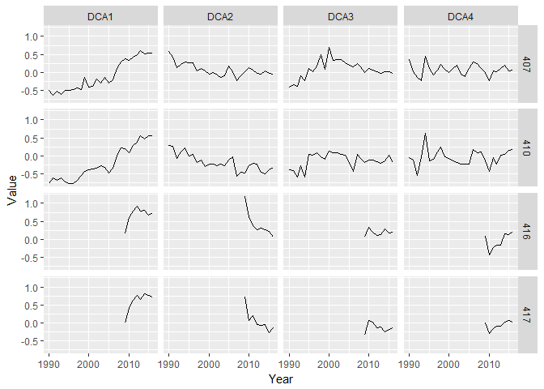<!-- -->

### c. Plot NMDS  

```r
df %>%
  gather("NMDS_axis", "Value", NMDS1:NMDS2) %>%
  ggplot(aes(Year, Value)) +
    geom_line() +
    facet_grid(Site~NMDS_axis)
```

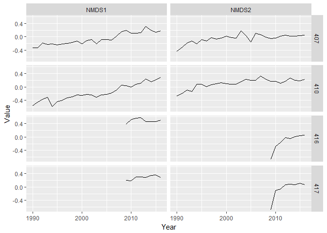<!-- -->

### d. Plot DCAstrand

```r
df %>%
  gather("DCA_axis", "Value", DCA1strand:DCA4strand) %>%
  ggplot(aes(Year, Value)) +
    geom_line() +
    facet_grid(Site~DCA_axis)
```

```
## Warning: Removed 20 rows containing missing values (geom_path).
```

<!-- -->

### e. Plot species

```r
df %>%
  gather("Species", "Value", `LGD.Halidrys siliquosa`:`LGD.Rhodomela confervoides`) %>%
  mutate(Species = sub("LDG.", "", Species)) %>%
  ggplot(aes(Year, Value)) +
    geom_line() +
    facet_grid(Site~Species)
```

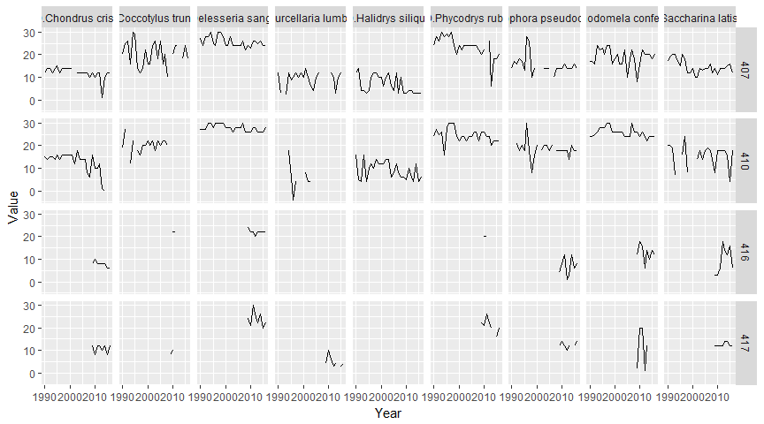<!-- -->

## 6. Phytoplankton
### a. Data   
* Note: deleted the empty second row manually, and one empty column 
* Also copied the data (just the range with data, A1:V471) to a new sheet

```r
df <- read_excel("Datasett/Plankton/Planteplankton Arendal.xlsx") # range = "A1:V471"
df$Year <- lubridate::year(df$Dato)
df$Month <- lubridate::month(df$Dato)
xtabs(~Year + Month, df)
```

```
##       Month
## Year   1 2 3 4 5 6 7 8 9 10 11 12
##   1994 2 2 2 2 1 2 1 2 1  1  1  2
##   1995 1 1 2 2 2 2 1 2 2  1  1  1
##   1996 2 3 1 2 2 2 1 2 2  2  2  1
##   1997 2 2 2 2 2 2 2 2 1  2  2  1
##   1998 1 2 2 2 1 2 1 3 2  2  1  1
##   1999 1 2 2 1 2 2 3 2 2  1  2  2
##   2000 0 0 2 1 2 1 2 1 1  1  0  0
##   2001 0 1 2 1 1 1 1 1 1  1  1  0
##   2002 0 3 2 2 2 1 2 2 1  1  1  0
##   2003 2 4 2 1 3 1 2 2 2  2  2  1
##   2004 2 1 3 1 2 2 1 2 2  2  2  1
##   2005 1 2 6 2 2 1 2 6 2  2  1  2
##   2006 1 2 3 1 2 2 2 2 2  2  1  2
##   2007 1 2 3 1 2 2 2 2 2  2  2  1
##   2008 2 1 3 2 2 2 1 2 2  1  2  1
##   2009 2 2 2 2 2 2 2 2 1  2  2  1
##   2010 1 0 2 1 3 2 2 2 2  2  2  1
##   2011 0 1 2 2 2 2 2 2 2  2  2  1
##   2012 1 2 2 2 2 2 1 2 2  1  2  0
##   2013 1 2 2 2 2 2 2 2 2  2  2  1
##   2014 1 2 2 2 2 2 2 2 2  2  2  1
##   2015 1 2 2 2 2 2 2 2 2  2  2  1
##   2016 2 2 2 2 2 2 2 2 2  2  1  1
```

### b. Plot time series of main groups

```r
df %>%
  gather("Group", "Value", Kiselalger:Flagellater) %>%
  ggplot(aes(Dato, Value)) +
    geom_line() +
    facet_wrap(~Group, scale = "free_y")
```

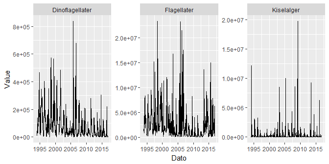<!-- -->

### c. Plot time series of main groups by month

```r
df %>%
  gather("Group", "Value", Kiselalger:Flagellater) %>%
  group_by(Year, Month, Group) %>%
  summarize(Value = mean(Value)) %>%
  filter(Month %in% c(2,4,6,8,10)) %>%
  ggplot(aes(Year, Value)) +
    geom_line() +
    facet_grid(Group~Month, scale = "free_y")
```

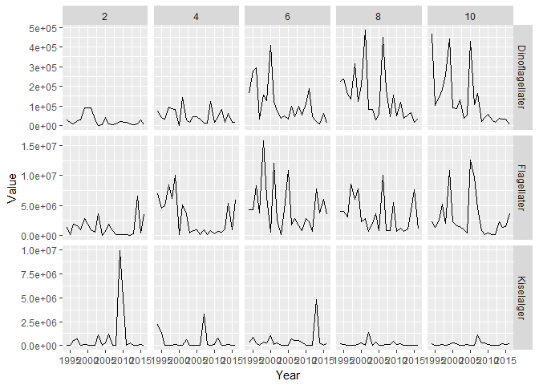<!-- -->

### d. Plot time series of 6 main taxa (by median abundance) by month

```r
mean_abundance <- apply(df %>% select(Cyanophycea:Chlorophycea), 2, mean, na.rm = TRUE) %>% sort() %>% rev()
median_abundance <- apply(df %>% select(Cyanophycea:Chlorophycea), 2, median, na.rm = TRUE) %>% sort() %>% rev()
taxa <- names(median_abundance) %>% head(6)
df %>%
  gather("Taxon", "Value", Cyanophycea:Chlorophycea) %>%
  group_by(Year, Month, Taxon) %>%
  summarize(Value = mean(Value)) %>%
  filter(Month %in% c(2,4,6,8,10) & Taxon %in% taxa) %>%
  ggplot(aes(Year, Value)) +
    geom_line() +
    facet_grid(Taxon~Month, scale = "free_y")
```

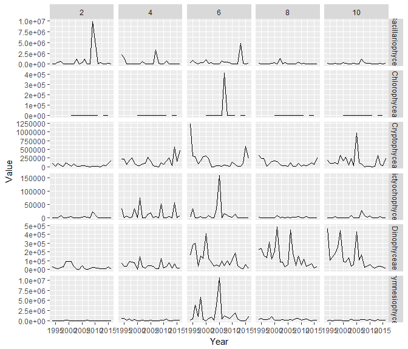<!-- -->

### e. Plot time series of 5 lesser taxa (by median abundance) by month

```r
taxa <- names(median_abundance) %>% tail(5)
df %>%
  gather("Taxon", "Value", Cyanophycea:Chlorophycea) %>%
  group_by(Year, Month, Taxon) %>%
  summarize(Value = mean(Value)) %>%
  filter(Month %in% c(2,4,6,8,10) & Taxon %in% taxa) %>%
  ggplot(aes(Year, Value)) +
    geom_line() +
    facet_grid(Taxon~Month, scale = "free_y")
```

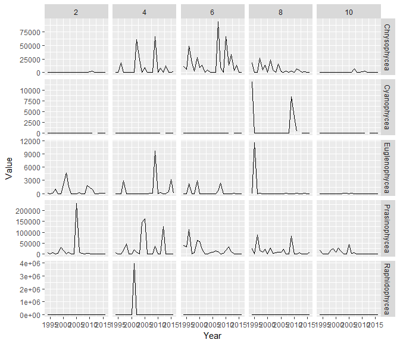<!-- -->


