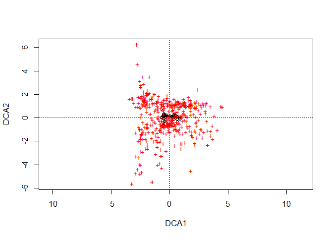
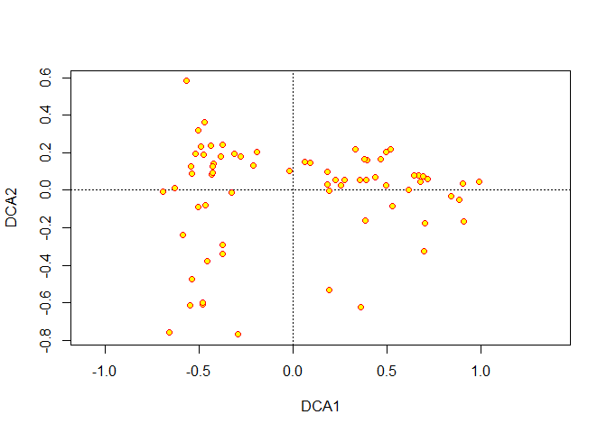
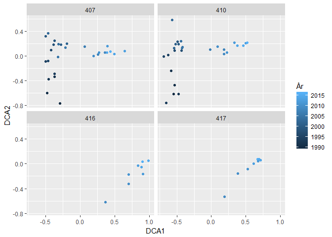
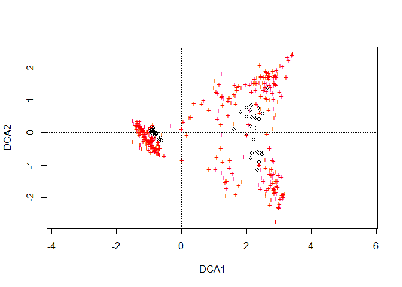
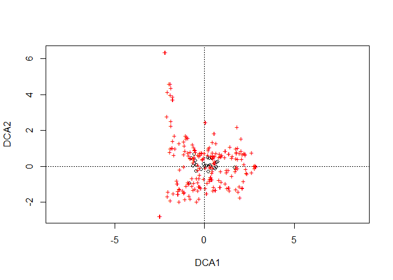
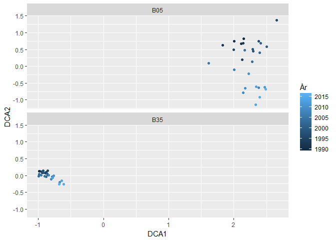

## 0. Libraries

```r
library(tidyverse)
```

```
## -- Attaching packages ---------------------------------------------------------------------------------------------------------------------- tidyverse 1.2.1 --
```

```
## v ggplot2 2.2.1     v purrr   0.2.4
## v tibble  1.4.2     v dplyr   0.7.6
## v tidyr   0.8.1     v stringr 1.3.1
## v readr   1.1.1     v forcats 0.3.0
```

```
## -- Conflicts ------------------------------------------------------------------------------------------------------------------------- tidyverse_conflicts() --
## x dplyr::filter() masks stats::filter()
## x dplyr::lag()    masks stats::lag()
```

```r
library(readxl)
# install.packages("vegan")
library(vegan)
```

```
## Loading required package: permute
```

```
## Loading required package: lattice
```

```
## This is vegan 2.5-2
```

### Function for finding text in R files  

```r
search_text <- function(string, dir = ".", extension = c("R","Rmd"), pattern = NULL, fixed = FALSE, ignore.case = TRUE, deep = FALSE){
  if (!is.null(extension) & !is.null(pattern))
    warning("Pattern will take predence over extension")
  if (is.null(pattern)) {
    ext <- paste(extension, collapse = "|")
    pattern <- paste0("\\.(", paste(extension, collapse = '|'), ")$")
	}
  fn <- list.files(path = dir, pattern = pattern, full.names = TRUE, recursive = deep)
  search <- plyr::alply(fn, 1, function(x) grep(string,  readLines(x, warn = FALSE), fixed = fixed, ignore.case = ignore.case), .progress = "text")
  fn[plyr::laply(search, length) > 0]	
  }
```

## 1. Check organisation/analysis of hard-bottom data from Guri's scripts   
### a. Content of folders (see code)  

```r
dir("Datasett/hardbunn_kopi")
```

```
## [1] "HBanalysesett.csv" "other docs"        "r workspace"
```

```r
dir("Datasett/hardbunn_kopi/r workspace")
```

```
##  [1] "Artskategorier.csv"                
##  [2] "Artskategorier.xlsx"               
##  [3] "Artskategorier_forklaring_2018.csv"
##  [4] "Artskategorier_JKG_2018.csv"       
##  [5] "HBanalyse.R"                       
##  [6] "HBdata.R"                          
##  [7] "HBdatasammensying.R"               
##  [8] "HBOrdinasjon.R"                    
##  [9] "Klimaoverblikk_hardbunn.html"      
## [10] "Klimaoverblikk_hardbunn.Rmd"       
## [11] "R workspace.Rproj"
```

```r
#
# Used this to explore where different data sets occur:
# search_text("ord1.df", "Datasett/hardbunn_kopi/r workspace")
# 
```

### b. Read 'transekt.df' which Guri used for ordination  
Does not include ord1.df, which is used in 'Klimaoverblikk_hardbunn.Rmd', but does include a lot of other stuff...  
Order of Guri's scripts:  
1) HBdata.R: HBdata -> Hbuse  
2) HBOrdinasjon.R: Hbuse -> HBagg -> transekt.df -> SiteSpec -> spec.m -> ordinasjon -> ord1.df  

```r
load("Datasett/hardbunn_kopi/r workspace/.RData")

# Let us delete everything except transekt.df
obj <- ls()
rm(list = obj[!obj %in% c("transekt.df")])

str(transekt.df)
```

```
## 'data.frame':	63757 obs. of  3 variables:
##  $ Sitename: Factor w/ 70 levels "407_1990","407_1991",..: 32 29 67 32 32 70 10 5 57 57 ...
##  $ Species : Factor w/ 470 levels " \nAcrochaetium secundatum",..: 2 2 2 448 446 446 446 446 4 4 ...
##  $ Value   : num  2 1 2 1 1 1 1 2 2 2 ...
```

### c. Create data for ordination ('spec.m') and perform ordination   
From Guri's code in 'HBOrdinasjon.R', except the first part     
* 'transekt.df' is in 'long format'  
* Is reshaped to broad format ('SiteSpec'). *Note* that this one is later combined with PCA output to create 'ord1.df'   
* For the ordination, the year and site columns are removed and NA -> 0 ('spec.m')   

```r
# table(transekt.df$Sitename)
transekt.df <- transekt.df %>%
  mutate(Site = substr(Sitename, 1,3), Year = as.numeric(substr(Sitename, 5,8))) %>%
  select(Site, Year, Species, Value)
# names(transekt.df) = c("Site", "Year", "Species", "Value")

# gjor om til vidt format
SiteSpec = reshape(transekt.df, idvar = c("Site", "Year"), timevar = "Species", direction = "wide")
# names(SiteSpec)

# Endrer navnene
artsnavn = names(SiteSpec)[-c(1:2)]
artsnavn = gsub("Value.", "", artsnavn)
artsnavn = gsub(" \n", "", artsnavn)
# artsnavn

# artsmatrise
spec.m = SiteSpec[, -c(1:2)]
names(spec.m) = artsnavn

# må erstatte NA med 0
spec.m[is.na(spec.m)] = 0

cat("Dimensions of 'spec.m':\n", dim(spec.m))
```

```
## Dimensions of 'spec.m':
##  70 471
```

### d. Perform ordination

```r
# Transekt
ord1 <- decorana(spec.m)

# Pretty longish output
# summary(ord1) # viser arts- og rutescorer

# Short output
summary(ord1, display = "none")
```

```
## 
## Call:
## decorana(veg = spec.m) 
## 
## Detrended correspondence analysis with 26 segments.
## Rescaling of axes with 4 iterations.
## 
##                   DCA1    DCA2    DCA3    DCA4
## Eigenvalues     0.2007 0.07804 0.06180 0.04766
## Decorana values 0.2014 0.08661 0.06047 0.05412
## Axis lengths    1.6815 1.34989 1.47208 1.37247
```
### e. Test plot 1

```r
plot(ord1) # sorte sirkler er sites, røde pluss er arter
```

<!-- -->

### f. Test plot 2

```r
plot(ord1, display = "sites", type = "n")
points(ord1, display = "sites", pch = 21, col = "red", bg = "yellow")
```

<!-- -->

### g. Make data set for the plots done in 'Klimaoverblikk_hardbunn.Rmd'  

```r
# trekker ut akseskorer så det kan kobles til stasjon og år... i.e. Sitename
ord1.sites <- data.frame(scores(ord1, display = "sites"))

ord1.df <- data.frame(SiteSpec[,c(1:2)], ord1.sites)

str(ord1.df)
```

```
## 'data.frame':	70 obs. of  6 variables:
##  $ Site: chr  "410" "410" "417" "417" ...
##  $ Year: num  1994 1991 2013 2016 1999 ...
##  $ DCA1: num  -0.656 -0.537 0.613 0.67 -0.376 ...
##  $ DCA2: num  -0.75742 -0.47306 0.00305 0.07751 0.24333 ...
##  $ DCA3: num  -0.3264 -0.3517 -0.2725 -0.0551 -0.2102 ...
##  $ DCA4: num  -0.6546 0.2205 -0.0848 -0.022 0.1406 ...
```

### h. Redone plots done in 'Klimaoverblikk_hardbunn.Rmd'   
* *BUT* they look a bit different... so the input data are probably not identical  

```r
# Innledende DCA - litt usikker på utfallet  
DCAplot.1 <- ggplot(ord1.df, aes(DCA1, DCA2, color = as.numeric(as.character(Year)))) + 
  geom_point() + 
  facet_wrap(~ Site, nrow=2) +
  labs(color = "År")

DCAplot.2 <- ggplot(ord1.df, aes(DCA3, DCA4, color = as.numeric(as.character(Year)))) + 
  geom_point() + 
  facet_wrap(~ Site, nrow=2) +
  labs(color = "År")

DCAplot.1
```

<!-- -->


## 2. Reorganise soft-bottom fauna data and test ordination
### a. Data

```r
df_blot_b35 <- read_excel("Datasett/Bløtbunn/Klimaoverblikk bløtbunn_data til Helene og Dag.xlsx", sheet = "B35_artsliste")
colnames(df_blot_b35)[1] <- "Species"

df_blot_b05 <- read_excel("Datasett/Bløtbunn/Klimaoverblikk bløtbunn_data til Helene og Dag.xlsx", sheet = "B05_artsliste")
colnames(df_blot_b05)[1] <- "Species"

df_blot_ind <- read_excel("Datasett/Bløtbunn/Klimaoverblikk bløtbunn_data til Helene og Dag.xlsx", sheet = "indekser_sedimentparametere")

cat("b35, number of species:", nrow(df_blot_b35), ", Number of years:", ncol(df_blot_b35), "\n")
```

```
## b35, number of species: 266 , Number of years: 28
```

```r
cat("b05, number of species:", nrow(df_blot_b05), ", Number of years:", ncol(df_blot_b05), "\n")
```

```
## b05, number of species: 265 , Number of years: 28
```

### b. Put on data long format, combine, and extract Site and Year separately

```r
df_long_1 <- df_blot_b05 %>%
  gather("Siteyear", "Value", B05_1990:B05_2016)
df_long_2 <- df_blot_b35 %>%
  gather("Siteyear", "Value", B35_1990:B35_2016)

df_long <- bind_rows(df_long_1, df_long_2) %>%
  mutate(Site = substr(Siteyear, 1,3), Year = as.numeric(substr(Siteyear, 5,8))) %>%
  select(Site, Year, Species, Value)

str(df_long)
```

```
## Classes 'tbl_df', 'tbl' and 'data.frame':	14337 obs. of  4 variables:
##  $ Site   : chr  "B05" "B05" "B05" "B05" ...
##  $ Year   : num  1990 1990 1990 1990 1990 1990 1990 1990 1990 1990 ...
##  $ Species: chr  "Hydroidolina indet" "Anthozoa indet" "Athenaria indet" "Cerianthidae indet" ...
##  $ Value  : num  NA NA NA NA NA NA NA NA NA NA ...
```

### c. Reshape for ordination  
Reshape to wide format the tidyr way (instead of using reshape()) - gives us nice column names right away  

```r
SiteSpec <- df_long %>%
  spread(Species, Value)

# artsmatrise
spec.m = SiteSpec[, -c(1:2)]

# må erstatte NA med 0
spec.m[is.na(spec.m)] = 0

cat("Dimensions of 'spec.m':\n", dim(spec.m))
```

```
## Dimensions of 'spec.m':
##  54 413
```

### d. Perform ordination

```r
# Transekt
ord1 <- decorana(spec.m)

# Pretty longish output
# summary(ord1) # viser arts- og rutescorer

# Short output
summary(ord1, display = "none")
```

```
## 
## Call:
## decorana(veg = spec.m) 
## 
## Detrended correspondence analysis with 26 segments.
## Rescaling of axes with 4 iterations.
## 
##                   DCA1   DCA2    DCA3    DCA4
## Eigenvalues     0.7752 0.2711 0.09674 0.11774
## Decorana values 0.7851 0.2687 0.11334 0.07683
## Axis lengths    3.6488 2.5232 1.76519 1.61926
```
### e. Test plot 1

```r
plot(ord1) # sorte sirkler er sites, røde pluss er arter
```

<!-- -->

### f. Test plot 2

```r
plot(ord1, display = "sites", type = "n")
points(ord1, display = "sites", pch = 21, col = "red", bg = "yellow")
```

<!-- -->

### g. Make data set for ggplot

```r
# trekker ut akseskorer så det kan kobles til stasjon og år... i.e. Sitename
ord1.sites <- data.frame(scores(ord1, display = "sites"))

ord1.df <- data.frame(SiteSpec[,c(1:2)], ord1.sites)

str(ord1.df)
```

```
## 'data.frame':	54 obs. of  6 variables:
##  $ Site: chr  "B05" "B05" "B05" "B05" ...
##  $ Year: num  1990 1991 1992 1993 1994 ...
##  $ DCA1: num  2.15 2 2.11 1.83 2.14 ...
##  $ DCA2: num  0.828 0.753 0.678 0.632 0.682 ...
##  $ DCA3: num  0.224 0.294 0.333 -0.019 0.25 ...
##  $ DCA4: num  0.466 0.195 0.694 -0.238 0.23 ...
```

### h. Redone plots similar to 'Klimaoverblikk_hardbunn.Rmd'   

```r
# Innledende DCA - litt usikker på utfallet  
DCAplot.1 <- ggplot(ord1.df, aes(DCA1, DCA2, color = as.numeric(as.character(Year)))) + 
  geom_point() + 
  facet_wrap(~ Site, nrow=2) +
  labs(color = "År")

DCAplot.2 <- ggplot(ord1.df, aes(DCA3, DCA4, color = as.numeric(as.character(Year)))) + 
  geom_point() + 
  facet_wrap(~ Site, nrow=2) +
  labs(color = "År")

DCAplot.1
```

<!-- -->
