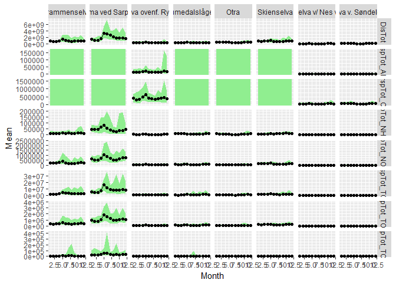
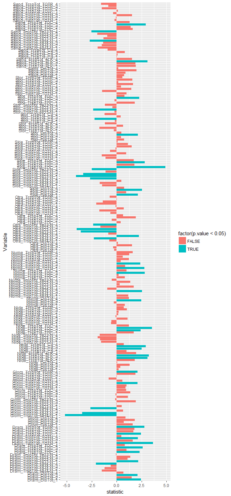

## 0. Libraries

```r
library(tidyverse)
```

```
## -- Attaching packages --------------------------------------- tidyverse 1.2.1 --
```

```
## v ggplot2 2.2.1     v purrr   0.2.4
## v tibble  1.4.2     v dplyr   0.7.6
## v tidyr   0.8.1     v stringr 1.3.1
## v readr   1.1.1     v forcats 0.3.0
```

```
## -- Conflicts ------------------------------------------ tidyverse_conflicts() --
## x dplyr::filter() masks stats::filter()
## x dplyr::lag()    masks stats::lag()
```

```r
library(readxl)
library(broom)
# library(pander)
```

## 1. Folders and files    
Content of folders (see code)  

```r
dir("Datasett")
```

```
## [1] "Bløtbunn"              "Eksempel datafil.xlsx" "hardbunn_kopi"        
## [4] "hydrografi"            "Plankton"              "River data (from OKA)"
```

```r
dir("Datasett/River data (from OKA)")
```

```
## [1] "Annual mean flows"                   
## [2] "Concentrations (individual samples)" 
## [3] "Monthly flow-weighted concentrations"
## [4] "Monthly loads"
```

```r
dir("Datasett/hydrografi")
```

```
## [1] "Arendal_allvars_1990_2016.csv"   "Arendal_allvars_1990_2016.Rdata"
## [3] "R scripts"                       "Rådata"
```

```r
dir("Datasett/Bløtbunn")
```

```
## [1] "Beskrivelse av bløtbunndata.docx"                   
## [2] "Klimaoverblikk bløtbunn_data til Helene og Dag.xlsx"
```

```r
dir("Datasett/hardbunn_kopi")
```

```
## [1] "HBanalysesett.csv" "other docs"        "r workspace"
```

```r
dir("Datasett/Plankton")
```

```
## [1] "Beskrivelse av planktondata.docx" "Planteplankton Arendal.xlsx"
```

## 2. River data   
Content of folders (see code)

```r
dir("Datasett/River data (from OKA)/Annual mean flows")
```

```
## [1] "Mean annual flow.xlsx"
```

```r
dir("Datasett/River data (from OKA)/Monthly loads")
```

```
## [1] "Gjerstadelva_Nidelva_monthly loads.xlsx"
## [2] "RIDx5_monthly loads.xlsx"               
## [3] "Storelva_monthly loads.xlsx"
```

```r
dir("Datasett/River data (from OKA)/Concentrations (individual samples)")
```

```
## [1] "Gjerstadelva_Nidelva_conc.xlsx" "RIDx5_conc.xlsx"               
## [3] "Storelva_conc.xlsx"
```

```r
dir("Datasett/River data (from OKA)/Monthly flow-weighted concentrations")
```

```
## [1] "Gjerstadelva_Nidelva_flow-weighted mean_month.xlsx"
## [2] "RIDx5_flow-weighted mean_month.xlsx"               
## [3] "Storelva_flow-weighted mean_month.xlsx"
```

### a. Data; example: Storelva loads

```r
df1 <- read_excel("Datasett/River data (from OKA)/Monthly loads/Storelva_monthly loads.xlsx")  

df2 <- read_excel("Datasett/River data (from OKA)/Monthly loads/Gjerstadelva_Nidelva_monthly loads.xlsx")  

df3 <- read_excel("Datasett/River data (from OKA)/Monthly loads/RIDx5_monthly loads.xlsx")  

head(df1, 3)
```

<div data-pagedtable="false">
  <script data-pagedtable-source type="application/json">
{"columns":[{"label":["Station ID"],"name":[1],"type":["dbl"],"align":["right"]},{"label":["Station Code"],"name":[2],"type":["chr"],"align":["left"]},{"label":["Station name"],"name":[3],"type":["chr"],"align":["left"]},{"label":["Year"],"name":[4],"type":["dbl"],"align":["right"]},{"label":["Month"],"name":[5],"type":["dbl"],"align":["right"]},{"label":["TrspTot TOTN"],"name":[6],"type":["chr"],"align":["left"]},{"label":["TrspTot NO3-N"],"name":[7],"type":["chr"],"align":["left"]},{"label":["TrspTot NH4-N"],"name":[8],"type":["chr"],"align":["left"]},{"label":["TrspTot TOTP"],"name":[9],"type":["chr"],"align":["left"]},{"label":["TrspTot TOC"],"name":[10],"type":["chr"],"align":["left"]},{"label":["TrspTot ALK"],"name":[11],"type":["chr"],"align":["left"]},{"label":["TrspTot Ca"],"name":[12],"type":["chr"],"align":["left"]},{"label":["DisTot"],"name":[13],"type":["chr"],"align":["left"]}],"data":[{"1":"NA","2":"NA","3":"NA","4":"NA","5":"NA","6":"Kg","7":"Kg","8":"Kg","9":"Kg","10":"Kg","11":"Km","12":"Kg","13":"m3"},{"1":"14680","2":"VEGAAR 11","3":"Storelva v/ Nes verk","4":"1990","5":"1","6":"NA","7":"NA","8":"NA","9":"NA","10":"NA","11":"NA","12":"NA","13":"26920417.025920399"},{"1":"14680","2":"VEGAAR 11","3":"Storelva v/ Nes verk","4":"1990","5":"2","6":"NA","7":"NA","8":"NA","9":"NA","10":"NA","11":"NA","12":"NA","13":"69119714.104767695"}],"options":{"columns":{"min":{},"max":[10]},"rows":{"min":[10],"max":[10]},"pages":{}}}
  </script>
</div>

```r
head(df2, 3)
```

<div data-pagedtable="false">
  <script data-pagedtable-source type="application/json">
{"columns":[{"label":["Station ID"],"name":[1],"type":["dbl"],"align":["right"]},{"label":["Station Code"],"name":[2],"type":["chr"],"align":["left"]},{"label":["Station name"],"name":[3],"type":["chr"],"align":["left"]},{"label":["Year"],"name":[4],"type":["dbl"],"align":["right"]},{"label":["Month"],"name":[5],"type":["dbl"],"align":["right"]},{"label":["TrspTot TOTN"],"name":[6],"type":["chr"],"align":["left"]},{"label":["TrspTot NO3-N"],"name":[7],"type":["chr"],"align":["left"]},{"label":["TrspTot NH4-N"],"name":[8],"type":["chr"],"align":["left"]},{"label":["TrspTot TOTP"],"name":[9],"type":["chr"],"align":["left"]},{"label":["TrspTot TOC"],"name":[10],"type":["chr"],"align":["left"]},{"label":["TrspTot ALK"],"name":[11],"type":["chr"],"align":["left"]},{"label":["TrspTot Ca"],"name":[12],"type":["chr"],"align":["left"]},{"label":["DisTot"],"name":[13],"type":["chr"],"align":["left"]}],"data":[{"1":"NA","2":"NA","3":"NA","4":"NA","5":"NA","6":"Kg","7":"Kg","8":"Kg","9":"Kg","10":"Kg","11":"Km","12":"Kg","13":"m3"},{"1":"12100","2":"OVELV 3 1","3":"Søndeledelva v. Søndeleddammen","4":"1990","5":"1","6":"23199.808584706701","7":"13849.2787305985","8":"2037.2996925892201","9":"NA","10":"164284.05929017","11":"1579.4133809008899","12":"88586.984514178796","13":"40144600.960498802"},{"1":"12100","2":"OVELV 3 1","3":"Søndeledelva v. Søndeleddammen","4":"1990","5":"2","6":"37462.8814262206","7":"22293.687654999401","8":"3805.8536058290201","9":"NA","10":"302942.48518765299","11":"2703.6963563633699","12":"132572.46576606401","13":"75182809.912218198"}],"options":{"columns":{"min":{},"max":[10]},"rows":{"min":[10],"max":[10]},"pages":{}}}
  </script>
</div>

```r
head(df3, 3)
```

<div data-pagedtable="false">
  <script data-pagedtable-source type="application/json">
{"columns":[{"label":["Station ID"],"name":[1],"type":["dbl"],"align":["right"]},{"label":["Station Code"],"name":[2],"type":["chr"],"align":["left"]},{"label":["Station name"],"name":[3],"type":["chr"],"align":["left"]},{"label":["Year"],"name":[4],"type":["dbl"],"align":["right"]},{"label":["Month"],"name":[5],"type":["dbl"],"align":["right"]},{"label":["TrspTot TOTN"],"name":[6],"type":["chr"],"align":["left"]},{"label":["TrspTot NO3-N"],"name":[7],"type":["chr"],"align":["left"]},{"label":["TrspTot NH4-N"],"name":[8],"type":["chr"],"align":["left"]},{"label":["TrspTot TOTP"],"name":[9],"type":["chr"],"align":["left"]},{"label":["TrspTot PO4-P"],"name":[10],"type":["chr"],"align":["left"]},{"label":["TrspTot TOC"],"name":[11],"type":["chr"],"align":["left"]},{"label":["TrspTot SPM"],"name":[12],"type":["chr"],"align":["left"]},{"label":["TrspTot SiO2"],"name":[13],"type":["chr"],"align":["left"]},{"label":["DisTot"],"name":[14],"type":["chr"],"align":["left"]}],"data":[{"1":"NA","2":"NA","3":"NA","4":"NA","5":"NA","6":"Kg","7":"Kg","8":"Kg","9":"Kg","10":"Kg","11":"Kg","12":"Kg","13":"Kg","14":"m3"},{"1":"29612","2":"BUSEDRA","3":"Drammenselva","4":"1990","5":"1","6":"178426.30775056101","7":"121897.217932584","8":"NA","9":"3030.6931078651601","10":"469.82260112359501","11":"NA","12":"567680.060224719","13":"NA","14":"691863662.02247095"},{"1":"29612","2":"BUSEDRA","3":"Drammenselva","4":"1990","5":"2","6":"311495.31692065398","7":"216115.052414645","8":"NA","9":"5115.0293468926702","10":"1366.78926816543","11":"NA","12":"1370723.02330414","13":"NA","14":"756814878.20224702"}],"options":{"columns":{"min":{},"max":[10]},"rows":{"min":[10],"max":[10]},"pages":{}}}
  </script>
</div>

```r
colnames(df1) %>% dput()
```

```
## c("Station ID", "Station Code", "Station name", "Year", "Month", 
## "TrspTot TOTN", "TrspTot NO3-N", "TrspTot NH4-N", "TrspTot TOTP", 
## "TrspTot TOC", "TrspTot ALK", "TrspTot Ca", "DisTot")
```

```r
colnames(df2) %>% dput()
```

```
## c("Station ID", "Station Code", "Station name", "Year", "Month", 
## "TrspTot TOTN", "TrspTot NO3-N", "TrspTot NH4-N", "TrspTot TOTP", 
## "TrspTot TOC", "TrspTot ALK", "TrspTot Ca", "DisTot")
```

```r
colnames(df3) %>% dput()
```

```
## c("Station ID", "Station Code", "Station name", "Year", "Month", 
## "TrspTot TOTN", "TrspTot NO3-N", "TrspTot NH4-N", "TrspTot TOTP", 
## "TrspTot PO4-P", "TrspTot TOC", "TrspTot SPM", "TrspTot SiO2", 
## "DisTot")
```

```r
df <- bind_rows(df1[-1,], df2[-1,], df3[-1,])

# colnames(df) %>% dput()
vars <- c("TrspTot TOTN", "TrspTot NO3-N", "TrspTot NH4-N", "TrspTot TOTP", 
          "TrspTot TOC", "TrspTot ALK", "TrspTot Ca", "DisTot")
for (var in vars)
  df[[var]] <- as.numeric(df[[var]])
df$Time <- with(df, lubridate::ymd(paste(Year, Month, "15")))

# Add "_" in column names (TrspTot Ca -> TrspTot_Ca)
colnames(df) <- sub(" ", "_", colnames(df), fixed = TRUE)

tb <- df %>% 
  gather("Variable", Value, TrspTot_TOTN:DisTot) %>%
  filter(!is.na(Value)) %>%
  xtabs(~Station_name + Variable, .)
tb
```

```
##                                 Variable
## Station_name                     DisTot TrspTot_ALK TrspTot_Ca
##   Drammenselva                      324           0          0
##   Glomma ved Sarpsfoss              324           0          0
##   Nidelva ovenf. Rygene             324         311        311
##   Numedalslågen                     324           0          0
##   Otra                              324           0          0
##   Skienselva                        324           0          0
##   Storelva v/ Nes verk              312         232        276
##   Søndeledelva v. Søndeleddammen    324         324        324
##                                 Variable
## Station_name                     TrspTot_NH4-N TrspTot_NO3-N TrspTot_TOC
##   Drammenselva                             299           324         303
##   Glomma ved Sarpsfoss                     299           324         324
##   Nidelva ovenf. Rygene                     17           311         311
##   Numedalslågen                            300           324         304
##   Otra                                     300           324         303
##   Skienselva                               299           324         303
##   Storelva v/ Nes verk                      17           276         276
##   Søndeledelva v. Søndeleddammen           324           324         324
##                                 Variable
## Station_name                     TrspTot_TOTN TrspTot_TOTP
##   Drammenselva                            324          324
##   Glomma ved Sarpsfoss                    324          324
##   Nidelva ovenf. Rygene                   311          271
##   Numedalslågen                           324          324
##   Otra                                    324          324
##   Skienselva                              324          324
##   Storelva v/ Nes verk                    276          275
##   Søndeledelva v. Søndeleddammen          324          227
```

### b, Plot seasonal cycle

```r
gg <- df %>%
  gather("Variable", "Value",  TrspTot_TOTN:DisTot) %>%
  group_by(Station_name, Variable, Month) %>%
  summarise(Mean = mean(Value, na.rm = TRUE), Min = min(Value, na.rm = TRUE), Max = max(Value, na.rm = TRUE)) %>%
  ggplot(., aes(Month, Mean)) + 
    geom_ribbon(aes(ymin = Min, ymax = Max), fill = "lightgreen") +
    geom_line() + geom_point() +
    facet_grid(Variable~Station_name, scales = "free_y")
gg
```

```
## Warning: Removed 120 rows containing missing values (geom_point).
```

<!-- -->

### c. Quarterly means of all variables

```r
df2 <- df %>%
  mutate(Quarter = case_when(
    Month %in% 1:3 ~ 1,
    Month %in% 4:6 ~ 2,
    Month %in% 7:9 ~ 3,
    Month %in% 10:12 ~ 4
  )) %>%
  gather("Variable", "Value",  TrspTot_TOTN:DisTot) %>%
  group_by(Station_name, Variable, Year, Quarter) %>%
  summarise(Mean = mean(Value, na.rm = TRUE), Min = min(Value, na.rm = TRUE), Max = max(Value, na.rm = TRUE))
```

### d. Make quarterly site-specific variables

```r
df3 <- df2 %>%
  unite("VarQuarter", Variable, Quarter) %>%
  mutate(Station_short = substr(Station_name, 1, 4)) %>%
  unite("StVarQuarter", Station_short, VarQuarter) %>%
  arrange(StVarQuarter, Year)
```

### e. Test regression of every station / varibale / quarter

```r
get_reg_coef <- function(df) {
  lm <- lm(Mean ~ Year, data = df)
  subset(tidy(lm), term == "Year")
  }

m_yeareffect <- df3 %>%
  filter(!is.na(Mean)) %>%
  group_by(StVarQuarter) %>%
  mutate(N_year = n()) %>%
  filter(N_year >= 10) %>%
  split(.$StVarQuarter) %>%
  map_df(~get_reg_coef(.), .id = "Variable")

ggplot(m_yeareffect, aes(Variable, statistic, fill = factor(p.value < 0.05))) +
         geom_col() +
  coord_flip()
```

<!-- -->

```r
#   theme(axis.text.x = element_text(angle = 90, hjust = 1, vjust = 0.2))
```


