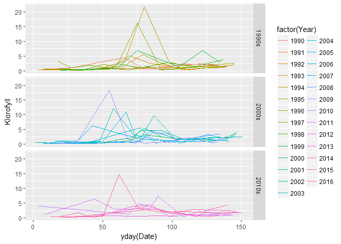
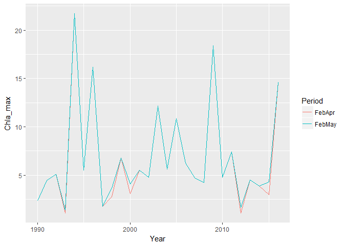
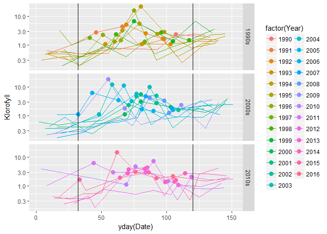
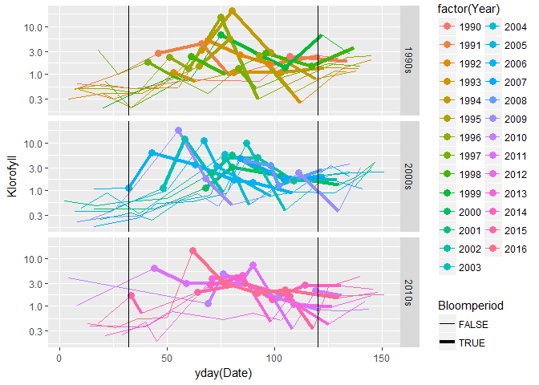

## 1. Data
### a. Read hydrography data

```r
load("Datasett/Hydrografi/Arendal_allvars_1990_2016.Rdata")
Df.Arendal$Month <- Df.Arendal$Dato %>% as.character() %>% substr(6,7) %>% as.numeric()
Df.Arendal$Year <- Df.Arendal$Dato %>% as.character() %>% substr(1,4) %>% as.numeric()

Df.Arendal$Date <- ymd_hms(paste(Df.Arendal$Dato, "00:00:00"))   # R's time format
```

### b. Read plankton data

```r
df_plank <- read_excel("Datasett/Plankton/Planteplankton Arendal.xlsx") # range = "A1:V471"
df_plank$Year <- lubridate::year(df_plank$Dato)
df_plank$Month <- lubridate::month(df_plank$Dato)
```

### c. Plankton: Select by depth  
0-30 or 5 m  

```r
xtabs(~Dyp, df_plank)
```

```
## Dyp
##  0-30 m 0-30 m*     0 m    10 m    20 m    30 m    30 M     5 m      5m 
##     122       1       6       3       2       1       1     322      12
```

```r
# Select
sel <- df_plank$Dyp %in% c("0-30 m", "5 m", "5m"); 
df_plank <- df_plank[sel,]

# Stats
cat("Select", sum(sel), "lines\n")
```

```
## Select 456 lines
```

```r
cat(mean(sel)*100, "% of the data")
```

```
## 97.02128 % of the data
```

## 2. Plot ChlA
### a. All year

```r
Df.Arendal %>%
  filter(Depth %in% 5) %>%
  mutate(Decade = paste0(10*floor(Year/10), "s")) %>%
  ggplot(aes(yday(Date), Klorofyll, group = Year, color = factor(Year))) + 
    geom_line() +
    facet_wrap(~Decade)
```

<!-- -->

### b. Spring (January - May)

```r
Df.Arendal %>%
  filter(Depth %in% 5 & Month %in% 1:5) %>%
  mutate(Decade = paste0(10*floor(Year/10), "s")) %>%
  ggplot(aes(yday(Date), Klorofyll, group = Year, color = factor(Year))) + 
    geom_line() +
    facet_grid(Decade~.)
```

<!-- -->
### c. Spring (January - May) log-scale

```r
yday_1feb <- yday(ymd(20010201))
yday_30apr <- yday(ymd(20010430))
Df.Arendal %>%
  filter(Depth %in% 5 & Month %in% 1:5) %>%
  mutate(Decade = paste0(10*floor(Year/10), "s")) %>%
  ggplot(aes(yday(Date), Klorofyll, group = Year, color = factor(Year))) + 
    geom_line() +
    geom_vline(xintercept = c(yday_1feb, yday_30apr)) +
    scale_y_log10() +
    facet_grid(Decade~.)
```

<!-- -->

 
### d. Max chlorophyll February-April and February-May

```r
df <- Df.Arendal %>%
  filter(Depth %in% 5) %>% 
  group_by(Year) %>%
  summarize(FebApr = max(Klorofyll[Month %in% 2:4], na.rm = TRUE),
            FebMay = max(Klorofyll[Month %in% 2:5], na.rm = TRUE))
df %>%
  gather("Period", "Chla_max", FebApr, FebMay) %>%
  ggplot(aes(Year, Chla_max, color = Period)) + 
  geom_line()
```

<!-- -->

```r
cat("Lowest max value Feb-April:", min(df$FebApr), "\n")
```

```
## Lowest max value Feb-April: 1.1
```

## 3. Get bloom periods to use  
### a. Bloomperiod_01: Chl a over absolute threshold  

```r
threshold <- 1.1
Bloomperiod_01 <- Df.Arendal %>%
  filter(Depth %in% 5 & Month %in% 2:4 & Klorofyll >= threshold & !is.na(Klorofyll)) %>% 
  group_by(Year) %>%
  summarize(Date1 = min(Date), Date2 = max(Date))
```

### b. Plot periods

```r
df <- Df.Arendal %>%
  filter(Depth %in% 5 & Month %in% 1:5) %>%
  mutate(Decade = paste0(10*floor(Year/10), "s")) %>%
  mutate(Bloomperiod = Month %in% 2:4 & Klorofyll >= threshold & !is.na(Klorofyll))
ggplot(df, aes(yday(Date), Klorofyll, group = Year, color = factor(Year))) + 
    geom_line() +
    geom_point(data = df %>% filter(Bloomperiod), size = rel(3)) +
    geom_vline(xintercept = c(yday_1feb, yday_30apr)) +
    scale_y_log10() +
    facet_grid(Decade~.)
```

<!-- -->

```r
ggplot(df, aes(yday(Date), Klorofyll, group = Year, color = factor(Year), size = Bloomperiod)) + 
    geom_line() +
    scale_size_manual(values = c(0.5, 1.5)) +
    geom_point(data = df %>% filter(Bloomperiod), size = rel(3)) +
    geom_vline(xintercept = c(yday_1feb, yday_30apr)) +
    scale_y_log10() +
    facet_grid(Decade~.)
```

<!-- -->

### c. Bloomperiod_02: Max Chl a

```r
Bloomperiod_02 <- Df.Arendal %>%
  filter(Depth %in% 5 & Month %in% 2:4 & Klorofyll >= threshold & !is.na(Klorofyll)) %>% 
  group_by(Year) %>%
  summarize(Date = Date[Klorofyll %in% max(Klorofyll)][1])
```

## 4. Pick data in plankton data set
### a. Create Bloom01 and Bloom2 variables (false/true) in plankton data set  
We make a "buffer zone" of one extra day in each direction (in 1998, max Chla is 6 April by plankton data are from 7 april)  

```r
df_plank <- df_plank %>% as.data.frame()
Bloomperiod_01 <- Bloomperiod_01 %>% as.data.frame()
Bloomperiod_02 <- Bloomperiod_02  %>% as.data.frame()
df_plank$Bloom01 <- FALSE
df_plank$Bloom02 <- FALSE
for (yr in unique(Bloomperiod_01$Year)){
  # yr <- 1998
  df <- Bloomperiod_01 %>% filter(Year %in% yr) 
  sel <- df_plank$Year %in% yr & df_plank$Dato >= (df$Date1[1] - days(1)) & df_plank$Dato <= (df$Date2[1] + days(1))
  df_plank$Bloom01[sel] <- TRUE
  df <- Bloomperiod_02 %>% filter(Year %in% yr) 
  sel <- df_plank$Year %in% yr & df_plank$Dato >= (df$Date[1] - days(1)) & df_plank$Dato <= (df$Date[1] + days(1)) 
  df_plank$Bloom02[sel] <- TRUE
}
xtabs(~Year + Bloom01, df_plank)
```

```
##       Bloom01
## Year   FALSE TRUE
##   1994    16    3
##   1995    15    3
##   1996    19    3
##   1997    18    4
##   1998    16    4
##   1999    19    2
##   2000     8    3
##   2001     8    3
##   2002    12    3
##   2003    18    4
##   2004    18    3
##   2005    19    2
##   2006    16    5
##   2007    20    2
##   2008    18    3
##   2009    17    5
##   2010    17    3
##   2011    15    5
##   2012    18    1
##   2013    18    4
##   2014    18    4
##   2015    17    5
##   2016    18    4
```

```r
xtabs(~Year + Bloom02, df_plank)
```

```
##       Bloom02
## Year   FALSE TRUE
##   1994    18    1
##   1995    17    1
##   1996    21    1
##   1997    21    1
##   1998    19    1
##   1999    20    1
##   2000    10    1
##   2001    10    1
##   2002    14    1
##   2003    21    1
##   2004    20    1
##   2005    20    1
##   2006    20    1
##   2007    21    1
##   2008    20    1
##   2009    21    1
##   2010    19    1
##   2011    19    1
##   2012    18    1
##   2013    21    1
##   2014    21    1
##   2015    21    1
##   2016    21    1
```

```r
# df_plank %>% filter(Bloom02) %>% View()
```

### b. Extract plankton data - mean/median values based on Bloom01

```r
df_plank_bloom01_mean <- df_plank %>%
  filter(Bloom01) %>%
  group_by(Year) %>%
  summarize_at(vars(Cyanophycea:Flagellater), mean, na.rm = TRUE)

df_plank_bloom01_median <- df_plank %>%
  filter(Bloom01) %>%
  group_by(Year) %>%
  summarize_at(vars(Cyanophycea:Flagellater), median, na.rm = TRUE)
```

### b. Extract plankton data - values based on Bloom02, i.e. max ChlA

```r
df_plank_bloom02 <- df_plank %>%
  filter(Bloom02)
```

## 5. Save plankton data in folder 'Data_produced'  

```r
write.csv(df_plank_bloom01_mean, "Data_produced/df_plank_bloom01_mean.csv", row.names = FALSE, quote = FALSE)
write.csv(df_plank_bloom01_median, "Data_produced/df_plank_bloom01_median.csv", row.names = FALSE, quote = FALSE)
write.csv(df_plank_bloom02, "Data_produced/df_plank_bloom02.csv", row.names = FALSE, quote = FALSE)
```


