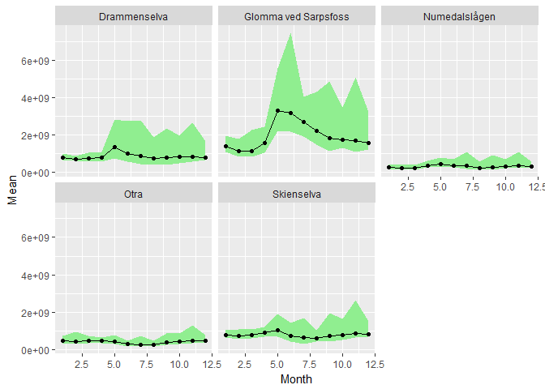
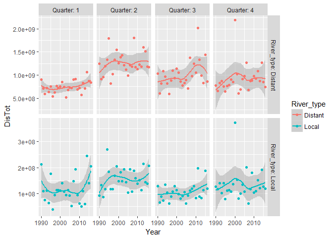
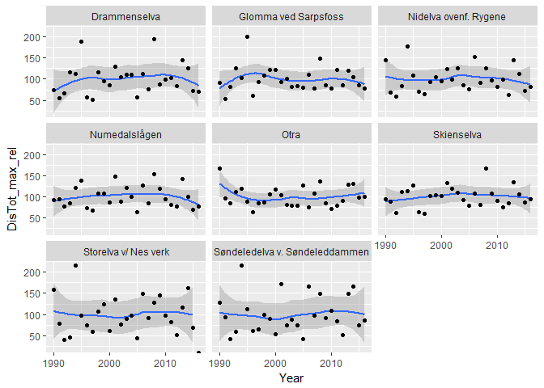
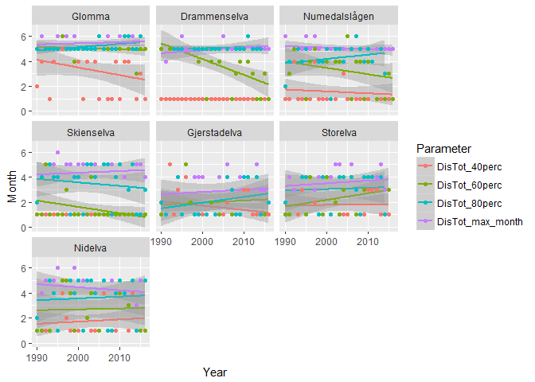
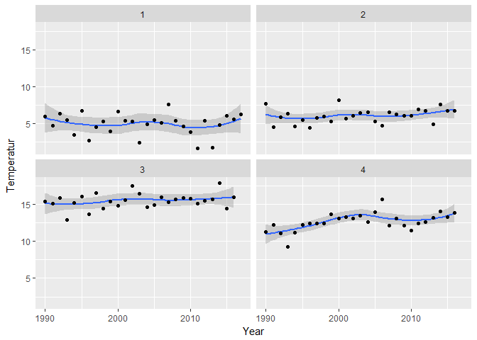
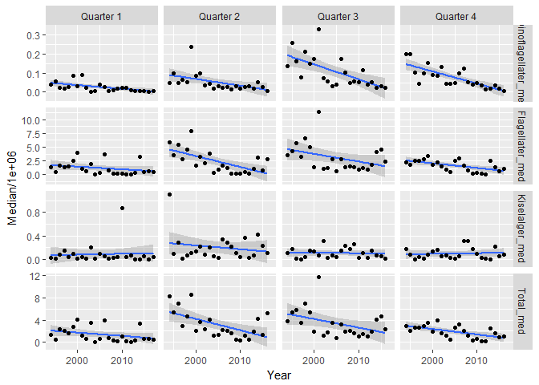

__Test file__ for producing summarized data by year and quarter   
Actual data used (in folder 'Data_produced') are made in __script 05b__    


## 0. Libraries

```r
library(tidyverse)
```

```
## -- Attaching packages ------------------------------------------------------------------------------------------ tidyverse 1.2.1 --
```

```
## v ggplot2 2.2.1     v purrr   0.2.4
## v tibble  1.4.2     v dplyr   0.7.6
## v tidyr   0.8.1     v stringr 1.3.1
## v readr   1.1.1     v forcats 0.3.0
```

```
## -- Conflicts --------------------------------------------------------------------------------------------- tidyverse_conflicts() --
## x dplyr::filter() masks stats::filter()
## x dplyr::lag()    masks stats::lag()
```

```r
library(readxl)
library(broom)
library(lubridate)
```

```
## 
## Attaching package: 'lubridate'
```

```
## The following object is masked from 'package:base':
## 
##     date
```

```r
# library(pander)
```

## 1. Folders and files    
Content of folders (see code)  

```r
dir("Datasett")
```

```
## [1] "Bløtbunn"              "Eksempel datafil.xlsx" "hardbunn_kopi"        
## [4] "hydrografi"            "Plankton"              "River data (from OKA)"
```

```r
dir("Datasett/River data (from OKA)")
```

```
## [1] "Annual mean flows"                   
## [2] "Concentrations (individual samples)" 
## [3] "Monthly flow-weighted concentrations"
## [4] "Monthly loads"
```

```r
dir("Datasett/hydrografi")
```

```
## [1] "Arendal_allvars_1990_2016.csv"   "Arendal_allvars_1990_2016.Rdata"
## [3] "R scripts"                       "Rådata"
```

```r
dir("Datasett/Bløtbunn")
```

```
## [1] "Beskrivelse av bløtbunndata.docx"                   
## [2] "Klimaoverblikk bløtbunn_data til Helene og Dag.xlsx"
```

```r
dir("Datasett/hardbunn_kopi")
```

```
## [1] "HBanalysesett.csv" "other docs"        "r workspace"
```

```r
dir("Datasett/Plankton")
```

```
## [1] "Beskrivelse av planktondata.docx" "Planteplankton Arendal.xlsx"
```

## 2. River data   
Content of folders (see code)

```r
dir("Datasett/River data (from OKA)/Annual mean flows")
```

```
## [1] "Mean annual flow.xlsx"
```

```r
dir("Datasett/River data (from OKA)/Monthly loads")
```

```
## [1] "Gjerstadelva_Nidelva_monthly loads.xlsx"
## [2] "RIDx5_monthly loads.xlsx"               
## [3] "Storelva_monthly loads.xlsx"
```

```r
dir("Datasett/River data (from OKA)/Concentrations (individual samples)")
```

```
## [1] "Gjerstadelva_Nidelva_conc.xlsx" "RIDx5_conc.xlsx"               
## [3] "Storelva_conc.xlsx"
```

```r
dir("Datasett/River data (from OKA)/Monthly flow-weighted concentrations")
```

```
## [1] "Gjerstadelva_Nidelva_flow-weighted mean_month.xlsx"
## [2] "RIDx5_flow-weighted mean_month.xlsx"               
## [3] "Storelva_flow-weighted mean_month.xlsx"
```

### a. Data of monthly river loads and total discharge  

```r
df1 <- read_excel("Datasett/River data (from OKA)/Monthly loads/Storelva_monthly loads.xlsx")  
df2 <- read_excel("Datasett/River data (from OKA)/Monthly loads/Gjerstadelva_Nidelva_monthly loads.xlsx")  
df3 <- read_excel("Datasett/River data (from OKA)/Monthly loads/RIDx5_monthly loads.xlsx")  

# head(df1, 3)
# head(df2, 3)
# head(df3, 3)

# colnames(df1) %>% dput()
# colnames(df2) %>% dput()
# colnames(df3) %>% dput()   RID rivers also include PO4, SiO2 and SPM

df_rivers <- bind_rows(df1[-1,], df2[-1,], df3[-1,])

# colnames(df_rivers) %>% dput()
vars <- c("TrspTot TOTN", "TrspTot NO3-N", "TrspTot NH4-N", "TrspTot TOTP",           
          "TrspTot TOC", "TrspTot ALK", "TrspTot Ca", "DisTot")
for (var in vars)
  df_rivers[[var]] <- as.numeric(df_rivers[[var]])
df_rivers$Time <- with(df_rivers, lubridate::ymd(paste(Year, Month, "15")))

# Add "_" in column names (TrspTot Ca -> TrspTot_Ca)
colnames(df_rivers) <- sub(" ", "_", colnames(df_rivers), fixed = TRUE)

# endre rekkefølge på elver fra nord til sør for ggplot
df_rivers$Station_name <- factor(df_rivers$Station_name, levels = c("Glomma ved Sarpsfoss", "Drammenselva", "Numedalslågen", "Skienselva", "Søndeledelva v. Søndeleddammen", "Storelva v/ Nes verk", "Nidelva ovenf. Rygene", "Otra"))

# endre navn på elver
sel <- levels(df_rivers$Station_name) == "Glomma ved Sarpsfoss"; sum(sel)
```

```
## [1] 1
```

```r
levels(df_rivers$Station_name)[sel] <- "Glomma"

sel <- levels(df_rivers$Station_name) == "Søndeledelva v. Søndeleddammen"; sum(sel)
```

```
## [1] 1
```

```r
levels(df_rivers$Station_name)[sel] <- "Gjerstadelva"

sel <- levels(df_rivers$Station_name) == "Storelva v/ Nes verk"; sum(sel)
```

```
## [1] 1
```

```r
levels(df_rivers$Station_name)[sel] <- "Storelva"

sel <- levels(df_rivers$Station_name) == "Nidelva ovenf. Rygene"; sum(sel)
```

```
## [1] 1
```

```r
levels(df_rivers$Station_name)[sel] <- "Nidelva"

levels(df_rivers$Station_name)
```

```
## [1] "Glomma"        "Drammenselva"  "Numedalslågen" "Skienselva"   
## [5] "Gjerstadelva"  "Storelva"      "Nidelva"       "Otra"
```

```r
# Dropp Otra fra plot og analyser (nedstrøms)
df_rivers <- df_rivers %>% 
  filter(Station_name != "Otra") %>% 
  droplevels()

#print (df_rivers)

# Table of available data for each river
tb <- df_rivers %>% 
  gather("Variable", Value, TrspTot_TOTN:DisTot) %>%
  filter(!is.na(Value)) %>%
  xtabs(~Station_name + Variable, .)
tb
```

```
##                Variable
## Station_name    DisTot TrspTot_ALK TrspTot_Ca TrspTot_NH4-N TrspTot_NO3-N
##   Glomma           324           0          0           299           324
##   Drammenselva     324           0          0           299           324
##   Numedalslågen    324           0          0           300           324
##   Skienselva       324           0          0           299           324
##   Gjerstadelva     324         324        324           324           324
##   Storelva         312         232        276            17           276
##   Nidelva          324         311        311            17           311
##                Variable
## Station_name    TrspTot_TOC TrspTot_TOTN TrspTot_TOTP
##   Glomma                324          324          324
##   Drammenselva          303          324          324
##   Numedalslågen         304          324          324
##   Skienselva            303          324          324
##   Gjerstadelva          324          324          227
##   Storelva              276          276          275
##   Nidelva               311          311          271
```

### b. Local rivers, plot monthly mean discharge by station

```r
gg <- df_rivers %>%
  filter(substr(Station_name, 1, 4) %in% c("Nide","Gjer","Stor")) %>%
  group_by(Station_name, Month) %>%
  summarise(Mean = mean(DisTot, na.rm = TRUE), 
            Q10 = quantile(DisTot, 0.1, na.rm = TRUE), 
            Q90 = max(DisTot, 0.9, na.rm = TRUE)) %>%
  ggplot(., aes(Month, Mean)) + 
    geom_ribbon(aes(ymin = Q10, ymax = Q90), fill = "lightgreen") +
    geom_line() + geom_point() +
    facet_wrap(~Station_name)
gg
```

<!-- -->

```r
# gg + scale_y_log10()
```

### c. Distant rivers, plot monthly mean discharge by station  
Including Otra

```r
gg <- df_rivers %>%
  filter(!substr(Station_name, 1, 4) %in% c("Nide","Gjer","Stor")) %>%
  group_by(Station_name, Month) %>%
  summarise(Mean = mean(DisTot, na.rm = TRUE), 
            Q10 = quantile(DisTot, 0.1, na.rm = TRUE), 
            Q90 = max(DisTot, 0.9, na.rm = TRUE)) %>%
  ggplot(., aes(Month, Mean)) + 
    geom_ribbon(aes(ymin = Q10, ymax = Q90), fill = "lightgreen") +
    geom_line() + geom_point() +
    facet_wrap(~Station_name)
gg
```

<!-- -->

```r
# gg + scale_y_log10()
```

### d. Summarize by "local rivers"/"distant rivers" and quarter  
    * Exclude Otra

```r
df_rivers_summ <- df_rivers %>%
  filter(!Station_name %in% "Otra") %>%
  mutate(River_type = ifelse(substr(Station_name, 1, 4) %in% c("Nide","Gjer","Stor"), "Local", "Distant")) %>%
  mutate(Quarter = case_when(
    Month %in% 1:3 ~ 1,
    Month %in% 4:6 ~ 2,
    Month %in% 7:9 ~ 3,
    Month %in% 10:12 ~ 4
  )) %>%
  group_by(River_type, Year, Quarter) %>%
  summarise_at(c("TrspTot_TOTN", "TrspTot_NO3-N", "TrspTot_TOTP", "TrspTot_TOC", "DisTot"), mean, na.rm = TRUE)
```

### e. Plot in order to check data

```r
ggplot(df_rivers_summ, aes(Year, DisTot, color = River_type)) +
  geom_smooth() +
  geom_point() + 
  facet_grid(River_type~Quarter, scales = "free_y", labeller = label_both)
```

```
## `geom_smooth()` using method = 'loess'
```

<!-- -->

### f. Timing and size of spring flood

```r
df_rivers_springflood_allyears <- df_rivers %>%
  group_by(Station_name, Year) %>%
  mutate(DisTot_max = max(DisTot[Month %in% 1:6]), na.rm = TRUE) %>%
  group_by(Station_name) %>%
  summarize(DisTot_max_mean = mean(DisTot_max, na.rm = TRUE))
df_rivers_springflood_allyears
```

<div data-pagedtable="false">
  <script data-pagedtable-source type="application/json">
{"columns":[{"label":["Station_name"],"name":[1],"type":["fctr"],"align":["left"]},{"label":["DisTot_max_mean"],"name":[2],"type":["dbl"],"align":["right"]}],"data":[{"1":"Glomma","2":"3748959681"},{"1":"Drammenselva","2":"1455532290"},{"1":"Numedalslågen","2":"507342841"},{"1":"Skienselva","2":"1122609913"},{"1":"Gjerstadelva","2":"58587352"},{"1":"Storelva","2":"43451160"},{"1":"Nidelva","2":"570183077"}],"options":{"columns":{"min":{},"max":[10]},"rows":{"min":[10],"max":[10]},"pages":{}}}
  </script>
</div>

```r
df_rivers_springflood <- df_rivers %>%
  filter(Month %in% 1:6) %>%
  group_by(Station_name, Year) %>%
  mutate(DisTot_max = max(DisTot), na.rm = TRUE) %>%
  group_by(Station_name) %>%
  mutate(DisTot_max_mean = mean(DisTot_max, na.rm = TRUE)) %>%
  ungroup() %>%
  group_by(Station_name, Year) %>%
  summarize(DisTot_max_rel = max(DisTot/DisTot_max_mean*100, na.rm = TRUE),
            DisTot_max_month = Month[DisTot == DisTot_max][1],
            DisTot_40perc = Month[DisTot >= 0.40*DisTot_max_mean][1],
            DisTot_60perc = Month[DisTot >= 0.60*DisTot_max_mean][1],
            DisTot_80perc = Month[DisTot >= 0.80*DisTot_max_mean][1])
```

```
## Warning in max(DisTot/DisTot_max_mean * 100, na.rm = TRUE): no non-missing
## arguments to max; returning -Inf
```

### g. Save both

```r
# write.csv(df_rivers_summ, "Data_produced/05_df_rivers_summ.csv", row.names = FALSE, quote = FALSE)
# write.csv(df_rivers_springflood, "Data_produced/05_df_rivers_springflood.csv", 
#           row.names = FALSE, quote = FALSE)
```


### h1. Plot of max flood

```r
ggplot(df_rivers_springflood, aes(Year, DisTot_max_rel)) +
  geom_smooth() + geom_point() +
  facet_wrap(~Station_name)
```

```
## `geom_smooth()` using method = 'loess'
```

```
## Warning: Removed 1 rows containing non-finite values (stat_smooth).
```

<!-- -->

### h2. Plot of flood timing

```r
df_rivers_springflood %>%
  gather("Parameter", "Month", DisTot_max_month, DisTot_40perc, DisTot_60perc, DisTot_80perc) %>%
  ggplot(aes(Year, Month, group = Parameter, color = Parameter)) +
  geom_smooth(method = "lm") + geom_point() +
  facet_wrap(~Station_name)
```

```
## Warning: Removed 74 rows containing non-finite values (stat_smooth).
```

```
## Warning: Removed 74 rows containing missing values (geom_point).
```

<!-- -->

## 3. Hydrological data
### a. Read data

```r
load("Datasett/Hydrografi/Arendal_allvars_1990_2016.Rdata")
Df.Arendal$Month <- Df.Arendal$Dato %>% as.character() %>% substr(6,7) %>% as.numeric()
Df.Arendal$Year <- Df.Arendal$Dato %>% as.character() %>% substr(1,4) %>% as.numeric()
Df.Arendal$Time <- ymd_hms(paste(Df.Arendal$Dato, "00:00:00"))   # R's time format
```

### b. Summarize by depth bins and quarter    
    * Depth bins = 0-10, 10-30, 30-50
    * Quarters starting with March

```r
df_hydro_summ <- Df.Arendal %>%
  mutate(
    Quarter = case_when(
      Month %in% 1:2 ~ 1,
      Month %in% 3:5 ~ 2,
      Month %in% 6:8 ~ 3,
      Month %in% 9:11 ~ 4,
      Month %in% 12 ~ 1),
    Year2 = case_when(
      Month == 12 ~ Year + 1,
      Month < 12 ~ Year),
    Depth = case_when(
      Depth %in% c(0,5,10) ~ "Surface",
      Depth %in% c(20,30) ~ "Intermediate",
      Depth %in% c(50,75) ~ "Deep")
    ) %>%
  group_by(Year2, Quarter, Depth) %>%
  summarize_at(vars(Temperatur:Siktdyp), mean, na.rm = TRUE) %>%
  rename(Year = Year2)

df_hydro_summ$Depth <- factor(df_hydro_summ$Depth, 
                                 levels = c("Surface", "Intermediate", "Deep"))

head (df_hydro_summ)
```

<div data-pagedtable="false">
  <script data-pagedtable-source type="application/json">
{"columns":[{"label":["Year"],"name":[1],"type":["dbl"],"align":["right"]},{"label":["Quarter"],"name":[2],"type":["dbl"],"align":["right"]},{"label":["Depth"],"name":[3],"type":["fctr"],"align":["left"]},{"label":["Temperatur"],"name":[4],"type":["dbl"],"align":["right"]},{"label":["Salt"],"name":[5],"type":["dbl"],"align":["right"]},{"label":["Tetthet"],"name":[6],"type":["dbl"],"align":["right"]},{"label":["O2"],"name":[7],"type":["dbl"],"align":["right"]},{"label":["O2_metning"],"name":[8],"type":["dbl"],"align":["right"]},{"label":["PO4"],"name":[9],"type":["dbl"],"align":["right"]},{"label":["NO2"],"name":[10],"type":["dbl"],"align":["right"]},{"label":["NO3"],"name":[11],"type":["dbl"],"align":["right"]},{"label":["NO2_NO3"],"name":[12],"type":["dbl"],"align":["right"]},{"label":["NH4"],"name":[13],"type":["dbl"],"align":["right"]},{"label":["SiO4"],"name":[14],"type":["dbl"],"align":["right"]},{"label":["N_P"],"name":[15],"type":["dbl"],"align":["right"]},{"label":["Klorofyll"],"name":[16],"type":["dbl"],"align":["right"]},{"label":["TotP"],"name":[17],"type":["dbl"],"align":["right"]},{"label":["TotN"],"name":[18],"type":["dbl"],"align":["right"]},{"label":["POP"],"name":[19],"type":["dbl"],"align":["right"]},{"label":["PON"],"name":[20],"type":["dbl"],"align":["right"]},{"label":["POC"],"name":[21],"type":["dbl"],"align":["right"]},{"label":["TSM"],"name":[22],"type":["dbl"],"align":["right"]},{"label":["Siktdyp"],"name":[23],"type":["dbl"],"align":["right"]}],"data":[{"1":"1990","2":"1","3":"Deep","4":"6.827000","5":"33.73950","6":"26.44897","7":"NaN","8":"NaN","9":"NaN","10":"0.6500000","11":"7.525000","12":"8.175000","13":"NaN","14":"5.310000","15":"10.86586","16":"0.4950000","17":"NaN","18":"NaN","19":"NaN","20":"NaN","21":"NaN","22":"NaN","23":"5"},{"1":"1990","2":"1","3":"Intermediate","4":"6.507000","5":"33.00700","6":"25.91196","7":"NaN","8":"NaN","9":"NaN","10":"0.5050000","11":"8.047500","12":"8.552500","13":"NaN","14":"6.000000","15":"10.82908","16":"0.4550000","17":"NaN","18":"NaN","19":"NaN","20":"NaN","21":"NaN","22":"NaN","23":"5"},{"1":"1990","2":"1","3":"Surface","4":"5.990500","5":"31.81700","6":"25.03962","7":"NaN","8":"NaN","9":"NaN","10":"0.5025000","11":"8.503333","12":"9.005833","13":"NaN","14":"6.741667","15":"11.71277","16":"0.6333333","17":"NaN","18":"NaN","19":"NaN","20":"NaN","21":"NaN","22":"NaN","23":"5"},{"1":"1990","2":"2","3":"Deep","4":"6.749625","5":"34.05713","6":"26.70970","7":"6.805","8":"99.33607","9":"NaN","10":"0.2487500","11":"7.862500","12":"8.111250","13":"NaN","14":"3.771250","15":"12.74068","16":"0.3550000","17":"NaN","18":"NaN","19":"NaN","20":"NaN","21":"NaN","22":"NaN","23":"7"},{"1":"1990","2":"2","3":"Intermediate","4":"6.850250","5":"32.83938","6":"25.73512","7":"6.985","8":"101.02189","9":"NaN","10":"0.1987500","11":"7.806250","12":"8.005000","13":"NaN","14":"3.855000","15":"13.23542","16":"0.7412500","17":"NaN","18":"NaN","19":"NaN","20":"NaN","21":"NaN","22":"NaN","23":"7"},{"1":"1990","2":"2","3":"Surface","4":"7.659833","5":"29.06183","6":"22.64780","7":"7.320","8":"103.70407","9":"NaN","10":"0.1691667","11":"6.446667","12":"6.615833","13":"NaN","14":"3.919167","15":"13.06817","16":"1.2875000","17":"NaN","18":"NaN","19":"NaN","20":"NaN","21":"NaN","22":"NaN","23":"7"}],"options":{"columns":{"min":{},"max":[10]},"rows":{"min":[10],"max":[10]},"pages":{}}}
  </script>
</div>

```r
print (df_hydro_summ)
```

```
## # A tibble: 327 x 23
## # Groups:   Year, Quarter [109]
##     Year Quarter Depth    Temperatur  Salt Tetthet     O2 O2_metning   PO4
##    <dbl>   <dbl> <fct>         <dbl> <dbl>   <dbl>  <dbl>      <dbl> <dbl>
##  1  1990       1 Deep           6.83  33.7    26.4 NaN         NaN     NaN
##  2  1990       1 Interme~       6.51  33.0    25.9 NaN         NaN     NaN
##  3  1990       1 Surface        5.99  31.8    25.0 NaN         NaN     NaN
##  4  1990       2 Deep           6.75  34.1    26.7   6.81       99.3   NaN
##  5  1990       2 Interme~       6.85  32.8    25.7   6.99      101.    NaN
##  6  1990       2 Surface        7.66  29.1    22.6   7.32      104.    NaN
##  7  1990       3 Deep          10.4   34.6    26.6   5.68       85.9   NaN
##  8  1990       3 Interme~      12.5   33.4    25.2   5.90       92.9   NaN
##  9  1990       3 Surface       15.4   28.7    21.0   6.31      102.    NaN
## 10  1990       4 Deep          12.0   34.4    26.1   5.45       88.1   NaN
## # ... with 317 more rows, and 14 more variables: NO2 <dbl>, NO3 <dbl>,
## #   NO2_NO3 <dbl>, NH4 <dbl>, SiO4 <dbl>, N_P <dbl>, Klorofyll <dbl>,
## #   TotP <dbl>, TotN <dbl>, POP <dbl>, PON <dbl>, POC <dbl>, TSM <dbl>,
## #   Siktdyp <dbl>
```

```r
str(df_hydro_summ)
```

```
## Classes 'grouped_df', 'tbl_df', 'tbl' and 'data.frame':	327 obs. of  23 variables:
##  $ Year      : num  1990 1990 1990 1990 1990 1990 1990 1990 1990 1990 ...
##  $ Quarter   : num  1 1 1 2 2 2 3 3 3 4 ...
##  $ Depth     : Factor w/ 3 levels "Surface","Intermediate",..: 3 2 1 3 2 1 3 2 1 3 ...
##  $ Temperatur: num  6.83 6.51 5.99 6.75 6.85 ...
##  $ Salt      : num  33.7 33 31.8 34.1 32.8 ...
##  $ Tetthet   : num  26.4 25.9 25 26.7 25.7 ...
##  $ O2        : num  NaN NaN NaN 6.81 6.99 ...
##  $ O2_metning: num  NaN NaN NaN 99.3 101 ...
##  $ PO4       : num  NaN NaN NaN NaN NaN NaN NaN NaN NaN NaN ...
##  $ NO2       : num  0.65 0.505 0.503 0.249 0.199 ...
##  $ NO3       : num  7.52 8.05 8.5 7.86 7.81 ...
##  $ NO2_NO3   : num  8.18 8.55 9.01 8.11 8 ...
##  $ NH4       : num  NaN NaN NaN NaN NaN ...
##  $ SiO4      : num  5.31 6 6.74 3.77 3.85 ...
##  $ N_P       : num  10.9 10.8 11.7 12.7 13.2 ...
##  $ Klorofyll : num  0.495 0.455 0.633 0.355 0.741 ...
##  $ TotP      : num  NaN NaN NaN NaN NaN NaN NaN NaN NaN NaN ...
##  $ TotN      : num  NaN NaN NaN NaN NaN ...
##  $ POP       : num  NaN NaN NaN NaN NaN NaN NaN NaN NaN NaN ...
##  $ PON       : num  NaN NaN NaN NaN NaN ...
##  $ POC       : num  NaN NaN NaN NaN NaN ...
##  $ TSM       : num  NaN NaN NaN NaN NaN ...
##  $ Siktdyp   : num  5 5 5 7 7 7 9.6 9.6 9.6 8.25 ...
##  - attr(*, "vars")= chr  "Year" "Quarter"
##  - attr(*, "drop")= logi TRUE
##  - attr(*, "indices")=List of 109
##   ..$ : int  0 1 2
##   ..$ : int  3 4 5
##   ..$ : int  6 7 8
##   ..$ : int  9 10 11
##   ..$ : int  12 13 14
##   ..$ : int  15 16 17
##   ..$ : int  18 19 20
##   ..$ : int  21 22 23
##   ..$ : int  24 25 26
##   ..$ : int  27 28 29
##   ..$ : int  30 31 32
##   ..$ : int  33 34 35
##   ..$ : int  36 37 38
##   ..$ : int  39 40 41
##   ..$ : int  42 43 44
##   ..$ : int  45 46 47
##   ..$ : int  48 49 50
##   ..$ : int  51 52 53
##   ..$ : int  54 55 56
##   ..$ : int  57 58 59
##   ..$ : int  60 61 62
##   ..$ : int  63 64 65
##   ..$ : int  66 67 68
##   ..$ : int  69 70 71
##   ..$ : int  72 73 74
##   ..$ : int  75 76 77
##   ..$ : int  78 79 80
##   ..$ : int  81 82 83
##   ..$ : int  84 85 86
##   ..$ : int  87 88 89
##   ..$ : int  90 91 92
##   ..$ : int  93 94 95
##   ..$ : int  96 97 98
##   ..$ : int  99 100 101
##   ..$ : int  102 103 104
##   ..$ : int  105 106 107
##   ..$ : int  108 109 110
##   ..$ : int  111 112 113
##   ..$ : int  114 115 116
##   ..$ : int  117 118 119
##   ..$ : int  120 121 122
##   ..$ : int  123 124 125
##   ..$ : int  126 127 128
##   ..$ : int  129 130 131
##   ..$ : int  132 133 134
##   ..$ : int  135 136 137
##   ..$ : int  138 139 140
##   ..$ : int  141 142 143
##   ..$ : int  144 145 146
##   ..$ : int  147 148 149
##   ..$ : int  150 151 152
##   ..$ : int  153 154 155
##   ..$ : int  156 157 158
##   ..$ : int  159 160 161
##   ..$ : int  162 163 164
##   ..$ : int  165 166 167
##   ..$ : int  168 169 170
##   ..$ : int  171 172 173
##   ..$ : int  174 175 176
##   ..$ : int  177 178 179
##   ..$ : int  180 181 182
##   ..$ : int  183 184 185
##   ..$ : int  186 187 188
##   ..$ : int  189 190 191
##   ..$ : int  192 193 194
##   ..$ : int  195 196 197
##   ..$ : int  198 199 200
##   ..$ : int  201 202 203
##   ..$ : int  204 205 206
##   ..$ : int  207 208 209
##   ..$ : int  210 211 212
##   ..$ : int  213 214 215
##   ..$ : int  216 217 218
##   ..$ : int  219 220 221
##   ..$ : int  222 223 224
##   ..$ : int  225 226 227
##   ..$ : int  228 229 230
##   ..$ : int  231 232 233
##   ..$ : int  234 235 236
##   ..$ : int  237 238 239
##   ..$ : int  240 241 242
##   ..$ : int  243 244 245
##   ..$ : int  246 247 248
##   ..$ : int  249 250 251
##   ..$ : int  252 253 254
##   ..$ : int  255 256 257
##   ..$ : int  258 259 260
##   ..$ : int  261 262 263
##   ..$ : int  264 265 266
##   ..$ : int  267 268 269
##   ..$ : int  270 271 272
##   ..$ : int  273 274 275
##   ..$ : int  276 277 278
##   ..$ : int  279 280 281
##   ..$ : int  282 283 284
##   ..$ : int  285 286 287
##   ..$ : int  288 289 290
##   ..$ : int  291 292 293
##   ..$ : int  294 295 296
##   .. [list output truncated]
##  - attr(*, "group_sizes")= int  3 3 3 3 3 3 3 3 3 3 ...
##  - attr(*, "biggest_group_size")= int 3
##  - attr(*, "labels")='data.frame':	109 obs. of  2 variables:
##   ..$ Year   : num  1990 1990 1990 1990 1991 ...
##   ..$ Quarter: num  1 2 3 4 1 2 3 4 1 2 ...
##   ..- attr(*, "vars")= chr  "Year" "Quarter"
##   ..- attr(*, "drop")= logi TRUE
```

```r
# plot variable by quartes vr year
gg1 <- df_hydro_summ %>% 
  filter(Depth %in% "Surface") %>% 
  ggplot  (aes(Year, Temperatur)) +
  geom_smooth() + geom_point() +
   facet_wrap(~Quarter)

gg1
```

```
## `geom_smooth()` using method = 'loess'
```

<!-- -->

```r
data = . %>% filter(ID %in% c("P1" , "P3"))
```

### c. Save

```r
# write.csv(df_hydro_summ, "Data_produced/05_df_hydro_summ.csv", row.names = FALSE, quote = FALSE)
```

### d. Plot temperature

```r
ggplot(df_hydro_summ, aes(Year, Temperatur, color = Depth)) +
  geom_smooth(method = "lm") + geom_point() +
  facet_grid(.~Quarter, labeller = label_both)
```

<!-- -->

### e. Plot some nutrients etc.

```r
df_hydro_summ %>%
  gather("Var", "Concentration", NO2_NO3, TotP, TotN, TSM) %>%
  ggplot(aes(Year, Concentration, color = Depth)) +
    geom_smooth(method = "lm") + geom_point() +
    facet_grid(Var~Quarter, scales = "free_y", labeller = label_both)
```

```
## Warning: Removed 57 rows containing non-finite values (stat_smooth).
```

```
## Warning: Removed 57 rows containing missing values (geom_point).
```

<!-- -->

## 4. Plankton  
Summarize main groups only  
    * Will add ordination scores (DCA) later
    
### a. Read plankton data

```r
df_plank <- read_excel("Datasett/Plankton/Planteplankton Arendal.xlsx") # range = "A1:V471"
df_plank$Year <- lubridate::year(df_plank$Dato)
df_plank$Month <- lubridate::month(df_plank$Dato)
```

### b. Plankton: Select by depth  
0-30 or 5 m  

```r
xtabs(~Dyp, df_plank)
```

```
## Dyp
##  0-30 m 0-30 m*     0 m    10 m    20 m    30 m    30 M     5 m      5m 
##     122       1       6       3       2       1       1     322      12
```

```r
# Select
sel <- df_plank$Dyp %in% c("0-30 m", "5 m", "5m"); 
df_plank <- df_plank[sel,]

# Stats
cat("Select", sum(sel), "lines\n")
```

```
## Select 456 lines
```

```r
cat(mean(sel)*100, "% of the data")
```

```
## 97.02128 % of the data
```

### c. Summarize data  
Use quarters starting with February  

```r
df_plank_summ <- df_plank %>%
  mutate(
    Quarter = case_when(
      Month %in% 1:2 ~ 1,
      Month %in% 3:5 ~ 2,
      Month %in% 6:8 ~ 3,
      Month %in% 9:11 ~ 4,
      Month %in% 12 ~ 1),
    Year2 = case_when(
      Month == 12 ~ Year + 1,
      Month < 12 ~ Year),
    Total = Kiselalger + Dinoflagellater + Flagellater
    ) %>%
  group_by(Year2, Quarter) %>%
  summarize_at(.vars = vars(Kiselalger:Flagellater, Total), 
               .funs = funs(med = median, max = max)
               ) %>%
  rename(Year = Year2)
```

### d. Save

```r
# write.csv(df_plank_summ, "Data_produced/05_df_plank_summ.csv", row.names = FALSE, quote = FALSE)
```

### e. Plot medians

```r
df_plank_summ %>%
  gather("Group", "Median", Kiselalger_med:Total_med) %>%
  mutate(Quarter = paste("Quarter", Quarter)) %>%
  ggplot(aes(Year, Median/1E6)) +
    geom_smooth(method = "lm") + geom_point() +
    facet_grid(Group~Quarter, scales = "free_y")
```

<!-- -->
### f. Plot maxima

```r
df_plank_summ %>%
  gather("Group", "Maximum", Kiselalger_max:Total_max) %>%
  mutate(Quarter = paste("Quarter", Quarter)) %>%
  ggplot(aes(Year, Maximum/1E6)) +
    geom_smooth(method = "lm") + geom_point() +
    facet_grid(Group~Quarter, scales = "free_y")
```

<!-- -->


