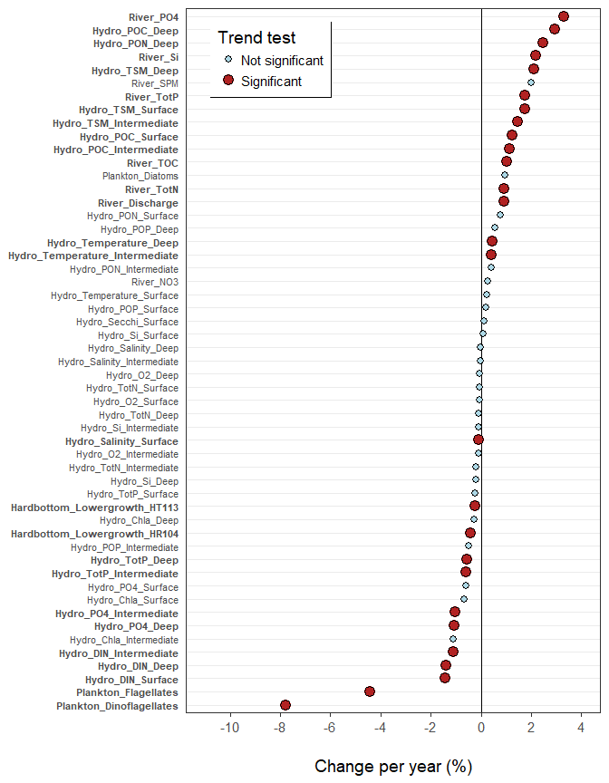

Non-parametric tests for trends over time  
* Performed both on
    + Annual data (ending in _a, plus rivergroup_springflood)
    + Seasonal data (for seasons separately)
* For seasonal data, note that hydrography + plankton + river seasons start in February in order to get a "full spring bloom" in quarter 1 from February to April
* Uses data from script 05b_ ( ex. df_rivers_summ_a)
* produces summarized data from different datatypes onn annual (Dat_a) and quarterly (Dat_q) for use in regression models (08_regression)
* produces plots of time series trends (Kap 3.2) for quarterly and annual data for the report
* Test = Mann-Kendall trend test (for P) and Theil-Sen's slope estimator (for percent change per year)   


DHJ: you borrowed much of this code from   'file:///C:/Data/Referanseelver_2018/Climate/05_Analysis_gridded_data_MK_TheilSen.html'    


## 0. Libraries

```r
library(tidyverse)
```

```
## -- Attaching packages -------------------------------------------------------------------------------------------------- tidyverse 1.2.1 --
```

```
## v ggplot2 2.2.1     v purrr   0.2.4
## v tibble  1.4.2     v dplyr   0.7.6
## v tidyr   0.8.1     v stringr 1.3.1
## v readr   1.1.1     v forcats 0.3.0
```

```
## -- Conflicts ----------------------------------------------------------------------------------------------------- tidyverse_conflicts() --
## x dplyr::filter() masks stats::filter()
## x dplyr::lag()    masks stats::lag()
```

```r
library(readxl)
library(broom)
library(lubridate)
```

```
## 
## Attaching package: 'lubridate'
```

```
## The following object is masked from 'package:base':
## 
##     date
```

```r
# install.packages("rkt")
library(rkt)        # rkt() - computes the Mann-Kendall tests and Theil-Sen's slope estimator

#citation ("rkt")
#citation ("ggplot2")

# library(pander)
save_plots <- FALSE
```

## 1. Data (annual and partly seasonal)  
### a. Read data
* rivers, hydrography and plankton are gathered from annual datasets produced in 05b_
* ON HOLD: indices and ordinations for plankton, soft and hard-bottom. 

```r
# rivers
df_rivers_summ_a <- read.csv("Data_produced/05_df_rivers_summ_a.csv")
#df_rivergroup_springflood <- read.csv("Data_produced/05_df_rivergroup_springflood.csv")

#hydrography
df_hydro_summ_a <- read.csv("Data_produced/05_df_hydro_summ_a.csv")

# plankton groups and ordination (use Bloom2)
df_plank_summ_a <- read.csv("Data_produced/05_df_plank_summ_a.csv")

# Hard-bottom lower growth limit - EQR from MSMDI (lower growth limit index)
df_lgm <- readr::read_csv2("Datasett/Hardbunn_KOPI/HBanalysesett2.csv")
```

```
## Using ',' as decimal and '.' as grouping mark. Use read_delim() for more control.
```

```
## Parsed with column specification:
## cols(
##   .default = col_integer(),
##   DCA1 = col_double(),
##   DCA2 = col_double(),
##   DCA3 = col_double(),
##   DCA4 = col_double(),
##   NMDS1 = col_double(),
##   NMDS2 = col_double(),
##   DCA1strand = col_double(),
##   DCA2strand = col_double(),
##   DCA3strand = col_double(),
##   DCA4strand = col_double(),
##   NMDS1strand = col_double(),
##   NMDS2strand = col_double(),
##   midTurf = col_double(),
##   midBarren = col_double(),
##   midFilter = col_double(),
##   midHerb = col_double(),
##   H = col_double(),
##   J = col_double(),
##   EQR = col_double()
## )
```

```
## See spec(...) for full column specifications.
```

```r
# ON HOLD: ordinations and indices
# df_plank_ord <- readr::read_csv2("Data_produced/P02ord.csv")
# 
# # soft bottom indices and ordinations
# df_blot_ind <- read.csv("Data_produced/01_df_blot_ind.csv")
# # retrieving softbottom ordinations ordinations
# df_blot_ord_05 <- readr::read_csv2("Data_produced/BBordSites_05.csv")
# #names(df_blot_ord_05)
# df_blot_ord_35 <- readr::read_csv2("Data_produced/BBordSites_35.csv")
# #names(df_blot_ord_35)
# # rename soft-bottom stations
# levels(df_blot_ind$STAS)[levels(df_blot_ind$STAS)=="B05"] <- "BR1"
# levels(df_blot_ind$STAS)[levels(df_blot_ind$STAS)=="B35"] <- "BT44"
#                           
# # hard-bottom indices and ordinations
# df_hard <- readr::read_csv2("Datasett/Hardbunn_KOPI/HBanalysesett.csv")
# # rename hard-bottom stations
# df_hard$Site[which(df_hard$Site==407)]<-"HT113"
# df_hard$Site[which(df_hard$Site==410)]<-"HR104"
# #str(df_hard)
# # select only the two stations we use
# df_hard <- df_hard %>%
#   filter(Site %in% c("HT113", "HR104"))
```

### b. Collect data  
* River data
    + discharge divided by 1 million, the rest divided by 1000

```r
# df1 = rivers
str(df_rivers_summ_a)
```

```
## 'data.frame':	27 obs. of  10 variables:
##  $ River_type: Factor w/ 1 level "Distant": 1 1 1 1 1 1 1 1 1 1 ...
##  $ Year      : int  1990 1991 1992 1993 1994 1995 1996 1997 1998 1999 ...
##  $ TotN      : num  19463081 16760373 19654146 21669290 22144055 ...
##  $ NO3       : num  12219257 10724983 13168085 13455592 14302161 ...
##  $ TotP      : num  615017 475914 552369 522731 416934 ...
##  $ TOC       : num  NA NA 1.43e+08 1.60e+08 1.82e+08 ...
##  $ Discharge : num  4.78e+10 3.49e+10 3.87e+10 4.67e+10 4.47e+10 ...
##  $ PO4       : num  252706 191504 182374 225769 150670 ...
##  $ SPM       : num  3.62e+08 1.46e+08 4.25e+08 2.83e+08 2.13e+08 ...
##  $ Si        : num  NA NA NA NA NA ...
```

```r
df1 <- df_rivers_summ_a %>%
  mutate(Discharge = Discharge/1E3) %>%
  gather("Variable", "Value", TotN:Si) %>%
  mutate(Variable = paste0("River", "_", Variable)) %>%
  mutate(Value = Value/1E3) %>%
  dplyr::select(Variable, Year, Value)

# HFR: removed these lines because only use distant river group
  #mutate(River_type = paste0("River_", River_type),
   #      Variable = sub("TrspTot_", "", Variable, fixed = TRUE)) %>%
  #mutate(Variable = paste0(River_type, "_", Variable),
         #Value = Value/1E3) %>%

# head(df1a)
#df1 %>% group_by(Variable) %>% summarise(mean(Value, na.rm = TRUE))

#df1b <- df_rivergroup_springflood %>%
 #rename(Floodmax = DisTot_max_rel, FloodmaxMonth = DisTot_max_month) %>%
# gather("Variable", "Value", Floodmax, FloodmaxMonth) %>%
 # mutate(River_type = paste0("River_", River_type)) %>%
#  mutate(Variable = paste0(River_type, "_", Variable)) %>%
 # select(Variable, Year, Value)
# head(df1b)

#df2= hydrography
#str(df_hydro_summ_a)
df2 <- df_hydro_summ_a %>%
  gather("Variable", "Value", Temperature, Salinity, O2, PO4, Si, Chla:DIN) %>%
  mutate(Variable = paste0("Hydro", "_", Variable, "_", Depth)) %>%
  filter(!(Variable %in% c("Hydro_Secchi_Intermediate", "Hydro_Secchi_Deep"))) %>%
  droplevels() %>%
  dplyr::select(Variable, Year, Value)

# df3a= plankton groups
#str (df_plank_summ_a)
df3a <- df_plank_summ_a %>%
  gather("Variable", "Value", Diatoms:Flagellates) %>%
  mutate(Variable = paste0("Plankton", "_", Variable)) %>%
  dplyr::select(Variable, Year,Value)

df4 <- df_lgm %>%
  filter(Site %in% c(407, 410)) %>%
  mutate(Station = case_when(Site == 407 ~ "HT113",
                             Site == 410 ~ "HR104")) %>%
  mutate(Variable = paste0("Hardbottom_Lowergrowth_", Station)) %>%
  rename(Value = EQR) %>%
  dplyr::select(Variable, Year, Value)


#ON HOLD: ordinations and indices
# # df3b= plankton DCA1
# df3b <- df_plank_ord %>%
#   gather("Variable", "Value", DCA1) %>%
#   mutate(Variable = paste0("Plankton", "_", Variable)) %>%
#   select(Variable, Year,Value)
# 
# # df4a = soft-bottom NQI
# #str (df_blot_ind)
# df4a <- df_blot_ind %>%
#   gather("Variable", "Value", NQI1) %>%
#   mutate(Variable = paste0("SoftBottom", "_", Variable, "_", STAS)) %>%
#   select(Variable, Year, Value)
# 
# # df4b + c = Soft-bottom ordinations for stations BR1 and BT44
# df4b <- df_blot_ord_05 %>%
#   gather("Variable", "Value", DCA1) %>%
#   mutate(Variable = paste0("SoftBottom", "_", Variable, "_", "BR1")) %>%
#   select(Variable, Year,Value)
# 
# df4c <- df_blot_ord_35 %>%
#   gather("Variable", "Value", DCA1) %>%
#   mutate(Variable = paste0("SoftBottom", "_", Variable, "_", "BT44")) %>%
#   select(Variable, Year, Value)
# 
# # df5 =  Hard bottom DCA1 and LGD for different species (can we summarize species?)
# #str (df_hard)
# df5 <- df_hard %>%
#   gather("Variable", "Value", DCA1, "LGD.Halidrys siliquosa":"LGD.Rhodomela confervoides") %>%
#   mutate(Variable = paste0("HardBottom", "_", Variable)) %>%
#   select(Variable, Year,Value)

# collect all datasets

#df3b, df4a, df4b, df4c, df5 #ON HOLD
dat_a <- rbind(df1, df2, df3a, df4) %>% as.data.frame()
#head(dat_a)
```

### c. Read quarterly data

```r
df_rivers_summ_q <- read.csv("Data_produced/05_df_rivers_summ_q.csv")
df_hydro_summ_q <- read.csv("Data_produced/05_df_hydro_summ_q.csv")
df_plank_summ_q <- read.csv("Data_produced/05_df_plank_summ_q.csv")

#str (df_rivers_summ_q)
#str (df_hydro_summ_q)
#str (df_plank_summ_q)
```

### d. Collect quarterly data  
* River data
    + discharge divided by 1 million, the rest divided by 1000

```r
df1 <- df_rivers_summ_q %>%
  mutate(Discharge = Discharge/1E3) %>%
  gather("Variable", "Value", TotN:Si) %>%
  mutate(Variable = paste0("River", "_", Variable)) %>%
  mutate(Value = Value/1E3) %>%
  select(Variable, Year, Quarter, Value)

head(df1)
```

<div data-pagedtable="false">
  <script data-pagedtable-source type="application/json">
{"columns":[{"label":[""],"name":["_rn_"],"type":[""],"align":["left"]},{"label":["Variable"],"name":[1],"type":["chr"],"align":["left"]},{"label":["Year"],"name":[2],"type":["int"],"align":["right"]},{"label":["Quarter"],"name":[3],"type":["int"],"align":["right"]},{"label":["Value"],"name":[4],"type":["dbl"],"align":["right"]}],"data":[{"1":"River_TotN","2":"1989","3":"4","4":"1034.482","_rn_":"1"},{"1":"River_TotN","2":"1990","3":"1","4":"6257.492","_rn_":"2"},{"1":"River_TotN","2":"1990","3":"2","4":"6155.458","_rn_":"3"},{"1":"River_TotN","2":"1990","3":"3","4":"3126.734","_rn_":"4"},{"1":"River_TotN","2":"1990","3":"4","4":"4862.858","_rn_":"5"},{"1":"River_TotN","2":"1991","3":"1","4":"5121.331","_rn_":"6"}],"options":{"columns":{"min":{},"max":[10]},"rows":{"min":[10],"max":[10]},"pages":{}}}
  </script>
</div>

```r
df1 %>% group_by(Variable) %>% summarise(mean(Value, na.rm = TRUE))
```

<div data-pagedtable="false">
  <script data-pagedtable-source type="application/json">
{"columns":[{"label":["Variable"],"name":[1],"type":["chr"],"align":["left"]},{"label":["mean(Value, na.rm = TRUE)"],"name":[2],"type":["dbl"],"align":["right"]}],"data":[{"1":"River_Discharge","2":"11743.11051"},{"1":"River_NO3","2":"3357.97931"},{"1":"River_PO4","2":"68.56124"},{"1":"River_Si","2":"39179.34919"},{"1":"River_SPM","2":"78646.85497"},{"1":"River_TOC","2":"45677.37418"},{"1":"River_TotN","2":"5587.79362"},{"1":"River_TotP","2":"140.58454"}],"options":{"columns":{"min":{},"max":[10]},"rows":{"min":[10],"max":[10]},"pages":{}}}
  </script>
</div>

```r
#str(df_hydro_summ_q)
df2 <- df_hydro_summ_q %>%
  gather("Variable", "Value", Temperature, Salinity, O2, PO4, Si, Chla:DIN) %>%
  mutate(Variable = paste0(Variable, "_", Depth)) %>%
  filter(!(Variable %in% c("Secchi_Intermediate", "Secchi_Deep"))) %>%
  select(Variable, Year, Quarter, Value) %>%
  select(Variable, Year, Quarter, Value)

#head(df2)

df3 <- df_plank_summ_q %>%
  gather("Variable", "Value", Diatoms:Flagellates) %>%
  select(Variable, Year, Quarter, Value)
head(df3)
```

<div data-pagedtable="false">
  <script data-pagedtable-source type="application/json">
{"columns":[{"label":[""],"name":["_rn_"],"type":[""],"align":["left"]},{"label":["Variable"],"name":[1],"type":["chr"],"align":["left"]},{"label":["Year"],"name":[2],"type":["int"],"align":["right"]},{"label":["Quarter"],"name":[3],"type":["int"],"align":["right"]},{"label":["Value"],"name":[4],"type":["dbl"],"align":["right"]}],"data":[{"1":"Diatoms","2":"1993","3":"4","4":"18850","_rn_":"1"},{"1":"Diatoms","2":"1994","3":"1","4":"2952617","_rn_":"2"},{"1":"Diatoms","2":"1994","3":"2","4":"167650","_rn_":"3"},{"1":"Diatoms","2":"1994","3":"3","4":"193850","_rn_":"4"},{"1":"Diatoms","2":"1994","3":"4","4":"78225","_rn_":"5"},{"1":"Diatoms","2":"1995","3":"1","4":"1218920","_rn_":"6"}],"options":{"columns":{"min":{},"max":[10]},"rows":{"min":[10],"max":[10]},"pages":{}}}
  </script>
</div>

```r
dat_q <- rbind(df1, df2, df3) %>% as.data.frame()
```

e. Save collected data

```r
write.csv(dat_a, "Data_produced/06_dat_a.csv", row.names = FALSE, quote = FALSE)
write.csv(dat_q, "Data_produced/06_dat_q.csv", row.names = FALSE, quote = FALSE)
```

## 3a. Define trend analysis functions
One for annual data, one for seasonal

```r
trend_analysis_a <- function(variable, data = dat_a){
  df <- data %>%
    filter(Variable %in% variable & !is.na(Value))
  result <- rkt(df$Year, df$Value)
  data.frame(Variable = variable, Quarter = "Annual", 
             P = result$sl, Estimate = result$B, 
             Change_perc = 100*result$B/quantile(df$Value, 0.5), stringsAsFactors = FALSE)
}

#debugonce(trend_analysis_a)
#trend_analysis_a("River_Distant_TOTN")

trend_analysis_q <- function(variable, quarter, data = dat_q){
  df <- data %>%
    filter(Variable %in% variable & Quarter %in% quarter & !is.na(Value))
  result <- rkt(df$Year, df$Value)
  data.frame(Variable = variable, Quarter = as.character(quarter), 
             P = result$sl, Estimate = result$B, 
             Change_perc = 100*result$B/quantile(df$Value, 0.5), stringsAsFactors = FALSE)
}

#trend_analysis_q("River_Distant_TOTN", 2)
```

## 3b. Annual data, perform analysis  

```r
# ?map

df <- dat_a %>%
  filter(!is.na(Value)) %>%
  group_by(Variable) %>%
  summarise(N = n()) %>%
  filter(N >= 8)
 
df_result_list <-  1:nrow(df) %>% map(~trend_analysis_a(df$Variable[.], data = dat_a))

df_result_a <- bind_rows(df_result_list)
```


## 3c. Quarterly data, perform analysis  

```r
# ?map
df <- dat_q %>%
  filter(!is.na(Value)) %>%
  group_by(Variable, Quarter) %>%
  summarise(N = n()) %>%
  filter(N >= 8)
 df_result_list <- 
  1:nrow(df) %>% map(~trend_analysis_q(df$Variable[.], df$Quarter[.], data = dat_q))
 df_result_q <- bind_rows(df_result_list)
```


## 4. Show results
### a. Most extreme changes

```r
# head = mest negative = st�rst reduksjon over tid.
df_result_q %>% arrange(Change_perc) %>% tail()
```

<div data-pagedtable="false">
  <script data-pagedtable-source type="application/json">
{"columns":[{"label":[""],"name":["_rn_"],"type":[""],"align":["left"]},{"label":["Variable"],"name":[1],"type":["chr"],"align":["left"]},{"label":["Quarter"],"name":[2],"type":["chr"],"align":["left"]},{"label":["P"],"name":[3],"type":["dbl"],"align":["right"]},{"label":["Estimate"],"name":[4],"type":["dbl"],"align":["right"]},{"label":["Change_perc"],"name":[5],"type":["dbl"],"align":["right"]}],"data":[{"1":"POC_Deep","2":"1","3":"0.0003069829","4":"0.252500","5":"3.295730","_rn_":"199"},{"1":"River_PO4","2":"4","3":"0.0312824954","4":"2.242285","5":"3.525094","_rn_":"200"},{"1":"River_Si","2":"3","3":"0.0240810052","4":"1128.740621","5":"3.736150","_rn_":"201"},{"1":"River_TotP","2":"3","3":"0.0030737830","4":"3.548403","5":"3.944501","_rn_":"202"},{"1":"River_SPM","2":"3","3":"0.0059270133","4":"1664.082204","5":"4.002590","_rn_":"203"},{"1":"River_PO4","2":"3","3":"0.0009883866","4":"2.109056","5":"5.838865","_rn_":"204"}],"options":{"columns":{"min":{},"max":[10]},"rows":{"min":[10],"max":[10]},"pages":{}}}
  </script>
</div>

```r
df_result_q %>% arrange(Change_perc) %>% head()
```

<div data-pagedtable="false">
  <script data-pagedtable-source type="application/json">
{"columns":[{"label":[""],"name":["_rn_"],"type":[""],"align":["left"]},{"label":["Variable"],"name":[1],"type":["chr"],"align":["left"]},{"label":["Quarter"],"name":[2],"type":["chr"],"align":["left"]},{"label":["P"],"name":[3],"type":["dbl"],"align":["right"]},{"label":["Estimate"],"name":[4],"type":["dbl"],"align":["right"]},{"label":["Change_perc"],"name":[5],"type":["dbl"],"align":["right"]}],"data":[{"1":"Dinoflagellates","2":"4","3":"2.382277e-05","4":"-3112.500","5":"-11.317153","_rn_":"1"},{"1":"Flagellates","2":"1","3":"3.939705e-02","4":"-128869.143","5":"-9.925010","_rn_":"2"},{"1":"Dinoflagellates","2":"2","3":"1.057007e-03","4":"-7815.333","5":"-9.234344","_rn_":"3"},{"1":"Dinoflagellates","2":"3","3":"7.445903e-05","4":"-8052.111","5":"-7.384142","_rn_":"4"},{"1":"Flagellates","2":"4","3":"3.033737e-02","4":"-56821.429","5":"-6.653594","_rn_":"5"},{"1":"Dinoflagellates","2":"1","3":"1.123178e-02","4":"-1715.667","5":"-5.324850","_rn_":"6"}],"options":{"columns":{"min":{},"max":[10]},"rows":{"min":[10],"max":[10]},"pages":{}}}
  </script>
</div>

## 5. Save results

```r
write.csv(df_result_a, "Data_produced/06_df_result_a.csv",
          row.names = FALSE, quote = FALSE)
write.csv(df_result_q, "Data_produced/06_df_result_q.csv",
          row.names = FALSE, quote = FALSE)
```

## 6. Some plots
### a. Dot plot theme

```r
# Code and theme from http://www.joyce-robbins.com/blog/2016/06/02/datavis-with-rdrawing-a-cleveland-dot-plot-with-ggplot2/
theme_dotplot <- theme_bw(14) +
    theme(axis.text.y = element_text(size = rel(.75)),
    	axis.ticks.y = element_blank(),
        axis.title.x = element_text(size = rel(.75)),
        panel.grid.major.x = element_blank(),
        panel.grid.major.y = element_line(size = 0.5),
        panel.grid.minor.x = element_blank())
```

### b. Plot one season

```r
qrt <- 2        
df <- df_result_q %>% filter(Quarter == qrt) 

ggplot(df, aes(x = Change_perc, y = reorder(Variable, Change_perc), size = factor(P < 0.05))) +
	geom_point(color = "blue") +
	scale_x_continuous(limits = c(-12, 4), breaks = seq(-12, 4, 2)) +
  scale_size_manual(values = c(2,4)) +
	# scale_size_continuous(limits = c(-12, 4), breaks = seq(-12, 4, 2)) +
	theme_dotplot +
	xlab("\nChange per year (%)") +
	ylab("Variable\n") +
	ggtitle(paste("Changes in quarter", qrt))
```

<!-- -->


### c. Plot for all seasons
* HFR: rather color code variables by datatype (river, hydro, plankton), instead of having it as prefix to variable?

```r
df_mean <- df_result_q  %>%
  group_by(Variable) %>%
  summarise(Mean_change = mean(Change_perc)) %>%
  arrange(Mean_change)

df <- df_result_q
df$Variable <- factor(df$Variable, levels = df_mean$Variable)
df$Quarter <- factor(df$Quarter)
df$P <- factor(df$P < 0.05, labels = c("Not significant", "Significant"))
# range(df$Change_perc)

cols <- RColorBrewer::brewer.pal(4, "RdBu")[c(3,4,1,2)]

# create the plot
ggplot(df, aes(x = Change_perc, y = Variable, fill = Quarter, size = P)) +
  geom_vline(xintercept = 0) +
	geom_point(pch = 21) +
  # scale_color_brewer(palette = "RdBu", direction = -1) +
  scale_fill_manual(values = cols) +
  scale_size_manual("Trend test", values = c(2.5,4)) +
	scale_x_continuous(limits = c(-11, 7), breaks = seq(-10, 6, 2)) +
	theme_dotplot +
	xlab("\nChange per year (%)") +
	ylab("Variable\n")
```

```
## Warning: Removed 1 rows containing missing values (geom_point).
```

<!-- -->

```r
if (save_plots)
  ggsave ("Figures_rapp/MannKendall_q.png", width = 7, height = 8, dpi=500)
```

### d. Plot trends for annual data

```r
# create the plot
df <- df_result_a
df$P <- factor(df$P < 0.05, labels = c("Not significant", "Significant"))
df <- df[order(df$Change_perc),]
# range(df$Change_perc)

gg <- ggplot(df, aes(x = Change_perc, y = reorder(Variable, Change_perc), fill = P, size = P)) +
  geom_vline(xintercept = 0) +
	geom_point(pch = 21) +
  scale_fill_manual("Trend test", values = c("lightblue", "firebrick")) +
  scale_size_manual("Trend test", values = c(2.5,4)) +
	scale_x_continuous(limits = c(-11, 4), breaks = seq(-10, 4, 2)) +
	theme_dotplot +
	xlab("\nChange per year (%)") +
	ylab("Variable\n")

gg + theme(
    legend.position = c(.35, .98),
    legend.justification = c("right", "top"),
    legend.box.just = "left",
    legend.box.background = element_rect(),
    legend.margin = margin(6, 6, 6, 6),
    axis.title.x = element_text(size = rel(1)),
    #axis.text.y = element_text(color = df$P),
    axis.text.y = element_text(face = c("plain","bold")[df$P]),
    axis.title.y = element_blank()
  )
```

<!-- -->

```r
if (save_plots)
  ggsave ("Figures_rapp/MannKendall_a.png", width = 7, height = 9, dpi=500)
```

## 7. Make table of trends for annual data 

```r
# install.packages("kableExtra")
library(kableExtra)

tab <- df_result_a %>%
  mutate(Var_order = sub("River", "01", Variable),             # Ordering River first, then Hydro etc.
         Var_order = sub("Hydro", "02", Var_order),
         Var_order = sub("Plankton", "03", Var_order),
         Var_order = sub("Hardbottom", "04", Var_order)) %>%
  arrange(Var_order) %>%
    mutate(
    car = row.names(.),
    Estimate = cell_spec(sprintf("%.4g", Estimate), bold = ifelse(P < 0.05, TRUE, FALSE)),
    Change_perc = cell_spec(sprintf("%.2f", Change_perc, 2), bold = ifelse(P < 0.05, TRUE, FALSE)),
    P = cell_spec(ifelse(P > 0.001, sprintf("%.2g", P), "<0.001"))
  ) %>%
  select(Variable, Estimate, Change_perc, P) %>%
  kable(escape = F) %>%
  kable_styling("condensed", full_width = F) 


if (save_plots)
  writeLines(tab, "Figures_rapp/MannKendall_a_table.html")
# result is opened in web browser, Ctrl-A (to select all) and then copy-pasted to Word/Googledocs

tab
```

<table class="table table-condensed" style="width: auto !important; margin-left: auto; margin-right: auto;">
 <thead>
  <tr>
   <th style="text-align:left;"> Variable </th>
   <th style="text-align:left;"> Estimate </th>
   <th style="text-align:left;"> Change_perc </th>
   <th style="text-align:left;"> P </th>
  </tr>
 </thead>
<tbody>
  <tr>
   <td style="text-align:left;"> River_Discharge </td>
   <td style="text-align:left;"> <span style=" font-weight: bold;    ">429.7</span> </td>
   <td style="text-align:left;"> <span style=" font-weight: bold;    ">0.90</span> </td>
   <td style="text-align:left;"> <span style="     ">0.011</span> </td>
  </tr>
  <tr>
   <td style="text-align:left;"> River_NO3 </td>
   <td style="text-align:left;"> <span style="     ">33.63</span> </td>
   <td style="text-align:left;"> <span style="     ">0.25</span> </td>
   <td style="text-align:left;"> <span style="     ">0.53</span> </td>
  </tr>
  <tr>
   <td style="text-align:left;"> River_PO4 </td>
   <td style="text-align:left;"> <span style=" font-weight: bold;    ">7.694</span> </td>
   <td style="text-align:left;"> <span style=" font-weight: bold;    ">3.30</span> </td>
   <td style="text-align:left;"> <span style="     ">0.0035</span> </td>
  </tr>
  <tr>
   <td style="text-align:left;"> River_Si </td>
   <td style="text-align:left;"> <span style=" font-weight: bold;    ">3347</span> </td>
   <td style="text-align:left;"> <span style=" font-weight: bold;    ">2.16</span> </td>
   <td style="text-align:left;"> <span style="     ">0.008</span> </td>
  </tr>
  <tr>
   <td style="text-align:left;"> River_SPM </td>
   <td style="text-align:left;"> <span style="     ">5849</span> </td>
   <td style="text-align:left;"> <span style="     ">2.00</span> </td>
   <td style="text-align:left;"> <span style="     ">0.1</span> </td>
  </tr>
  <tr>
   <td style="text-align:left;"> River_TOC </td>
   <td style="text-align:left;"> <span style=" font-weight: bold;    ">1881</span> </td>
   <td style="text-align:left;"> <span style=" font-weight: bold;    ">1.04</span> </td>
   <td style="text-align:left;"> <span style="     ">0.038</span> </td>
  </tr>
  <tr>
   <td style="text-align:left;"> River_TotN </td>
   <td style="text-align:left;"> <span style=" font-weight: bold;    ">199.7</span> </td>
   <td style="text-align:left;"> <span style=" font-weight: bold;    ">0.90</span> </td>
   <td style="text-align:left;"> <span style="     ">0.02</span> </td>
  </tr>
  <tr>
   <td style="text-align:left;"> River_TotP </td>
   <td style="text-align:left;"> <span style=" font-weight: bold;    ">9.103</span> </td>
   <td style="text-align:left;"> <span style=" font-weight: bold;    ">1.74</span> </td>
   <td style="text-align:left;"> <span style="     ">0.022</span> </td>
  </tr>
  <tr>
   <td style="text-align:left;"> Hydro_Chla_Deep </td>
   <td style="text-align:left;"> <span style="     ">-0.001048</span> </td>
   <td style="text-align:left;"> <span style="     ">-0.27</span> </td>
   <td style="text-align:left;"> <span style="     ">0.74</span> </td>
  </tr>
  <tr>
   <td style="text-align:left;"> Hydro_Chla_Intermediate </td>
   <td style="text-align:left;"> <span style="     ">-0.009473</span> </td>
   <td style="text-align:left;"> <span style="     ">-1.10</span> </td>
   <td style="text-align:left;"> <span style="     ">0.05</span> </td>
  </tr>
  <tr>
   <td style="text-align:left;"> Hydro_Chla_Surface </td>
   <td style="text-align:left;"> <span style="     ">-0.01144</span> </td>
   <td style="text-align:left;"> <span style="     ">-0.68</span> </td>
   <td style="text-align:left;"> <span style="     ">0.23</span> </td>
  </tr>
  <tr>
   <td style="text-align:left;"> Hydro_DIN_Deep </td>
   <td style="text-align:left;"> <span style=" font-weight: bold;    ">-0.08121</span> </td>
   <td style="text-align:left;"> <span style=" font-weight: bold;    ">-1.41</span> </td>
   <td style="text-align:left;"> <span style="     ">0.013</span> </td>
  </tr>
  <tr>
   <td style="text-align:left;"> Hydro_DIN_Intermediate </td>
   <td style="text-align:left;"> <span style=" font-weight: bold;    ">-0.0509</span> </td>
   <td style="text-align:left;"> <span style=" font-weight: bold;    ">-1.10</span> </td>
   <td style="text-align:left;"> <span style="     ">0.0027</span> </td>
  </tr>
  <tr>
   <td style="text-align:left;"> Hydro_DIN_Surface </td>
   <td style="text-align:left;"> <span style=" font-weight: bold;    ">-0.04959</span> </td>
   <td style="text-align:left;"> <span style=" font-weight: bold;    ">-1.43</span> </td>
   <td style="text-align:left;"> <span style="     ">0.0027</span> </td>
  </tr>
  <tr>
   <td style="text-align:left;"> Hydro_O2_Deep </td>
   <td style="text-align:left;"> <span style="     ">-0.004005</span> </td>
   <td style="text-align:left;"> <span style="     ">-0.07</span> </td>
   <td style="text-align:left;"> <span style="     ">0.13</span> </td>
  </tr>
  <tr>
   <td style="text-align:left;"> Hydro_O2_Intermediate </td>
   <td style="text-align:left;"> <span style="     ">-0.006723</span> </td>
   <td style="text-align:left;"> <span style="     ">-0.11</span> </td>
   <td style="text-align:left;"> <span style="     ">0.2</span> </td>
  </tr>
  <tr>
   <td style="text-align:left;"> Hydro_O2_Surface </td>
   <td style="text-align:left;"> <span style="     ">-0.004992</span> </td>
   <td style="text-align:left;"> <span style="     ">-0.07</span> </td>
   <td style="text-align:left;"> <span style="     ">0.21</span> </td>
  </tr>
  <tr>
   <td style="text-align:left;"> Hydro_PO4_Deep </td>
   <td style="text-align:left;"> <span style=" font-weight: bold;    ">-0.004692</span> </td>
   <td style="text-align:left;"> <span style=" font-weight: bold;    ">-1.08</span> </td>
   <td style="text-align:left;"> <span style="     ">&lt;0.001</span> </td>
  </tr>
  <tr>
   <td style="text-align:left;"> Hydro_PO4_Intermediate </td>
   <td style="text-align:left;"> <span style=" font-weight: bold;    ">-0.00307</span> </td>
   <td style="text-align:left;"> <span style=" font-weight: bold;    ">-1.04</span> </td>
   <td style="text-align:left;"> <span style="     ">0.0031</span> </td>
  </tr>
  <tr>
   <td style="text-align:left;"> Hydro_PO4_Surface </td>
   <td style="text-align:left;"> <span style="     ">-0.00133</span> </td>
   <td style="text-align:left;"> <span style="     ">-0.60</span> </td>
   <td style="text-align:left;"> <span style="     ">0.058</span> </td>
  </tr>
  <tr>
   <td style="text-align:left;"> Hydro_POC_Deep </td>
   <td style="text-align:left;"> <span style=" font-weight: bold;    ">0.2299</span> </td>
   <td style="text-align:left;"> <span style=" font-weight: bold;    ">2.94</span> </td>
   <td style="text-align:left;"> <span style="     ">&lt;0.001</span> </td>
  </tr>
  <tr>
   <td style="text-align:left;"> Hydro_POC_Intermediate </td>
   <td style="text-align:left;"> <span style=" font-weight: bold;    ">0.1067</span> </td>
   <td style="text-align:left;"> <span style=" font-weight: bold;    ">1.13</span> </td>
   <td style="text-align:left;"> <span style="     ">0.004</span> </td>
  </tr>
  <tr>
   <td style="text-align:left;"> Hydro_POC_Surface </td>
   <td style="text-align:left;"> <span style=" font-weight: bold;    ">0.196</span> </td>
   <td style="text-align:left;"> <span style=" font-weight: bold;    ">1.25</span> </td>
   <td style="text-align:left;"> <span style="     ">0.0031</span> </td>
  </tr>
  <tr>
   <td style="text-align:left;"> Hydro_PON_Deep </td>
   <td style="text-align:left;"> <span style=" font-weight: bold;    ">0.02417</span> </td>
   <td style="text-align:left;"> <span style=" font-weight: bold;    ">2.47</span> </td>
   <td style="text-align:left;"> <span style="     ">0.0051</span> </td>
  </tr>
  <tr>
   <td style="text-align:left;"> Hydro_PON_Intermediate </td>
   <td style="text-align:left;"> <span style="     ">0.005212</span> </td>
   <td style="text-align:left;"> <span style="     ">0.39</span> </td>
   <td style="text-align:left;"> <span style="     ">0.32</span> </td>
  </tr>
  <tr>
   <td style="text-align:left;"> Hydro_PON_Surface </td>
   <td style="text-align:left;"> <span style="     ">0.01479</span> </td>
   <td style="text-align:left;"> <span style="     ">0.77</span> </td>
   <td style="text-align:left;"> <span style="     ">0.12</span> </td>
  </tr>
  <tr>
   <td style="text-align:left;"> Hydro_POP_Deep </td>
   <td style="text-align:left;"> <span style="     ">0.0003246</span> </td>
   <td style="text-align:left;"> <span style="     ">0.56</span> </td>
   <td style="text-align:left;"> <span style="     ">0.28</span> </td>
  </tr>
  <tr>
   <td style="text-align:left;"> Hydro_POP_Intermediate </td>
   <td style="text-align:left;"> <span style="     ">-0.0003997</span> </td>
   <td style="text-align:left;"> <span style="     ">-0.49</span> </td>
   <td style="text-align:left;"> <span style="     ">0.4</span> </td>
  </tr>
  <tr>
   <td style="text-align:left;"> Hydro_POP_Surface </td>
   <td style="text-align:left;"> <span style="     ">0.0002597</span> </td>
   <td style="text-align:left;"> <span style="     ">0.19</span> </td>
   <td style="text-align:left;"> <span style="     ">0.72</span> </td>
  </tr>
  <tr>
   <td style="text-align:left;"> Hydro_Salinity_Deep </td>
   <td style="text-align:left;"> <span style="     ">-0.002855</span> </td>
   <td style="text-align:left;"> <span style="     ">-0.01</span> </td>
   <td style="text-align:left;"> <span style="     ">0.32</span> </td>
  </tr>
  <tr>
   <td style="text-align:left;"> Hydro_Salinity_Intermediate </td>
   <td style="text-align:left;"> <span style="     ">-0.01134</span> </td>
   <td style="text-align:left;"> <span style="     ">-0.03</span> </td>
   <td style="text-align:left;"> <span style="     ">0.12</span> </td>
  </tr>
  <tr>
   <td style="text-align:left;"> Hydro_Salinity_Surface </td>
   <td style="text-align:left;"> <span style=" font-weight: bold;    ">-0.03101</span> </td>
   <td style="text-align:left;"> <span style=" font-weight: bold;    ">-0.11</span> </td>
   <td style="text-align:left;"> <span style="     ">0.037</span> </td>
  </tr>
  <tr>
   <td style="text-align:left;"> Hydro_Secchi_Surface </td>
   <td style="text-align:left;"> <span style="     ">0.01003</span> </td>
   <td style="text-align:left;"> <span style="     ">0.13</span> </td>
   <td style="text-align:left;"> <span style="     ">0.85</span> </td>
  </tr>
  <tr>
   <td style="text-align:left;"> Hydro_Si_Deep </td>
   <td style="text-align:left;"> <span style="     ">-0.007894</span> </td>
   <td style="text-align:left;"> <span style="     ">-0.21</span> </td>
   <td style="text-align:left;"> <span style="     ">0.43</span> </td>
  </tr>
  <tr>
   <td style="text-align:left;"> Hydro_Si_Intermediate </td>
   <td style="text-align:left;"> <span style="     ">-0.002968</span> </td>
   <td style="text-align:left;"> <span style="     ">-0.10</span> </td>
   <td style="text-align:left;"> <span style="     ">0.68</span> </td>
  </tr>
  <tr>
   <td style="text-align:left;"> Hydro_Si_Surface </td>
   <td style="text-align:left;"> <span style="     ">0.002418</span> </td>
   <td style="text-align:left;"> <span style="     ">0.08</span> </td>
   <td style="text-align:left;"> <span style="     ">0.93</span> </td>
  </tr>
  <tr>
   <td style="text-align:left;"> Hydro_Temperature_Deep </td>
   <td style="text-align:left;"> <span style=" font-weight: bold;    ">0.03856</span> </td>
   <td style="text-align:left;"> <span style=" font-weight: bold;    ">0.44</span> </td>
   <td style="text-align:left;"> <span style="     ">0.0052</span> </td>
  </tr>
  <tr>
   <td style="text-align:left;"> Hydro_Temperature_Intermediate </td>
   <td style="text-align:left;"> <span style=" font-weight: bold;    ">0.03822</span> </td>
   <td style="text-align:left;"> <span style=" font-weight: bold;    ">0.40</span> </td>
   <td style="text-align:left;"> <span style="     ">0.017</span> </td>
  </tr>
  <tr>
   <td style="text-align:left;"> Hydro_Temperature_Surface </td>
   <td style="text-align:left;"> <span style="     ">0.0221</span> </td>
   <td style="text-align:left;"> <span style="     ">0.22</span> </td>
   <td style="text-align:left;"> <span style="     ">0.087</span> </td>
  </tr>
  <tr>
   <td style="text-align:left;"> Hydro_TotN_Deep </td>
   <td style="text-align:left;"> <span style="     ">-0.01429</span> </td>
   <td style="text-align:left;"> <span style="     ">-0.09</span> </td>
   <td style="text-align:left;"> <span style="     ">0.74</span> </td>
  </tr>
  <tr>
   <td style="text-align:left;"> Hydro_TotN_Intermediate </td>
   <td style="text-align:left;"> <span style="     ">-0.02893</span> </td>
   <td style="text-align:left;"> <span style="     ">-0.19</span> </td>
   <td style="text-align:left;"> <span style="     ">0.42</span> </td>
  </tr>
  <tr>
   <td style="text-align:left;"> Hydro_TotN_Surface </td>
   <td style="text-align:left;"> <span style="     ">-0.01162</span> </td>
   <td style="text-align:left;"> <span style="     ">-0.07</span> </td>
   <td style="text-align:left;"> <span style="     ">0.9</span> </td>
  </tr>
  <tr>
   <td style="text-align:left;"> Hydro_TotP_Deep </td>
   <td style="text-align:left;"> <span style=" font-weight: bold;    ">-0.003718</span> </td>
   <td style="text-align:left;"> <span style=" font-weight: bold;    ">-0.57</span> </td>
   <td style="text-align:left;"> <span style="     ">0.0072</span> </td>
  </tr>
  <tr>
   <td style="text-align:left;"> Hydro_TotP_Intermediate </td>
   <td style="text-align:left;"> <span style=" font-weight: bold;    ">-0.003199</span> </td>
   <td style="text-align:left;"> <span style=" font-weight: bold;    ">-0.60</span> </td>
   <td style="text-align:left;"> <span style="     ">0.0082</span> </td>
  </tr>
  <tr>
   <td style="text-align:left;"> Hydro_TotP_Surface </td>
   <td style="text-align:left;"> <span style="     ">-0.001271</span> </td>
   <td style="text-align:left;"> <span style="     ">-0.25</span> </td>
   <td style="text-align:left;"> <span style="     ">0.22</span> </td>
  </tr>
  <tr>
   <td style="text-align:left;"> Hydro_TSM_Deep </td>
   <td style="text-align:left;"> <span style=" font-weight: bold;    ">0.01893</span> </td>
   <td style="text-align:left;"> <span style=" font-weight: bold;    ">2.10</span> </td>
   <td style="text-align:left;"> <span style="     ">&lt;0.001</span> </td>
  </tr>
  <tr>
   <td style="text-align:left;"> Hydro_TSM_Intermediate </td>
   <td style="text-align:left;"> <span style=" font-weight: bold;    ">0.01102</span> </td>
   <td style="text-align:left;"> <span style=" font-weight: bold;    ">1.44</span> </td>
   <td style="text-align:left;"> <span style="     ">&lt;0.001</span> </td>
  </tr>
  <tr>
   <td style="text-align:left;"> Hydro_TSM_Surface </td>
   <td style="text-align:left;"> <span style=" font-weight: bold;    ">0.01581</span> </td>
   <td style="text-align:left;"> <span style=" font-weight: bold;    ">1.74</span> </td>
   <td style="text-align:left;"> <span style="     ">&lt;0.001</span> </td>
  </tr>
  <tr>
   <td style="text-align:left;"> Plankton_Diatoms </td>
   <td style="text-align:left;"> <span style="     ">3198</span> </td>
   <td style="text-align:left;"> <span style="     ">0.95</span> </td>
   <td style="text-align:left;"> <span style="     ">0.75</span> </td>
  </tr>
  <tr>
   <td style="text-align:left;"> Plankton_Dinoflagellates </td>
   <td style="text-align:left;"> <span style=" font-weight: bold;    ">-5522</span> </td>
   <td style="text-align:left;"> <span style=" font-weight: bold;    ">-7.79</span> </td>
   <td style="text-align:left;"> <span style="     ">&lt;0.001</span> </td>
  </tr>
  <tr>
   <td style="text-align:left;"> Plankton_Flagellates </td>
   <td style="text-align:left;"> <span style=" font-weight: bold;    ">-1.154e+05</span> </td>
   <td style="text-align:left;"> <span style=" font-weight: bold;    ">-4.42</span> </td>
   <td style="text-align:left;"> <span style="     ">0.015</span> </td>
  </tr>
  <tr>
   <td style="text-align:left;"> Hardbottom_Lowergrowth_HR104 </td>
   <td style="text-align:left;"> <span style=" font-weight: bold;    ">-0.003846</span> </td>
   <td style="text-align:left;"> <span style=" font-weight: bold;    ">-0.43</span> </td>
   <td style="text-align:left;"> <span style="     ">0.0043</span> </td>
  </tr>
  <tr>
   <td style="text-align:left;"> Hardbottom_Lowergrowth_HT113 </td>
   <td style="text-align:left;"> <span style=" font-weight: bold;    ">-0.002308</span> </td>
   <td style="text-align:left;"> <span style=" font-weight: bold;    ">-0.25</span> </td>
   <td style="text-align:left;"> <span style="     ">0.04</span> </td>
  </tr>
</tbody>
</table>


