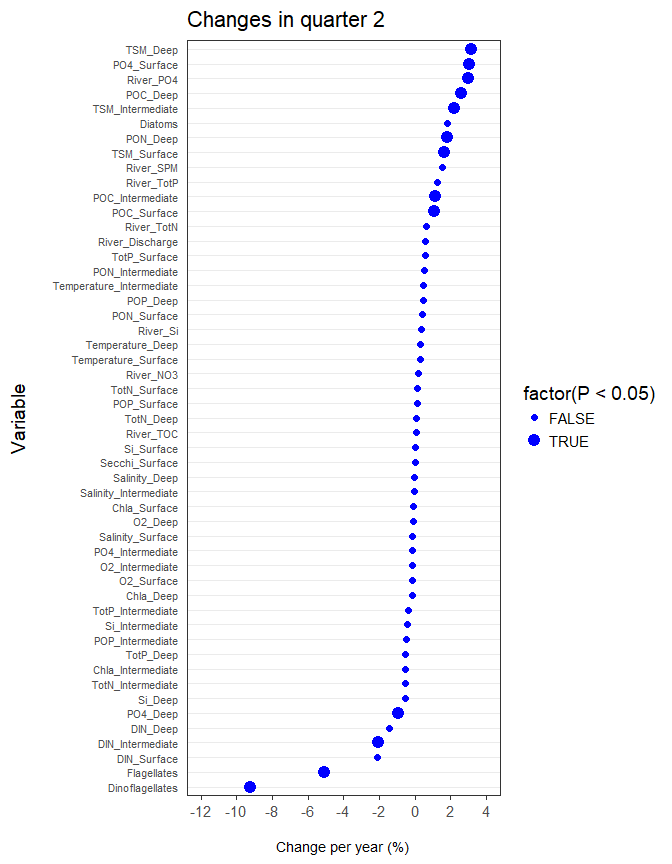
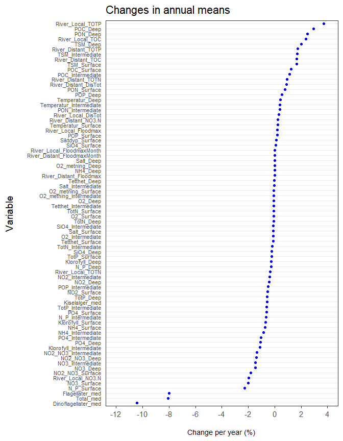

Non-parametric tests for trends over time  
* Performed for seasons separately (note that hydrography + plankton seasons start in December)  
* Uses data from script 05  
* Test = Mann-Kendall trend test (for P) and Theil-Sen's slope estimator (for percent change per year)   
__NOTE: Have yet to include timing of spring flood (df_rivers_springflood) and DCA scores.__
  

DHJ: you borrowed much of this code from   'file:///C:/Data/Referanseelver_2018/Climate/05_Analysis_gridded_data_MK_TheilSen.html'    


## 0. Libraries

```r
library(tidyverse)
```

```
## -- Attaching packages --------------------------------------------------------------------------------------- tidyverse 1.2.1 --
```

```
## v ggplot2 2.2.1     v purrr   0.2.4
## v tibble  1.4.2     v dplyr   0.7.6
## v tidyr   0.8.1     v stringr 1.3.1
## v readr   1.1.1     v forcats 0.3.0
```

```
## -- Conflicts ------------------------------------------------------------------------------------------ tidyverse_conflicts() --
## x dplyr::filter() masks stats::filter()
## x dplyr::lag()    masks stats::lag()
```

```r
library(readxl)
library(broom)
library(lubridate)
```

```
## 
## Attaching package: 'lubridate'
```

```
## The following object is masked from 'package:base':
## 
##     date
```

```r
# install.packages("rkt") 
library(rkt)        # rkt() - computes the Mann-Kendall tests and Theil-Sen's slope estimator

# library(pander)
```

## 1. Data  
### a. Read annual data

```r
df_rivers_summ_a <- read.csv("Data_produced/05_df_rivers_summ_a.csv")
df_rivergroup_springflood <- read.csv("Data_produced/05_df_rivergroup_springflood.csv")
df_hydro_summ_a <- read.csv("Data_produced/05_df_hydro_summ_a.csv")
df_plank_summ_a <- read.csv("Data_produced/05_df_plank_summ_a.csv")
```

### b. Collect annual data  
* River data
    + discharge divided by 1 million, the rest divided by 1000

```r
df1a <- df_rivers_summ_a %>%
  mutate(DisTot = DisTot/1E3) %>%
  gather("Variable", "Value", TrspTot_TOTN:DisTot) %>%
  mutate(River_type = paste0("River_", River_type),
         Variable = sub("TrspTot_", "", Variable, fixed = TRUE)) %>%
  mutate(Variable = paste0(River_type, "_", Variable),
         Value = Value/1E3) %>%
  select(Variable, Year, Value)
# head(df1a)
# df1 %>% group_by(Variable) %>% summarise(mean(Value, na.rm = TRUE))

df1b <- df_rivergroup_springflood %>%
  rename(Floodmax = DisTot_max_rel, FloodmaxMonth = DisTot_max_month) %>%
  gather("Variable", "Value", Floodmax, FloodmaxMonth) %>%
  mutate(River_type = paste0("River_", River_type)) %>%
  mutate(Variable = paste0(River_type, "_", Variable)) %>%
  select(Variable, Year, Value)
# head(df1b)

df2 <- df_hydro_summ_a %>%
  gather("Variable", "Value", Temperatur:Siktdyp) %>%
  mutate(Variable = paste0(Variable, "_", Depth)) %>%
  filter(!(Variable %in% c("Siktdyp_Intermediate", "Siktdyp_Deep"))) %>%
  select(Variable, Year, Value)

# head(df2)

df3 <- df_plank_summ_a %>%
  gather("Variable", "Value", Kiselalger_med:Total_med) %>%
  select(Variable, Year,Value)
# head(df3)

dat_a <- rbind(df1a, df1b, df2, df3) %>% as.data.frame()
head(dat_a)
```

<div data-pagedtable="false">
  <script data-pagedtable-source type="application/json">
{"columns":[{"label":[""],"name":["_rn_"],"type":[""],"align":["left"]},{"label":["Variable"],"name":[1],"type":["chr"],"align":["left"]},{"label":["Year"],"name":[2],"type":["int"],"align":["right"]},{"label":["Value"],"name":[3],"type":["dbl"],"align":["right"]}],"data":[{"1":"River_Distant_TOTN","2":"1990","3":"19293.66","_rn_":"1"},{"1":"River_Distant_TOTN","2":"1991","3":"16613.25","_rn_":"2"},{"1":"River_Distant_TOTN","2":"1992","3":"19542.83","_rn_":"3"},{"1":"River_Distant_TOTN","2":"1993","3":"21567.78","_rn_":"4"},{"1":"River_Distant_TOTN","2":"1994","3":"21913.44","_rn_":"5"},{"1":"River_Distant_TOTN","2":"1995","3":"23495.48","_rn_":"6"}],"options":{"columns":{"min":{},"max":[10]},"rows":{"min":[10],"max":[10]},"pages":{}}}
  </script>
</div>

### c. Read quarterly data

```r
df_rivers_summ_q <- read.csv("Data_produced/05_df_rivers_summ_q.csv")
df_hydro_summ_q <- read.csv("Data_produced/05_df_hydro_summ_q.csv")
df_plank_summ_q <- read.csv("Data_produced/05_df_plank_summ_q.csv")
```

### b. Collect quarterly data  
* River data
    + discharge divided by 1 million, the rest divided by 1000

```r
df1 <- df_rivers_summ_q %>%
  mutate(DisTot = DisTot/1E3) %>%
  gather("Variable", "Value", TrspTot_TOTN:DisTot) %>%
  mutate(River_type = paste0("River_", River_type),
         Variable = sub("TrspTot_", "", Variable, fixed = TRUE)) %>%
  mutate(Variable = paste0(River_type, "_", Variable),
         Value = Value/1E3) %>%
  select(Variable, Year, Quarter, Value)
head(df1)
```

<div data-pagedtable="false">
  <script data-pagedtable-source type="application/json">
{"columns":[{"label":[""],"name":["_rn_"],"type":[""],"align":["left"]},{"label":["Variable"],"name":[1],"type":["chr"],"align":["left"]},{"label":["Year"],"name":[2],"type":["int"],"align":["right"]},{"label":["Quarter"],"name":[3],"type":["int"],"align":["right"]},{"label":["Value"],"name":[4],"type":["dbl"],"align":["right"]}],"data":[{"1":"River_Distant_TOTN","2":"1990","3":"1","4":"5328.489","_rn_":"1"},{"1":"River_Distant_TOTN","2":"1990","3":"2","4":"5768.432","_rn_":"2"},{"1":"River_Distant_TOTN","2":"1990","3":"3","4":"4263.842","_rn_":"3"},{"1":"River_Distant_TOTN","2":"1990","3":"4","4":"3932.900","_rn_":"4"},{"1":"River_Distant_TOTN","2":"1991","3":"1","4":"4654.831","_rn_":"5"},{"1":"River_Distant_TOTN","2":"1991","3":"2","4":"4990.752","_rn_":"6"}],"options":{"columns":{"min":{},"max":[10]},"rows":{"min":[10],"max":[10]},"pages":{}}}
  </script>
</div>

```r
# df1 %>% group_by(Variable) %>% summarise(mean(Value, na.rm = TRUE))


df2 <- df_hydro_summ_q %>%
  gather("Variable", "Value", Temperatur:Siktdyp) %>%
  mutate(Variable = paste0(Variable, "_", Depth)) %>%
  filter(!(Variable %in% c("Siktdyp_Intermediate", "Siktdyp_Deep"))) %>%
  select(Variable, Year, Quarter, Value) %>%
  select(Variable, Year, Quarter, Value)

head(df2)
```

<div data-pagedtable="false">
  <script data-pagedtable-source type="application/json">
{"columns":[{"label":[""],"name":["_rn_"],"type":[""],"align":["left"]},{"label":["Variable"],"name":[1],"type":["chr"],"align":["left"]},{"label":["Year"],"name":[2],"type":["int"],"align":["right"]},{"label":["Quarter"],"name":[3],"type":["int"],"align":["right"]},{"label":["Value"],"name":[4],"type":["dbl"],"align":["right"]}],"data":[{"1":"Temperatur_Deep","2":"1990","3":"1","4":"6.827000","_rn_":"1"},{"1":"Temperatur_Intermediate","2":"1990","3":"1","4":"6.507000","_rn_":"2"},{"1":"Temperatur_Surface","2":"1990","3":"1","4":"5.990500","_rn_":"3"},{"1":"Temperatur_Deep","2":"1990","3":"2","4":"6.749625","_rn_":"4"},{"1":"Temperatur_Intermediate","2":"1990","3":"2","4":"6.850250","_rn_":"5"},{"1":"Temperatur_Surface","2":"1990","3":"2","4":"7.659833","_rn_":"6"}],"options":{"columns":{"min":{},"max":[10]},"rows":{"min":[10],"max":[10]},"pages":{}}}
  </script>
</div>

```r
df3 <- df_plank_summ_q %>%
  gather("Variable", "Value", Kiselalger_med:Total_med) %>%
  select(Variable, Year, Quarter, Value)
head(df3)
```

<div data-pagedtable="false">
  <script data-pagedtable-source type="application/json">
{"columns":[{"label":[""],"name":["_rn_"],"type":[""],"align":["left"]},{"label":["Variable"],"name":[1],"type":["chr"],"align":["left"]},{"label":["Year"],"name":[2],"type":["int"],"align":["right"]},{"label":["Quarter"],"name":[3],"type":["int"],"align":["right"]},{"label":["Value"],"name":[4],"type":["int"],"align":["right"]}],"data":[{"1":"Kiselalger_med","2":"1994","3":"1","4":"21050","_rn_":"1"},{"1":"Kiselalger_med","2":"1994","3":"2","4":"1109400","_rn_":"2"},{"1":"Kiselalger_med","2":"1994","3":"3","4":"113800","_rn_":"3"},{"1":"Kiselalger_med","2":"1994","3":"4","4":"183000","_rn_":"4"},{"1":"Kiselalger_med","2":"1995","3":"1","4":"10400","_rn_":"5"},{"1":"Kiselalger_med","2":"1995","3":"2","4":"97100","_rn_":"6"}],"options":{"columns":{"min":{},"max":[10]},"rows":{"min":[10],"max":[10]},"pages":{}}}
  </script>
</div>

```r
dat_q <- rbind(df1, df2, df3) %>% as.data.frame()
```

## 3a. Define trend analysis functions
One for annual data, one for swasonal

```r
trend_analysis_a <- function(variable, data = dat_a){
  df <- data %>%
    filter(Variable %in% variable & !is.na(Value))
  result <- rkt(df$Year, df$Value)
  data.frame(Variable = variable, Quarter = "Annual", 
             P = result$sl, Estimate = result$B, 
             Change_perc = 100*result$B/quantile(df$Value, 0.5), stringsAsFactors = FALSE)
}

# debugonce(trend_analysis_a)
# trend_analysis_a("River_Distant_TOTN")

  
trend_analysis_q <- function(variable, quarter, data = dat_q){
  df <- data %>%
    filter(Variable %in% variable & Quarter %in% quarter & !is.na(Value))
  result <- rkt(df$Year, df$Value)
  data.frame(Variable = variable, Quarter = as.character(quarter), 
             P = result$sl, Estimate = result$B, 
             Change_perc = 100*result$B/quantile(df$Value, 0.5), stringsAsFactors = FALSE)
}
# trend_analysis_q("River_Distant_TOTN", 2)
```


## 3b. Annual data, perform analysis  

```r
# ?map
df <- dat_a %>%
  filter(!is.na(Value)) %>%
  group_by(Variable) %>%
  summarise(N = n()) %>%
  filter(N >= 8)

df_result_list <- 
  1:nrow(df) %>% map(~trend_analysis_a(df$Variable[.], data = dat_a))

df_result_a <- bind_rows(df_result_list)
```


## 3b. Quarterly data, perform analysis  

```r
# ?map
df <- dat_q %>%
  filter(!is.na(Value)) %>%
  group_by(Variable, Quarter) %>%
  summarise(N = n()) %>%
  filter(N >= 8)

df_result_list <- 
  1:nrow(df) %>% map(~trend_analysis_q(df$Variable[.], df$Quarter[.], data = dat_q))

df_result_q <- bind_rows(df_result_list)
```

## 4. Show results
### a. Most extreme changes

```r
df_result_q %>% arrange(Change_perc) %>% tail()
```

<div data-pagedtable="false">
  <script data-pagedtable-source type="application/json">
{"columns":[{"label":[""],"name":["_rn_"],"type":[""],"align":["left"]},{"label":["Variable"],"name":[1],"type":["chr"],"align":["left"]},{"label":["Quarter"],"name":[2],"type":["chr"],"align":["left"]},{"label":["P"],"name":[3],"type":["dbl"],"align":["right"]},{"label":["Estimate"],"name":[4],"type":["dbl"],"align":["right"]},{"label":["Change_perc"],"name":[5],"type":["dbl"],"align":["right"]}],"data":[{"1":"POC_Deep","2":"2","3":"5.813974e-04","4":"0.2733281","5":"3.555487","_rn_":"283"},{"1":"POC_Deep","2":"1","3":"6.225244e-05","4":"0.2714286","5":"3.961015","_rn_":"284"},{"1":"River_Local_TOTP","2":"2","3":"9.103815e-02","4":"0.1780480","5":"4.202670","_rn_":"285"},{"1":"River_Local_TOTP","2":"1","3":"1.839449e-02","4":"0.1333004","5":"4.751949","_rn_":"286"},{"1":"River_Local_TOTP","2":"3","3":"2.295842e-02","4":"0.1832913","5":"5.213545","_rn_":"287"},{"1":"River_Local_TOTP","2":"4","3":"2.295842e-02","4":"0.2449224","5":"6.411754","_rn_":"288"}],"options":{"columns":{"min":{},"max":[10]},"rows":{"min":[10],"max":[10]},"pages":{}}}
  </script>
</div>

```r
df_result_q %>% arrange(Change_perc) %>% head()
```

<div data-pagedtable="false">
  <script data-pagedtable-source type="application/json">
{"columns":[{"label":[""],"name":["_rn_"],"type":[""],"align":["left"]},{"label":["Variable"],"name":[1],"type":["chr"],"align":["left"]},{"label":["Quarter"],"name":[2],"type":["chr"],"align":["left"]},{"label":["P"],"name":[3],"type":["dbl"],"align":["right"]},{"label":["Estimate"],"name":[4],"type":["dbl"],"align":["right"]},{"label":["Change_perc"],"name":[5],"type":["dbl"],"align":["right"]}],"data":[{"1":"Dinoflagellater_med","2":"4","3":"1.482216e-05","4":"-5470.000","5":"-11.019339","_rn_":"1"},{"1":"Flagellater_med","2":"2","3":"2.186816e-03","4":"-187587.917","5":"-10.989333","_rn_":"2"},{"1":"Dinoflagellater_med","2":"3","3":"4.016441e-04","4":"-6813.158","5":"-9.084211","_rn_":"3"},{"1":"Total_med","2":"2","3":"3.670769e-03","4":"-199717.500","5":"-9.064101","_rn_":"4"},{"1":"Total_med","2":"1","3":"5.614106e-02","4":"-57248.222","5":"-7.943695","_rn_":"5"},{"1":"Flagellater_med","2":"1","3":"6.283882e-02","4":"-49191.213","5":"-7.684086","_rn_":"6"}],"options":{"columns":{"min":{},"max":[10]},"rows":{"min":[10],"max":[10]},"pages":{}}}
  </script>
</div>

## 5. Save results

```r
write.csv(df_result_a, "Data_produced/06_df_result_a.csv",
          row.names = FALSE, quote = FALSE)
write.csv(df_result_q, "Data_produced/06_df_result_q.csv",
          row.names = FALSE, quote = FALSE)
```

## 6. Some plots
### a. Dot plot theme

```r
# Code and theme from http://www.joyce-robbins.com/blog/2016/06/02/datavis-with-rdrawing-a-cleveland-dot-plot-with-ggplot2/
theme_dotplot <- theme_bw(14) +
    theme(axis.text.y = element_text(size = rel(.75)),
    	axis.ticks.y = element_blank(),
        axis.title.x = element_text(size = rel(.75)),
        panel.grid.major.x = element_blank(),
        panel.grid.major.y = element_line(size = 0.5),
        panel.grid.minor.x = element_blank())
```

### b. Plot one season

```r
qrt <- 2        
df <- df_result_q %>% filter(Quarter == qrt) 
```


### c. Plot for all seasons

```r
df_mean <- df_result_q  %>%
  group_by(Variable) %>%
  summarise(Mean_change = mean(Change_perc)) %>%
  arrange(Mean_change)

df <- df_result_q 
df$Variable <- factor(df$Variable, levels = df_mean$Variable)
df$Quarter <- factor(df$Quarter)

cols <- RColorBrewer::brewer.pal(4, "RdBu")[c(3,4,1,2)]
# create the plot
ggplot(df, aes(x = Change_perc, y = Variable, color = Quarter)) +
  geom_vline(xintercept = 0) +
	geom_point(size = 2) +
  # scale_color_brewer(palette = "RdBu", direction = -1) +
  scale_color_manual(values = cols) +
	scale_x_continuous(limits = c(-12, 4), breaks = seq(-12, 4, 2)) +
	theme_dotplot +
	xlab("\nChange per year (%)") +
	ylab("Variable\n")
```

```
## Warning: Removed 4 rows containing missing values (geom_point).
```

<!-- -->

### d. Plot trends for annual data

```r
# create the plot
ggplot(df_result_a, aes(x = Change_perc, y = reorder(Variable, Change_perc))) +
	geom_point(color = "blue") +
	scale_x_continuous(limits = c(-12, 4),
		breaks = seq(-12, 4, 2)) +
	theme_dotplot +
	xlab("\nChange per year (%)") +
	ylab("Variable\n") +
	ggtitle("Changes in annual means")
```

<!-- -->

