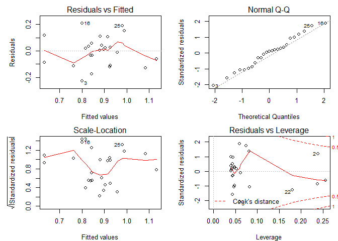
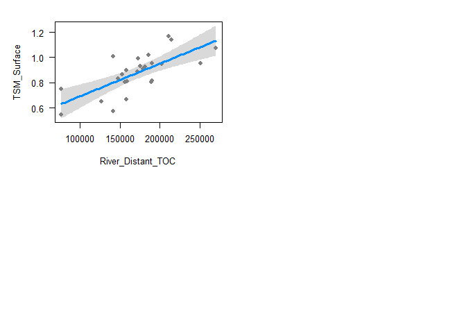
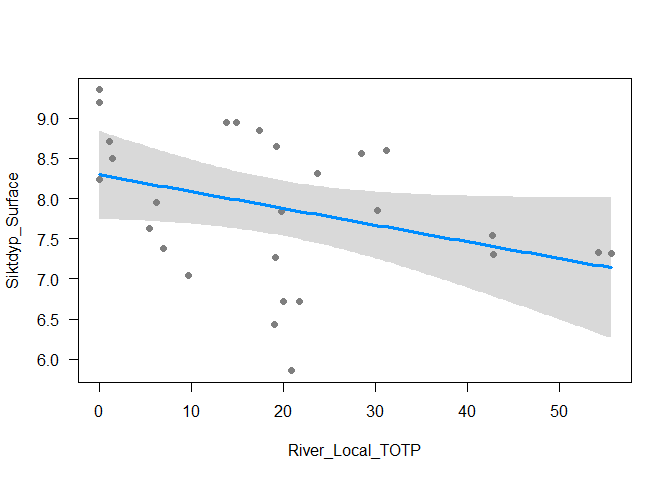
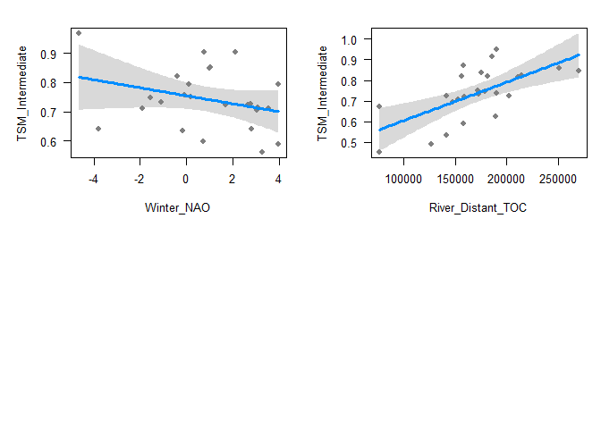
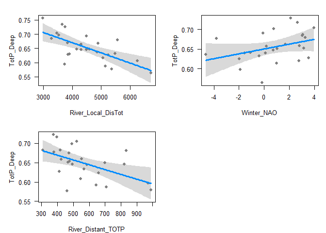
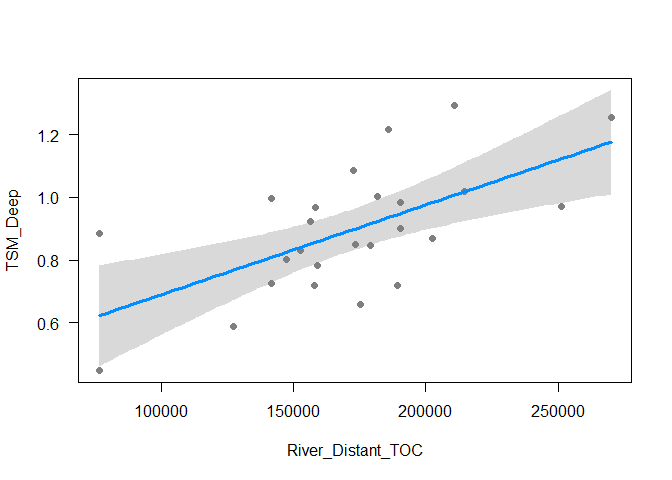
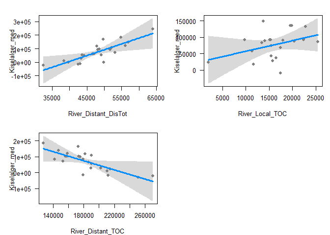
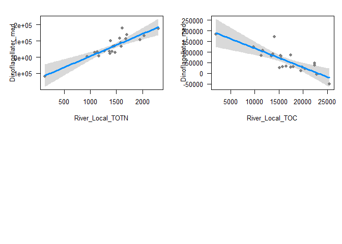

Regression analysis of (so far) hydrographic and plankton variables
  
Check out package dynlm for including lagged variables - see https://stackoverflow.com/a/13096824/1734247 

## 0. Libraries

```r
library(tidyverse)
```

```
## -- Attaching packages --------------------------------------- tidyverse 1.2.1 --
```

```
## v ggplot2 2.2.1     v purrr   0.2.4
## v tibble  1.4.2     v dplyr   0.7.6
## v tidyr   0.8.1     v stringr 1.3.1
## v readr   1.1.1     v forcats 0.3.0
```

```
## -- Conflicts ------------------------------------------ tidyverse_conflicts() --
## x dplyr::filter() masks stats::filter()
## x dplyr::lag()    masks stats::lag()
```

```r
library(readxl)
library(MASS)
```

```
## 
## Attaching package: 'MASS'
```

```
## The following object is masked from 'package:dplyr':
## 
##     select
```

```r
# install.packages("visreg")
library(visreg)


# library(pander)
```

## 1. Data  
### a. Read

```r
dat_a <- read.csv("Data_produced/06_dat_a.csv")
dat_q <- read.csv("Data_produced/06_dat_q.csv")
```

### b. Check variables

```r
unique(dat_a$Variable)
```

```
##  [1] River_Distant_TOTN          River_Local_TOTN           
##  [3] River_Distant_NO3.N         River_Local_NO3.N          
##  [5] River_Distant_TOTP          River_Local_TOTP           
##  [7] River_Distant_TOC           River_Local_TOC            
##  [9] River_Distant_DisTot        River_Local_DisTot         
## [11] River_Distant_Floodmax      River_Local_Floodmax       
## [13] River_Distant_FloodmaxMonth River_Local_FloodmaxMonth  
## [15] Temperatur_Deep             Temperatur_Intermediate    
## [17] Temperatur_Surface          Salt_Deep                  
## [19] Salt_Intermediate           Salt_Surface               
## [21] Tetthet_Deep                Tetthet_Intermediate       
## [23] Tetthet_Surface             O2_Deep                    
## [25] O2_Intermediate             O2_Surface                 
## [27] O2_metning_Deep             O2_metning_Intermediate    
## [29] O2_metning_Surface          PO4_Deep                   
## [31] PO4_Intermediate            PO4_Surface                
## [33] NO2_Deep                    NO2_Intermediate           
## [35] NO2_Surface                 NO3_Deep                   
## [37] NO3_Intermediate            NO3_Surface                
## [39] NO2_NO3_Deep                NO2_NO3_Intermediate       
## [41] NO2_NO3_Surface             NH4_Deep                   
## [43] NH4_Intermediate            NH4_Surface                
## [45] SiO4_Deep                   SiO4_Intermediate          
## [47] SiO4_Surface                N_P_Deep                   
## [49] N_P_Intermediate            N_P_Surface                
## [51] Klorofyll_Deep              Klorofyll_Intermediate     
## [53] Klorofyll_Surface           TotP_Deep                  
## [55] TotP_Intermediate           TotP_Surface               
## [57] TotN_Deep                   TotN_Intermediate          
## [59] TotN_Surface                POP_Deep                   
## [61] POP_Intermediate            POP_Surface                
## [63] PON_Deep                    PON_Intermediate           
## [65] PON_Surface                 POC_Deep                   
## [67] POC_Intermediate            POC_Surface                
## [69] TSM_Deep                    TSM_Intermediate           
## [71] TSM_Surface                 Siktdyp_Surface            
## [73] Kiselalger_med              Dinoflagellater_med        
## [75] Flagellater_med             Total_med                  
## 76 Levels: Dinoflagellater_med Flagellater_med ... TSM_Surface
```

### c. Make data on broad format

```r
dat <- 
  dat_a %>% 
  spread(Variable, Value)
```

### d. Add NAO data

```r
df_nao <- read.table("https://climatedataguide.ucar.edu/sites/default/files/nao_station_djfm.txt", skip = 1, header = FALSE)
colnames(df_nao) <- c("Year", "Winter_NAO")

dat <- left_join(dat, df_nao)
```

```
## Joining, by = "Year"
```


## 2. Hydrographic data, surface

### a. Surface salinity

```r
full_model <- lm(Salt_Surface ~ River_Local_DisTot + River_Distant_DisTot + Winter_NAO, data = dat)
# summary(full_model)
step_model <- stepAIC(full_model, direction = "both", trace = FALSE)
summary(step_model)
```

```
## 
## Call:
## lm(formula = Salt_Surface ~ River_Distant_DisTot, data = dat)
## 
## Residuals:
##     Min      1Q  Median      3Q     Max 
## -1.5252 -0.3038  0.1044  0.4301  0.8013 
## 
## Coefficients:
##                        Estimate Std. Error t value Pr(>|t|)    
## (Intercept)           3.088e+01  7.664e-01  40.288   <2e-16 ***
## River_Distant_DisTot -4.212e-05  1.612e-05  -2.612    0.015 *  
## ---
## Signif. codes:  0 '***' 0.001 '**' 0.01 '*' 0.05 '.' 0.1 ' ' 1
## 
## Residual standard error: 0.5759 on 25 degrees of freedom
## Multiple R-squared:  0.2144,	Adjusted R-squared:  0.183 
## F-statistic: 6.824 on 1 and 25 DF,  p-value: 0.015
```

### b. Surface Total N

```r
full_model <- lm(TotN_Surface ~ River_Local_DisTot + River_Distant_DisTot + Winter_NAO +
                 River_Local_TOTN + River_Distant_TOTN, data = dat)
# summary(full_model)
step_model <- stepAIC(full_model, direction = "both", trace = FALSE)
summary(step_model)
```

```
## 
## Call:
## lm(formula = TotN_Surface ~ River_Local_DisTot, data = dat)
## 
## Residuals:
##      Min       1Q   Median       3Q      Max 
## -2.48962 -0.81919  0.04425  0.84396  2.75781 
## 
## Coefficients:
##                     Estimate Std. Error t value Pr(>|t|)    
## (Intercept)        1.416e+01  1.306e+00  10.835 6.21e-11 ***
## River_Local_DisTot 6.589e-04  2.837e-04   2.322   0.0287 *  
## ---
## Signif. codes:  0 '***' 0.001 '**' 0.01 '*' 0.05 '.' 0.1 ' ' 1
## 
## Residual standard error: 1.32 on 25 degrees of freedom
## Multiple R-squared:  0.1774,	Adjusted R-squared:  0.1445 
## F-statistic: 5.393 on 1 and 25 DF,  p-value: 0.02866
```


### c. Surface Total P

```r
full_model <- lm(TotP_Surface ~ River_Local_DisTot + River_Distant_DisTot + Winter_NAO +
                 River_Local_TOTP + River_Distant_TOTP, data = dat)
# summary(full_model)
step_model <- stepAIC(full_model, direction = "both", trace = FALSE)
summary(step_model)
```

```
## 
## Call:
## lm(formula = TotP_Surface ~ River_Distant_DisTot, data = dat)
## 
## Residuals:
##       Min        1Q    Median        3Q       Max 
## -0.048317 -0.015295 -0.007732  0.021568  0.063983 
## 
## Coefficients:
##                        Estimate Std. Error t value Pr(>|t|)    
## (Intercept)           5.784e-01  4.144e-02  13.955 5.17e-13 ***
## River_Distant_DisTot -1.255e-06  8.718e-07  -1.439    0.163    
## ---
## Signif. codes:  0 '***' 0.001 '**' 0.01 '*' 0.05 '.' 0.1 ' ' 1
## 
## Residual standard error: 0.03114 on 24 degrees of freedom
##   (1 observation deleted due to missingness)
## Multiple R-squared:  0.07941,	Adjusted R-squared:  0.04105 
## F-statistic:  2.07 on 1 and 24 DF,  p-value: 0.1631
```

### d. Surface TSM

```r
full_model <- lm(TSM_Surface ~ River_Local_DisTot + River_Distant_DisTot + Winter_NAO +
                 River_Local_TOC + River_Distant_TOC, data = dat)
# summary(full_model)
step_model <- stepAIC(full_model, direction = "both", trace = FALSE)
summary(step_model)
```

```
## 
## Call:
## lm(formula = TSM_Surface ~ River_Distant_TOC, data = dat)
## 
## Residuals:
##      Min       1Q   Median       3Q      Max 
## -0.22897 -0.08651  0.01247  0.05703  0.20912 
## 
## Coefficients:
##                    Estimate Std. Error t value Pr(>|t|)    
## (Intercept)       4.351e-01  9.506e-02   4.577 0.000133 ***
## River_Distant_TOC 2.579e-06  5.384e-07   4.790 7.85e-05 ***
## ---
## Signif. codes:  0 '***' 0.001 '**' 0.01 '*' 0.05 '.' 0.1 ' ' 1
## 
## Residual standard error: 0.1146 on 23 degrees of freedom
##   (2 observations deleted due to missingness)
## Multiple R-squared:  0.4994,	Adjusted R-squared:  0.4777 
## F-statistic: 22.95 on 1 and 23 DF,  p-value: 7.849e-05
```

```r
par(mfrow = c(2,2), mar = c(4,5,2,1))
plot(step_model)
```

<!-- -->

```r
visreg(step_model, points = list(cex = 1))
```

<!-- -->

### e. Siktedyp

```r
full_model <- lm(Siktdyp_Surface ~ River_Local_DisTot + River_Distant_DisTot + Winter_NAO +
                 River_Local_TOTN + River_Distant_TOTN + River_Local_TOTP + River_Distant_TOTP + 
                 River_Local_TOC + River_Distant_TOC, data = dat)
# summary(full_model)
step_model <- stepAIC(full_model, direction = "both", trace = FALSE)
summary(step_model)
```

```
## 
## Call:
## lm(formula = Siktdyp_Surface ~ River_Local_TOTP, data = dat)
## 
## Residuals:
##     Min      1Q  Median      3Q     Max 
## -2.0033 -0.5890  0.1653  0.8024  1.0565 
## 
## Coefficients:
##                  Estimate Std. Error t value Pr(>|t|)    
## (Intercept)       8.29350    0.26746   31.01   <2e-16 ***
## River_Local_TOTP -0.02077    0.01076   -1.93    0.065 .  
## ---
## Signif. codes:  0 '***' 0.001 '**' 0.01 '*' 0.05 '.' 0.1 ' ' 1
## 
## Residual standard error: 0.8633 on 25 degrees of freedom
## Multiple R-squared:  0.1297,	Adjusted R-squared:  0.09491 
## F-statistic: 3.726 on 1 and 25 DF,  p-value: 0.06498
```

```r
visreg(step_model, points = list(cex = 1))
```

<!-- -->

## 3. Hydrographic data, intermediate

### a. Intermediate salinity

```r
full_model <- lm(Salt_Intermediate ~ River_Local_DisTot + River_Distant_DisTot + Winter_NAO, data = dat)
# summary(full_model)
step_model <- stepAIC(full_model, direction = "both", trace = FALSE)
summary(step_model)
```

```
## 
## Call:
## lm(formula = Salt_Intermediate ~ 1, data = dat)
## 
## Residuals:
##      Min       1Q   Median       3Q      Max 
## -0.55781 -0.17137 -0.05218  0.14365  0.55153 
## 
## Coefficients:
##             Estimate Std. Error t value Pr(>|t|)    
## (Intercept)  32.7335     0.0533   614.2   <2e-16 ***
## ---
## Signif. codes:  0 '***' 0.001 '**' 0.01 '*' 0.05 '.' 0.1 ' ' 1
## 
## Residual standard error: 0.2769 on 26 degrees of freedom
```

### b. Intermediate Total N

```r
full_model <- lm(TotN_Intermediate ~ River_Local_DisTot + River_Distant_DisTot + Winter_NAO +
                 River_Local_TOTN + River_Distant_TOTN, data = dat)
# summary(full_model)
step_model <- stepAIC(full_model, direction = "both", trace = FALSE)
summary(step_model)
```

```
## 
## Call:
## lm(formula = TotN_Intermediate ~ 1, data = dat)
## 
## Residuals:
##     Min      1Q  Median      3Q     Max 
## -2.4017 -0.9204 -0.2811  0.9212  2.7132 
## 
## Coefficients:
##             Estimate Std. Error t value Pr(>|t|)    
## (Intercept)  15.3447     0.2634   58.27   <2e-16 ***
## ---
## Signif. codes:  0 '***' 0.001 '**' 0.01 '*' 0.05 '.' 0.1 ' ' 1
## 
## Residual standard error: 1.368 on 26 degrees of freedom
```


### c. Intermediate Total P

```r
full_model <- lm(TotP_Intermediate ~ River_Local_DisTot + River_Distant_DisTot + Winter_NAO +
                 River_Local_TOTP + River_Distant_TOTP, data = dat)
# summary(full_model)
step_model <- stepAIC(full_model, direction = "both", trace = FALSE)
summary(step_model)
```

```
## 
## Call:
## lm(formula = TotP_Intermediate ~ River_Distant_DisTot, data = dat)
## 
## Residuals:
##       Min        1Q    Median        3Q       Max 
## -0.053098 -0.031450  0.001648  0.022239  0.088224 
## 
## Coefficients:
##                        Estimate Std. Error t value Pr(>|t|)    
## (Intercept)           7.226e-01  4.641e-02  15.571  4.8e-14 ***
## River_Distant_DisTot -4.014e-06  9.762e-07  -4.112 0.000397 ***
## ---
## Signif. codes:  0 '***' 0.001 '**' 0.01 '*' 0.05 '.' 0.1 ' ' 1
## 
## Residual standard error: 0.03487 on 24 degrees of freedom
##   (1 observation deleted due to missingness)
## Multiple R-squared:  0.4133,	Adjusted R-squared:  0.3889 
## F-statistic: 16.91 on 1 and 24 DF,  p-value: 0.0003968
```

### d. Intermediate TSM

```r
full_model <- lm(TSM_Intermediate ~ River_Local_DisTot + River_Distant_DisTot + Winter_NAO +
                 River_Local_TOC + River_Distant_TOC, data = dat)
# summary(full_model)
step_model <- stepAIC(full_model, direction = "both", trace = FALSE)
summary(step_model)
```

```
## 
## Call:
## lm(formula = TSM_Intermediate ~ Winter_NAO + River_Distant_TOC, 
##     data = dat)
## 
## Residuals:
##       Min        1Q    Median        3Q       Max 
## -0.165064 -0.069462  0.002246  0.060901  0.178076 
## 
## Coefficients:
##                     Estimate Std. Error t value Pr(>|t|)    
## (Intercept)        4.331e-01  8.556e-02   5.062 4.54e-05 ***
## Winter_NAO        -1.366e-02  9.014e-03  -1.516 0.143862    
## River_Distant_TOC  1.857e-06  4.806e-07   3.865 0.000838 ***
## ---
## Signif. codes:  0 '***' 0.001 '**' 0.01 '*' 0.05 '.' 0.1 ' ' 1
## 
## Residual standard error: 0.1022 on 22 degrees of freedom
##   (2 observations deleted due to missingness)
## Multiple R-squared:  0.4458,	Adjusted R-squared:  0.3954 
## F-statistic: 8.849 on 2 and 22 DF,  p-value: 0.001514
```

```r
# par(mfrow = c(2,2), mar = c(4,5,2,1))
# plot(step_model)
par(mfrow = c(2,2), mar = c(4,5,2,1))
visreg(step_model, points = list(cex = 1))
```

<!-- -->


## 4. Hydrographic data, deep

### a. Deep salinity

```r
full_model <- lm(Salt_Deep ~ River_Local_DisTot + River_Distant_DisTot + Winter_NAO, data = dat)
# summary(full_model)
step_model <- stepAIC(full_model, direction = "both", trace = FALSE)
summary(step_model)
```

```
## 
## Call:
## lm(formula = Salt_Deep ~ River_Distant_DisTot, data = dat)
## 
## Residuals:
##       Min        1Q    Median        3Q       Max 
## -0.202946 -0.066596 -0.006644  0.066785  0.245176 
## 
## Coefficients:
##                        Estimate Std. Error t value Pr(>|t|)    
## (Intercept)           3.478e+01  1.358e-01 256.045  < 2e-16 ***
## River_Distant_DisTot -1.056e-05  2.857e-06  -3.697  0.00107 ** 
## ---
## Signif. codes:  0 '***' 0.001 '**' 0.01 '*' 0.05 '.' 0.1 ' ' 1
## 
## Residual standard error: 0.1021 on 25 degrees of freedom
## Multiple R-squared:  0.3535,	Adjusted R-squared:  0.3276 
## F-statistic: 13.67 on 1 and 25 DF,  p-value: 0.001074
```

### b. Deep Total N

```r
full_model <- lm(TotN_Deep ~ River_Local_DisTot + River_Distant_DisTot + Winter_NAO +
                 River_Local_TOTN + River_Distant_TOTN, data = dat)
# summary(full_model)
step_model <- stepAIC(full_model, direction = "both", trace = FALSE)
summary(step_model)
```

```
## 
## Call:
## lm(formula = TotN_Deep ~ 1, data = dat)
## 
## Residuals:
##     Min      1Q  Median      3Q     Max 
## -3.3449 -0.8473  0.1243  0.7684  2.7059 
## 
## Coefficients:
##             Estimate Std. Error t value Pr(>|t|)    
## (Intercept)   15.373      0.243   63.26   <2e-16 ***
## ---
## Signif. codes:  0 '***' 0.001 '**' 0.01 '*' 0.05 '.' 0.1 ' ' 1
## 
## Residual standard error: 1.263 on 26 degrees of freedom
```


### c. Deep Total P

```r
full_model <- lm(TotP_Deep ~ River_Local_DisTot + River_Distant_DisTot + Winter_NAO +
                 River_Local_TOTP + River_Distant_TOTP, data = dat)
# summary(full_model)
step_model <- stepAIC(full_model, direction = "both", trace = FALSE)
summary(step_model)
```

```
## 
## Call:
## lm(formula = TotP_Deep ~ River_Local_DisTot + Winter_NAO + River_Distant_TOTP, 
##     data = dat)
## 
## Residuals:
##       Min        1Q    Median        3Q       Max 
## -0.085280 -0.015061 -0.001653  0.016687  0.065795 
## 
## Coefficients:
##                      Estimate Std. Error t value Pr(>|t|)    
## (Intercept)         8.711e-01  4.473e-02  19.477 2.32e-15 ***
## River_Local_DisTot -3.585e-05  8.893e-06  -4.031 0.000559 ***
## Winter_NAO          6.153e-03  3.671e-03   1.676 0.107871    
## River_Distant_TOTP -1.239e-04  4.352e-05  -2.847 0.009386 ** 
## ---
## Signif. codes:  0 '***' 0.001 '**' 0.01 '*' 0.05 '.' 0.1 ' ' 1
## 
## Residual standard error: 0.03754 on 22 degrees of freedom
##   (1 observation deleted due to missingness)
## Multiple R-squared:  0.5487,	Adjusted R-squared:  0.4872 
## F-statistic: 8.917 on 3 and 22 DF,  p-value: 0.0004679
```

```r
par(mfrow = c(2,2), mar = c(4,5,2,1))
visreg(step_model, points = list(cex = 1))
```

<!-- -->

### d. Deep TSM

```r
full_model <- lm(TSM_Deep ~ River_Local_DisTot + River_Distant_DisTot + Winter_NAO +
                 River_Local_TOC + River_Distant_TOC, data = dat)
# summary(full_model)
step_model <- stepAIC(full_model, direction = "both", trace = FALSE)
summary(step_model)
```

```
## 
## Call:
## lm(formula = TSM_Deep ~ River_Distant_TOC, data = dat)
## 
## Residuals:
##      Min       1Q   Median       3Q      Max 
## -0.24610 -0.11325 -0.02156  0.07903  0.28536 
## 
## Coefficients:
##                    Estimate Std. Error t value Pr(>|t|)    
## (Intercept)       4.033e-01  1.321e-01   3.053 0.005643 ** 
## River_Distant_TOC 2.862e-06  7.482e-07   3.825 0.000867 ***
## ---
## Signif. codes:  0 '***' 0.001 '**' 0.01 '*' 0.05 '.' 0.1 ' ' 1
## 
## Residual standard error: 0.1592 on 23 degrees of freedom
##   (2 observations deleted due to missingness)
## Multiple R-squared:  0.3888,	Adjusted R-squared:  0.3623 
## F-statistic: 14.63 on 1 and 23 DF,  p-value: 0.0008671
```

```r
# par(mfrow = c(2,2), mar = c(4,5,2,1))
# plot(step_model)
visreg(step_model, points = list(cex = 1))
```

<!-- -->

## 5. Plankton
### a. Kiselalger

```r
full_model <- lm(Kiselalger_med ~ River_Local_DisTot + River_Distant_DisTot + Winter_NAO +
                 River_Local_TOTN + River_Distant_TOTN + River_Local_TOTP + River_Distant_TOTP + 
                 River_Local_TOC + River_Distant_TOC, data = dat)
# summary(full_model)
step_model <- stepAIC(full_model, direction = "both", trace = FALSE)
summary(step_model)
```

```
## 
## Call:
## lm(formula = Kiselalger_med ~ River_Distant_DisTot + River_Local_TOC + 
##     River_Distant_TOC, data = dat)
## 
## Residuals:
##    Min     1Q Median     3Q    Max 
## -91543 -16892  -2922  17923  78622 
## 
## Coefficients:
##                        Estimate Std. Error t value Pr(>|t|)  
## (Intercept)          -1.303e+05  6.489e+04  -2.009   0.0590 .
## River_Distant_DisTot  8.600e+00  3.173e+00   2.710   0.0139 *
## River_Local_TOC       3.239e+00  2.394e+00   1.353   0.1918  
## River_Distant_TOC    -1.440e+00  6.791e-01  -2.121   0.0473 *
## ---
## Signif. codes:  0 '***' 0.001 '**' 0.01 '*' 0.05 '.' 0.1 ' ' 1
## 
## Residual standard error: 39910 on 19 degrees of freedom
##   (4 observations deleted due to missingness)
## Multiple R-squared:  0.4251,	Adjusted R-squared:  0.3343 
## F-statistic: 4.683 on 3 and 19 DF,  p-value: 0.013
```

```r
par(mfrow = c(2,2), mar = c(4,5,2,1))
visreg(step_model, points = list(cex = 1))
```

<!-- -->

### b. Dinoflagellater

```r
full_model <- lm(Dinoflagellater_med ~ River_Local_DisTot + River_Distant_DisTot + Winter_NAO +
                 River_Local_TOTN + River_Distant_TOTN + River_Local_TOTP + River_Distant_TOTP + 
                 River_Local_TOC + River_Distant_TOC, data = dat)
# summary(full_model)
step_model <- stepAIC(full_model, direction = "both", trace = FALSE)
summary(step_model)
```

```
## 
## Call:
## lm(formula = Dinoflagellater_med ~ River_Local_TOTN + River_Local_TOC, 
##     data = dat)
## 
## Residuals:
##    Min     1Q Median     3Q    Max 
## -44809 -21277  -1725   9359  90018 
## 
## Coefficients:
##                   Estimate Std. Error t value Pr(>|t|)    
## (Intercept)      10414.229  23813.864   0.437 0.666567    
## River_Local_TOTN   137.261     25.798   5.321  3.3e-05 ***
## River_Local_TOC     -8.964      2.169  -4.133 0.000515 ***
## ---
## Signif. codes:  0 '***' 0.001 '**' 0.01 '*' 0.05 '.' 0.1 ' ' 1
## 
## Residual standard error: 31010 on 20 degrees of freedom
##   (4 observations deleted due to missingness)
## Multiple R-squared:  0.5863,	Adjusted R-squared:  0.545 
## F-statistic: 14.17 on 2 and 20 DF,  p-value: 0.0001468
```

```r
par(mfrow = c(2,2), mar = c(4,5,2,1))
visreg(step_model, points = list(cex = 1))
```

<!-- -->

### c. Flagellater

```r
full_model <- lm(Dinoflagellater_med ~ River_Local_DisTot + River_Distant_DisTot + Winter_NAO +
                 River_Local_TOTN + River_Distant_TOTN + River_Local_TOTP + River_Distant_TOTP + 
                 River_Local_TOC + River_Distant_TOC, data = dat)
# summary(full_model)
step_model <- stepAIC(full_model, direction = "both", trace = FALSE)
summary(step_model)
```

```
## 
## Call:
## lm(formula = Dinoflagellater_med ~ River_Local_TOTN + River_Local_TOC, 
##     data = dat)
## 
## Residuals:
##    Min     1Q Median     3Q    Max 
## -44809 -21277  -1725   9359  90018 
## 
## Coefficients:
##                   Estimate Std. Error t value Pr(>|t|)    
## (Intercept)      10414.229  23813.864   0.437 0.666567    
## River_Local_TOTN   137.261     25.798   5.321  3.3e-05 ***
## River_Local_TOC     -8.964      2.169  -4.133 0.000515 ***
## ---
## Signif. codes:  0 '***' 0.001 '**' 0.01 '*' 0.05 '.' 0.1 ' ' 1
## 
## Residual standard error: 31010 on 20 degrees of freedom
##   (4 observations deleted due to missingness)
## Multiple R-squared:  0.5863,	Adjusted R-squared:  0.545 
## F-statistic: 14.17 on 2 and 20 DF,  p-value: 0.0001468
```

```r
par(mfrow = c(2,2), mar = c(4,5,2,1))
visreg(step_model, points = list(cex = 1))
```

<!-- -->
