# Regression of plankton

Regression analysis of plankton variables  
  
Parts 0 + 1a-e (libraries + data) is identical to script 08 (copied 26.11 kl. 22:00)  


## 0. Libraries

```r
# to check which libraries are set
#.libPaths()
#.libPaths("C:/Data/R/R-3.5.1/library")
library(tidyverse)
```

```
## -- Attaching packages --------------------------------------- tidyverse 1.2.1 --
```

```
## v ggplot2 2.2.1     v purrr   0.2.4
## v tibble  1.4.2     v dplyr   0.7.6
## v tidyr   0.8.1     v stringr 1.3.1
## v readr   1.1.1     v forcats 0.3.0
```

```
## -- Conflicts ------------------------------------------ tidyverse_conflicts() --
## x dplyr::filter() masks stats::filter()
## x dplyr::lag()    masks stats::lag()
```

```r
library(readxl)
library(MASS)
```

```
## 
## Attaching package: 'MASS'
```

```
## The following object is masked from 'package:dplyr':
## 
##     select
```

```r
library (ggplot2)
library(visreg)
# library(vegan)
# library(lme4) # for mixed effect models
#install.packages("standardize")
library(standardize) # standardize data for modelling
#install.packages("afex")
# library(afex) # adding p-values to lmer output
#install.packages("sjPlot") 
library(sjPlot) # effectplots lmer
```

```
## Warning in checkMatrixPackageVersion(): Package version inconsistency detected.
## TMB was built with Matrix version 1.2.15
## Current Matrix version is 1.2.14
## Please re-install 'TMB' from source using install.packages('TMB', type = 'source') or ask CRAN for a binary version of 'TMB' matching CRAN's 'Matrix' package
```

```r
# library(pander)
#install.packages("glmulti")
# library(glmulti)
#install.packages("rJava") # NB! I needed to installe Java for Windows x64 here: https://www.oracle.com/technetwork/java/javase/downloads/jdk8-downloads-2133151.html

# install.packages("MuMIn") 
library(MuMIn)
#library(rJava)
```

## 1. Data  
### a. Read

```r
dat_a <- read.csv("Data_produced/06_dat_a.csv")
dat_q <- read.csv("Data_produced/06_dat_q.csv")
```

### b. Check variables

```r
unique(dat_a$Variable)
```

```
##  [1] River_TotN                     River_NO3                     
##  [3] River_TotP                     River_TOC                     
##  [5] River_Discharge                River_PO4                     
##  [7] River_SPM                      River_Si                      
##  [9] Hydro_Temperature_Deep         Hydro_Temperature_Intermediate
## [11] Hydro_Temperature_Surface      Hydro_Salinity_Deep           
## [13] Hydro_Salinity_Intermediate    Hydro_Salinity_Surface        
## [15] Hydro_O2_Deep                  Hydro_O2_Intermediate         
## [17] Hydro_O2_Surface               Hydro_PO4_Deep                
## [19] Hydro_PO4_Intermediate         Hydro_PO4_Surface             
## [21] Hydro_Si_Deep                  Hydro_Si_Intermediate         
## [23] Hydro_Si_Surface               Hydro_Chla_Deep               
## [25] Hydro_Chla_Intermediate        Hydro_Chla_Surface            
## [27] Hydro_TotP_Deep                Hydro_TotP_Intermediate       
## [29] Hydro_TotP_Surface             Hydro_TotN_Deep               
## [31] Hydro_TotN_Intermediate        Hydro_TotN_Surface            
## [33] Hydro_POP_Deep                 Hydro_POP_Intermediate        
## [35] Hydro_POP_Surface              Hydro_PON_Deep                
## [37] Hydro_PON_Intermediate         Hydro_PON_Surface             
## [39] Hydro_POC_Deep                 Hydro_POC_Intermediate        
## [41] Hydro_POC_Surface              Hydro_TSM_Deep                
## [43] Hydro_TSM_Intermediate         Hydro_TSM_Surface             
## [45] Hydro_Secchi_Surface           Hydro_DIN_Deep                
## [47] Hydro_DIN_Intermediate         Hydro_DIN_Surface             
## [49] Plankton_Diatoms               Plankton_Dinoflagellates      
## [51] Plankton_Flagellates          
## 51 Levels: Hydro_Chla_Deep Hydro_Chla_Intermediate ... River_TotP
```

### c. Make data on broad format

```r
dat <- 
  dat_a %>% 
  spread(Variable, Value)
```


### d. Add NAO data

```r
df_nao <- read.table("https://climatedataguide.ucar.edu/sites/default/files/nao_station_djfm.txt", skip = 1, header = FALSE)
colnames(df_nao) <- c("Year", "Winter_NAO")

dat <- left_join(dat, df_nao)
```

```
## Joining, by = "Year"
```

### e. Wind data ??? Dag you mentioned you had files for Færder and Torungen?


### f. Checking missing years in dataset
* NB! TSM has been interpolated for 2012-2013, we decided not to interpolate the _Deep nutrients and POM, because these are at the end of the time series

```r
str(dat)
```

```
## 'data.frame':	27 obs. of  53 variables:
##  $ Year                          : int  1990 1991 1992 1993 1994 1995 1996 1997 1998 1999 ...
##  $ Hydro_Chla_Deep               : num  0.369 0.347 0.415 0.455 0.745 ...
##  $ Hydro_Chla_Intermediate       : num  0.808 1.056 0.678 0.968 1.093 ...
##  $ Hydro_Chla_Surface            : num  1.6 1.23 1.49 1.92 2.69 ...
##  $ Hydro_DIN_Deep                : num  4.46 6.82 5.88 7.35 7.57 ...
##  $ Hydro_DIN_Intermediate        : num  4.45 5.06 4.68 5.05 7.52 ...
##  $ Hydro_DIN_Surface             : num  3.87 3.74 3.6 3.81 5.68 ...
##  $ Hydro_O2_Deep                 : num  5.98 6.04 6.21 6.22 6.36 ...
##  $ Hydro_O2_Intermediate         : num  6.13 6.14 6.4 6.52 6.53 ...
##  $ Hydro_O2_Surface              : num  6.73 6.42 6.7 6.94 6.93 ...
##  $ Hydro_PO4_Deep                : num  NA 0.436 0.516 0.572 0.512 ...
##  $ Hydro_PO4_Intermediate        : num  NA 0.324 0.366 0.379 0.369 ...
##  $ Hydro_PO4_Surface             : num  NA 0.26 0.263 0.255 0.25 ...
##  $ Hydro_POC_Deep                : num  5 7.82 5.54 5.14 6.44 ...
##  $ Hydro_POC_Intermediate        : num  7.73 8.81 8.09 7.51 8.4 ...
##  $ Hydro_POC_Surface             : num  14.2 11.5 11.4 12.1 13.5 ...
##  $ Hydro_PON_Deep                : num  0.68 1.031 0.873 0.759 0.81 ...
##  $ Hydro_PON_Intermediate        : num  1.1 1.23 1.35 1.11 1.24 ...
##  $ Hydro_PON_Surface             : num  1.92 1.61 1.76 1.62 1.89 ...
##  $ Hydro_POP_Deep                : num  NA 0.0478 0.0473 0.0409 0.0591 ...
##  $ Hydro_POP_Intermediate        : num  NA 0.0663 0.0636 0.0643 0.0818 ...
##  $ Hydro_POP_Surface             : num  NA 0.0845 0.0962 0.115 0.133 ...
##  $ Hydro_Salinity_Deep           : num  34.3 34.4 34.4 34.4 34.1 ...
##  $ Hydro_Salinity_Intermediate   : num  33.2 32.4 33 32.9 32.7 ...
##  $ Hydro_Salinity_Surface        : num  29.3 29.3 29.7 28.9 29.2 ...
##  $ Hydro_Secchi_Surface          : num  8.23 9.19 9.35 8.71 7.63 ...
##  $ Hydro_Si_Deep                 : num  3.56 4.24 3.48 4.12 3.82 ...
##  $ Hydro_Si_Intermediate         : num  3.15 3.01 2.58 3.06 3.33 ...
##  $ Hydro_Si_Surface              : num  2.91 2.44 2.53 3.11 2.97 ...
##  $ Hydro_Temperature_Deep        : num  9.61 8.41 8.5 7.65 7.24 ...
##  $ Hydro_Temperature_Intermediate: num  10.49 9.28 9.13 8.28 8.16 ...
##  $ Hydro_Temperature_Surface     : num  10.8 9.61 9.87 8.38 8.99 ...
##  $ Hydro_TotN_Deep               : num  12 15.6 15 15.6 16.7 ...
##  $ Hydro_TotN_Intermediate       : num  12.9 14.7 14.8 14.9 17.5 ...
##  $ Hydro_TotN_Surface            : num  15 16.3 15.8 16.7 19.3 ...
##  $ Hydro_TotP_Deep               : num  NA 0.675 0.705 0.743 0.657 ...
##  $ Hydro_TotP_Intermediate       : num  NA 0.624 0.569 0.583 0.56 ...
##  $ Hydro_TotP_Surface            : num  NA 0.599 0.545 0.544 0.53 ...
##  $ Hydro_TSM_Deep                : num  0.447 0.886 0.727 0.783 0.848 ...
##  $ Hydro_TSM_Intermediate        : num  0.409 0.673 0.502 0.695 0.717 ...
##  $ Hydro_TSM_Surface             : num  0.547 0.752 0.572 0.811 0.91 ...
##  $ Plankton_Diatoms              : num  NA NA NA NA 1026600 ...
##  $ Plankton_Dinoflagellates      : num  NA NA NA NA 129689 ...
##  $ Plankton_Flagellates          : num  NA NA NA NA 3305884 ...
##  $ River_Discharge               : num  47827 34895 38657 46693 44698 ...
##  $ River_NO3                     : num  12219 10725 13168 13456 14302 ...
##  $ River_PO4                     : num  253 192 182 226 151 ...
##  $ River_Si                      : num  NA NA NA NA NA ...
##  $ River_SPM                     : num  361660 145555 425194 283252 212867 ...
##  $ River_TOC                     : num  NA NA 143009 159948 181589 ...
##  $ River_TotN                    : num  19463 16760 19654 21669 22144 ...
##  $ River_TotP                    : num  615 476 552 523 417 ...
##  $ Winter_NAO                    : num  3.96 1.03 3.28 2.67 3.03 3.96 -3.78 -0.17 0.72 1.7 ...
```

```r
check <-  dat %>%
  summarise_all(funs(sum(is.na(.))))

complete.cases(dat)
```

```
##  [1] FALSE FALSE FALSE FALSE FALSE  TRUE  TRUE  TRUE  TRUE  TRUE  TRUE
## [12]  TRUE  TRUE  TRUE  TRUE  TRUE  TRUE  TRUE  TRUE  TRUE  TRUE  TRUE
## [23]  TRUE FALSE FALSE FALSE FALSE
```

```r
# there are missing values for four first years (1990-1994) and the last four years (2013-2016)
  #River TOC missing in 1990 and 1991, 
  #P measurements from hydro missing 1990
  #Plankton group data start in 1994
  #River_Si starts in 1995
  # DIN_deep, POC_deep, PON,_deep and POP_deep is missing from 2013-2016

# Suggestion: 
  #1. We cut 1990 and 1991 from the dataset (many missing variables)
  #2. we cut variables that have more than one year missing (have them separate below so we can test)

# NB! keep in mind that the deep POC and PON are the variables with highest upward trends in the MannKendal test. but a possible proxy could be the TSM_deep which is sampled over the whole time period, and has fairly high correlation with POC (0.63). High correlations also between the deep and intermediate values for POC (0.75), PON (0.74) and DIN (0.72). 
plot (dat$Hydro_TSM_Deep, dat$Hydro_POC_Deep)
```

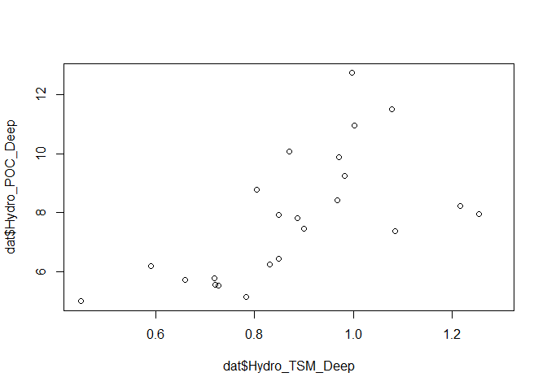<!-- -->

```r
plot (dat$Hydro_TSM_Deep, dat$Hydro_PON_Deep)
```

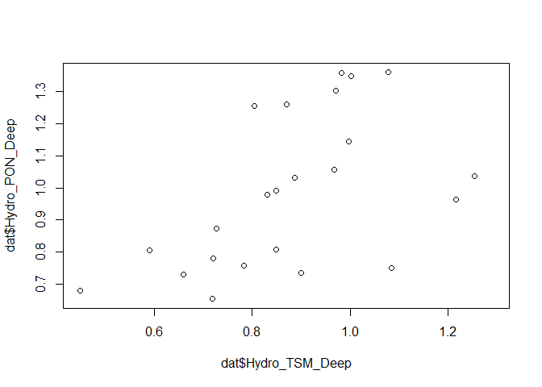<!-- -->

```r
plot (dat$Hydro_POC_Deep, dat$Hydro_POC_Intermediate)
```

<!-- -->

```r
plot (dat$Hydro_DIN_Deep, dat$Hydro_DIN_Intermediate)
```

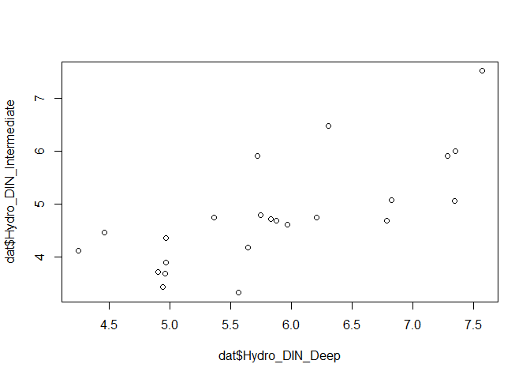<!-- -->

```r
cor(dat$Hydro_POC_Surface, dat$Hydro_POC_Intermediate, use = "complete.obs")
```

```
## [1] 0.8064515
```

```r
#cor(dat$Hydro_TSM_Deep, dat$Hydro_POC_Deep, use = "complete.obs")
#cor(dat$Hydro_PON_Deep, dat$Hydro_PON_Intermediate, use = "complete.obs")
#cor(dat$Hydro_DIN_Deep, dat$Hydro_DIN_Intermediate, use = "complete.obs")

# filter the datasets according to suggestion above
cols <- c("Hydro_DIN_Deep", "Hydro_POC_Deep", "Hydro_PON_Deep", "Hydro_POP_Deep", "River_Si")

dat_sel <- dat %>% 
  filter(Year != 1990 & Year != 1991) %>% 
  # dplyr::select(-starts_with('Plank')) %>% 
  dplyr::select(-one_of(cols))    

# Years with no missing cases - 1992-1993 is missing, but that is because of the plankton variables
rbind(dat_sel$Year, complete.cases(dat_sel))
```

```
##      [,1] [,2] [,3] [,4] [,5] [,6] [,7] [,8] [,9] [,10] [,11] [,12] [,13]
## [1,] 1992 1993 1994 1995 1996 1997 1998 1999 2000  2001  2002  2003  2004
## [2,]    0    0    1    1    1    1    1    1    1     1     1     1     1
##      [,14] [,15] [,16] [,17] [,18] [,19] [,20] [,21] [,22] [,23] [,24]
## [1,]  2005  2006  2007  2008  2009  2010  2011  2012  2013  2014  2015
## [2,]     1     1     1     1     1     1     1     1     1     1     1
##      [,25]
## [1,]  2016
## [2,]     1
```

```r
tab <- apply(is.na(dat_sel), 2, sum)
tab[tab > 0]
```

```
##         Plankton_Diatoms Plankton_Dinoflagellates     Plankton_Flagellates 
##                        2                        2                        2
```


# Plankton data
* excluding Hydro_Chla_Surface for all and two models for each group (a w/ secchi included, b w/ secchi excluded)

```r
dat_sel2 <- dat_sel[complete.cases(dat_sel),]

options(na.action = "na.fail")

save_plots <- FALSE

#NB! exclude Chla_surface for all
```

## a. Diatoms
* include Si_Surface

```r
### 1a Diatoms
full_model <- lm(Plankton_Diatoms ~ River_TOC + River_SPM + Winter_NAO + 
                    Hydro_Salinity_Surface + Hydro_POC_Surface + Hydro_DIN_Surface
                 + Hydro_PO4_Surface + Hydro_Si_Surface + Hydro_TotP_Surface +
                   Hydro_TotN_Surface + Hydro_Temperature_Surface, 
                  data = dat_sel2) 
# summary(full_model)
# finne min model
min_model <- dredge (full_model, rank = "BIC") 
```

```
## Fixed term is "(Intercept)"
```

```r
model_diatoms <- get.models(min_model, 1)[[1]]
summary (model_diatoms)
```

```
## 
## Call:
## lm(formula = Plankton_Diatoms ~ Hydro_PO4_Surface + Hydro_Salinity_Surface + 
##     Hydro_Si_Surface + 1, data = dat_sel2)
## 
## Residuals:
##     Min      1Q  Median      3Q     Max 
## -331123 -110334  -19584  124414  431259 
## 
## Coefficients:
##                        Estimate Std. Error t value Pr(>|t|)    
## (Intercept)             3715763    2451989   1.515 0.146129    
## Hydro_PO4_Surface      12126102    3118073   3.889 0.000987 ***
## Hydro_Salinity_Surface  -168329      87353  -1.927 0.069069 .  
## Hydro_Si_Surface        -363883     147028  -2.475 0.022918 *  
## ---
## Signif. codes:  0 '***' 0.001 '**' 0.01 '*' 0.05 '.' 0.1 ' ' 1
## 
## Residual standard error: 223200 on 19 degrees of freedom
## Multiple R-squared:  0.4452,	Adjusted R-squared:  0.3576 
## F-statistic: 5.083 on 3 and 19 DF,  p-value: 0.009442
```

```r
# Plot model
# model diagnostics
par(mfrow = c(2,2), mar = c(4,5,2,1))
plot(model_diatoms)
```

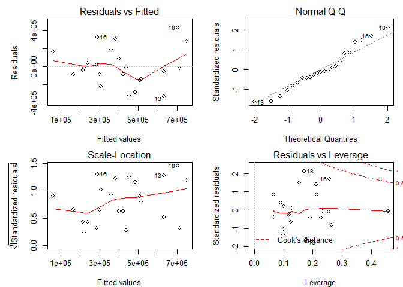<!-- -->

```r
# plot_model(model_diatoms, type = "diag")
# plot model estimates (neutral line; vertical intercept that indicates no effect)
# plot_model(model_diatoms, sort.est = TRUE)

#effektplot
# plot_model(model_diatoms, type = "slope", show.data = TRUE)
par(mar = c(4,6,2,1))
visreg(model_diatoms,  points = list(cex = 1), ylab = "")
mtext("Diatom abundance", 2, line = 4)

if(save_plots){
  png("Figures_rapp/Regressions_Plankton_diatoms.png", width = 18, height = 15, unit = "cm", res = 400)
  par(mfrow = c(2,2), mar = c(4,5,2,1), oma = c(0,3,0,0))
  visreg(model_diatoms,  points = list(cex = 1), ylab = "")
  mtext("Diatom abundance", 2, line = 1, outer = TRUE)
  dev.off()
}

tab_model (model_diatoms)
```

<table style="border-collapse:collapse; border:none;">
<tr>
<th style="border-top: double; text-align:center; font-style:normal; font-weight:bold; padding:0.2cm;  text-align:left; ">&nbsp;</th>
<th colspan="3" style="border-top: double; text-align:center; font-style:normal; font-weight:bold; padding:0.2cm; ">Plankton Diatoms</th>
</tr>
<tr>
<td style=" text-align:center; border-bottom:1px solid; font-style:italic; font-weight:normal;  text-align:left; ">Predictors</td>
<td style=" text-align:center; border-bottom:1px solid; font-style:italic; font-weight:normal;  ">Estimates</td>
<td style=" text-align:center; border-bottom:1px solid; font-style:italic; font-weight:normal;  ">CI</td>
<td style=" text-align:center; border-bottom:1px solid; font-style:italic; font-weight:normal;  ">p</td>
</tr>
<tr>
<td style=" padding:0.2cm; text-align:left; vertical-align:top; text-align:left; ">(Intercept)</td>
<td style=" padding:0.2cm; text-align:left; vertical-align:top; text-align:center;  ">3715763.29</td>
<td style=" padding:0.2cm; text-align:left; vertical-align:top; text-align:center;  ">-1090046.63&nbsp;&ndash;&nbsp;8521573.21</td>
<td style=" padding:0.2cm; text-align:left; vertical-align:top; text-align:center;  ">0.146</td>
</tr>
<tr>
<td style=" padding:0.2cm; text-align:left; vertical-align:top; text-align:left; ">Hydro PO 4 Surface</td>
<td style=" padding:0.2cm; text-align:left; vertical-align:top; text-align:center;  ">12126101.98</td>
<td style=" padding:0.2cm; text-align:left; vertical-align:top; text-align:center;  ">6014790.79&nbsp;&ndash;&nbsp;18237413.17</td>
<td style=" padding:0.2cm; text-align:left; vertical-align:top; text-align:center;  "><strong>0.001</strong></td>
</tr>
<tr>
<td style=" padding:0.2cm; text-align:left; vertical-align:top; text-align:left; ">Hydro Salinity Surface</td>
<td style=" padding:0.2cm; text-align:left; vertical-align:top; text-align:center;  ">-168329.09</td>
<td style=" padding:0.2cm; text-align:left; vertical-align:top; text-align:center;  ">-339537.79&nbsp;&ndash;&nbsp;2879.61</td>
<td style=" padding:0.2cm; text-align:left; vertical-align:top; text-align:center;  ">0.069</td>
</tr>
<tr>
<td style=" padding:0.2cm; text-align:left; vertical-align:top; text-align:left; ">Hydro Si Surface</td>
<td style=" padding:0.2cm; text-align:left; vertical-align:top; text-align:center;  ">-363883.38</td>
<td style=" padding:0.2cm; text-align:left; vertical-align:top; text-align:center;  ">-652052.73&nbsp;&ndash;&nbsp;-75714.04</td>
<td style=" padding:0.2cm; text-align:left; vertical-align:top; text-align:center;  "><strong>0.023</strong></td>
</tr>
<tr>
<td style=" padding:0.2cm; text-align:left; vertical-align:top; text-align:left; padding-top:0.1cm; padding-bottom:0.1cm; border-top:1px solid;">Observations</td>
<td style=" padding:0.2cm; text-align:left; vertical-align:top; padding-top:0.1cm; padding-bottom:0.1cm; text-align:left; border-top:1px solid;" colspan="3">23</td>
</tr>
<tr>
<td style=" padding:0.2cm; text-align:left; vertical-align:top; text-align:left; padding-top:0.1cm; padding-bottom:0.1cm;">R<sup>2</sup> / adjusted R<sup>2</sup></td>
<td style=" padding:0.2cm; text-align:left; vertical-align:top; padding-top:0.1cm; padding-bottom:0.1cm; text-align:left;" colspan="3">0.445 / 0.358</td>
</tr>

</table>

```r
# , file = "Figures_rapp/Regressions_POC_Surf_table.html"
```

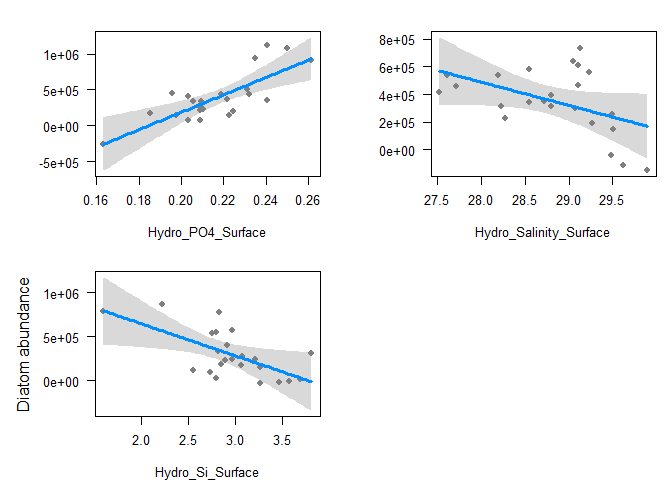<!-- -->

## b. Dinoflagellates
### Including Hydro_Secchi_Surface (but not Chl a)

```r
# 1b

full_model <- lm(Plankton_Dinoflagellates ~ River_TOC + River_SPM + Winter_NAO +
                   Hydro_Salinity_Surface + Hydro_POC_Surface + Hydro_DIN_Surface +
                   Hydro_PO4_Surface + Hydro_TotP_Surface + Hydro_TotN_Surface + 
                   Hydro_Temperature_Surface +
                   Hydro_Secchi_Surface, 
                  data = dat_sel2) 
# summary(full_model)
# finne min model
min_model <- dredge (full_model, rank = "BIC") 
```

```
## Fixed term is "(Intercept)"
```

```r
model_dinoflag01 <- get.models(min_model, 1)[[1]]
summary (model_dinoflag01)
```

```
## 
## Call:
## lm(formula = Plankton_Dinoflagellates ~ Hydro_DIN_Surface + Hydro_Secchi_Surface + 
##     Hydro_Temperature_Surface + Hydro_TotP_Surface + River_SPM + 
##     River_TOC + 1, data = dat_sel2)
## 
## Residuals:
##    Min     1Q Median     3Q    Max 
## -49555 -16227   2126  14553  40422 
## 
## Coefficients:
##                             Estimate Std. Error t value Pr(>|t|)    
## (Intercept)                8.292e+05  1.897e+05   4.370 0.000476 ***
## Hydro_DIN_Surface          1.780e+04  7.333e+03   2.428 0.027367 *  
## Hydro_Secchi_Surface      -3.403e+04  8.671e+03  -3.924 0.001211 ** 
## Hydro_Temperature_Surface -2.443e+04  1.001e+04  -2.440 0.026713 *  
## Hydro_TotP_Surface        -8.346e+05  2.345e+05  -3.560 0.002612 ** 
## River_SPM                 -2.236e-01  7.262e-02  -3.079 0.007189 ** 
## River_TOC                  1.091e+00  2.775e-01   3.933 0.001189 ** 
## ---
## Signif. codes:  0 '***' 0.001 '**' 0.01 '*' 0.05 '.' 0.1 ' ' 1
## 
## Residual standard error: 27710 on 16 degrees of freedom
## Multiple R-squared:  0.7686,	Adjusted R-squared:  0.6818 
## F-statistic: 8.857 on 6 and 16 DF,  p-value: 0.0002337
```

```r
# Plot model
# model diagnostics
par(mfrow = c(2,2), mar = c(4,5,2,1))
plot(model_dinoflag01)
```

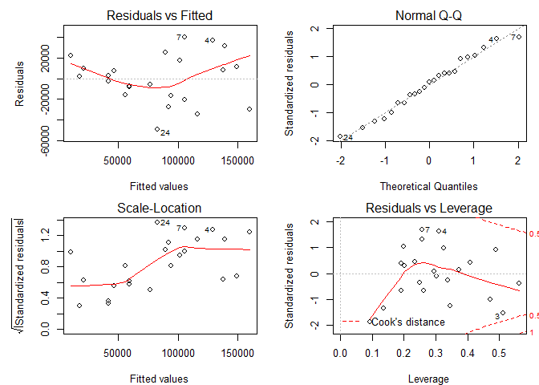<!-- -->

```r
# plot_model(model_dinoflag01, type = "diag")
# plot model estimates (neutral line; vertical intercept that indicates no effect)
# plot_model(model_dinoflag01, sort.est = TRUE)

#effektplot
# plot_model(model_dinoflag01, type = "slope", show.data = TRUE)
par(mfrow = c(2,3), mar = c(4,5,2,1))
visreg(model_dinoflag01,  points = list(cex = 1))
```

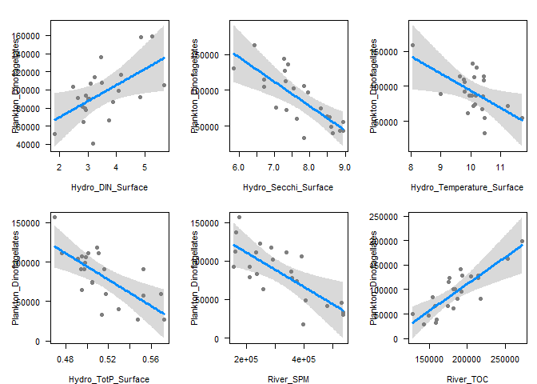<!-- -->

```r
if(save_plots){
  png("Figures_rapp/Regressions_Plankton_dinoflag01.png", width = 25, height = 15, unit = "cm", res = 400)
  par(mfrow = c(2,3), mar = c(4,5,2,1), oma = c(0,3,0,0))
  visreg(model_dinoflag01,  points = list(cex = 1), ylab = "")
  mtext("Dinoflagellate abundance", 2, line = 1, outer = TRUE)
  dev.off()
}

tab_model (model_dinoflag01)
```

<table style="border-collapse:collapse; border:none;">
<tr>
<th style="border-top: double; text-align:center; font-style:normal; font-weight:bold; padding:0.2cm;  text-align:left; ">&nbsp;</th>
<th colspan="3" style="border-top: double; text-align:center; font-style:normal; font-weight:bold; padding:0.2cm; ">Plankton Dinoflagellates</th>
</tr>
<tr>
<td style=" text-align:center; border-bottom:1px solid; font-style:italic; font-weight:normal;  text-align:left; ">Predictors</td>
<td style=" text-align:center; border-bottom:1px solid; font-style:italic; font-weight:normal;  ">Estimates</td>
<td style=" text-align:center; border-bottom:1px solid; font-style:italic; font-weight:normal;  ">CI</td>
<td style=" text-align:center; border-bottom:1px solid; font-style:italic; font-weight:normal;  ">p</td>
</tr>
<tr>
<td style=" padding:0.2cm; text-align:left; vertical-align:top; text-align:left; ">(Intercept)</td>
<td style=" padding:0.2cm; text-align:left; vertical-align:top; text-align:center;  ">829190.38</td>
<td style=" padding:0.2cm; text-align:left; vertical-align:top; text-align:center;  ">457328.10&nbsp;&ndash;&nbsp;1201052.66</td>
<td style=" padding:0.2cm; text-align:left; vertical-align:top; text-align:center;  "><strong>&lt;0.001</td>
</tr>
<tr>
<td style=" padding:0.2cm; text-align:left; vertical-align:top; text-align:left; ">Hydro DIN Surface</td>
<td style=" padding:0.2cm; text-align:left; vertical-align:top; text-align:center;  ">17801.96</td>
<td style=" padding:0.2cm; text-align:left; vertical-align:top; text-align:center;  ">3429.73&nbsp;&ndash;&nbsp;32174.20</td>
<td style=" padding:0.2cm; text-align:left; vertical-align:top; text-align:center;  "><strong>0.027</strong></td>
</tr>
<tr>
<td style=" padding:0.2cm; text-align:left; vertical-align:top; text-align:left; ">Hydro Secchi Surface</td>
<td style=" padding:0.2cm; text-align:left; vertical-align:top; text-align:center;  ">-34026.08</td>
<td style=" padding:0.2cm; text-align:left; vertical-align:top; text-align:center;  ">-51021.43&nbsp;&ndash;&nbsp;-17030.73</td>
<td style=" padding:0.2cm; text-align:left; vertical-align:top; text-align:center;  "><strong>0.001</strong></td>
</tr>
<tr>
<td style=" padding:0.2cm; text-align:left; vertical-align:top; text-align:left; ">Hydro Temperature Surface</td>
<td style=" padding:0.2cm; text-align:left; vertical-align:top; text-align:center;  ">-24429.11</td>
<td style=" padding:0.2cm; text-align:left; vertical-align:top; text-align:center;  ">-44053.81&nbsp;&ndash;&nbsp;-4804.42</td>
<td style=" padding:0.2cm; text-align:left; vertical-align:top; text-align:center;  "><strong>0.027</strong></td>
</tr>
<tr>
<td style=" padding:0.2cm; text-align:left; vertical-align:top; text-align:left; ">Hydro Tot P Surface</td>
<td style=" padding:0.2cm; text-align:left; vertical-align:top; text-align:center;  ">-834588.01</td>
<td style=" padding:0.2cm; text-align:left; vertical-align:top; text-align:center;  ">-1294110.49&nbsp;&ndash;&nbsp;-375065.53</td>
<td style=" padding:0.2cm; text-align:left; vertical-align:top; text-align:center;  "><strong>0.003</strong></td>
</tr>
<tr>
<td style=" padding:0.2cm; text-align:left; vertical-align:top; text-align:left; ">River SPM</td>
<td style=" padding:0.2cm; text-align:left; vertical-align:top; text-align:center;  ">-0.22</td>
<td style=" padding:0.2cm; text-align:left; vertical-align:top; text-align:center;  ">-0.37&nbsp;&ndash;&nbsp;-0.08</td>
<td style=" padding:0.2cm; text-align:left; vertical-align:top; text-align:center;  "><strong>0.007</strong></td>
</tr>
<tr>
<td style=" padding:0.2cm; text-align:left; vertical-align:top; text-align:left; ">River TOC</td>
<td style=" padding:0.2cm; text-align:left; vertical-align:top; text-align:center;  ">1.09</td>
<td style=" padding:0.2cm; text-align:left; vertical-align:top; text-align:center;  ">0.55&nbsp;&ndash;&nbsp;1.64</td>
<td style=" padding:0.2cm; text-align:left; vertical-align:top; text-align:center;  "><strong>0.001</strong></td>
</tr>
<tr>
<td style=" padding:0.2cm; text-align:left; vertical-align:top; text-align:left; padding-top:0.1cm; padding-bottom:0.1cm; border-top:1px solid;">Observations</td>
<td style=" padding:0.2cm; text-align:left; vertical-align:top; padding-top:0.1cm; padding-bottom:0.1cm; text-align:left; border-top:1px solid;" colspan="3">23</td>
</tr>
<tr>
<td style=" padding:0.2cm; text-align:left; vertical-align:top; text-align:left; padding-top:0.1cm; padding-bottom:0.1cm;">R<sup>2</sup> / adjusted R<sup>2</sup></td>
<td style=" padding:0.2cm; text-align:left; vertical-align:top; padding-top:0.1cm; padding-bottom:0.1cm; text-align:left;" colspan="3">0.769 / 0.682</td>
</tr>

</table>

### Excluding Hydro_Chla_Surface + Hydro_Secchi_Surface

```r
# 1b
full_model <- lm(Plankton_Dinoflagellates ~ River_TOC + River_SPM + Winter_NAO + 
                    Hydro_Salinity_Surface + Hydro_POC_Surface + Hydro_DIN_Surface + 
                    Hydro_PO4_Surface + Hydro_TotP_Surface + Hydro_TotN_Surface +
                    Hydro_Temperature_Surface, 
                  data = dat_sel2) 
# summary(full_model)
# finne min model
min_model <- dredge (full_model, rank = "BIC") 
```

```
## Fixed term is "(Intercept)"
```

```r
model_dinoflag02 <- get.models(min_model, 1)[[1]]
summary (model_dinoflag02)
```

```
## 
## Call:
## lm(formula = Plankton_Dinoflagellates ~ Hydro_DIN_Surface + Hydro_PO4_Surface + 
##     1, data = dat_sel2)
## 
## Residuals:
##    Min     1Q Median     3Q    Max 
## -57900 -24694  -9355  18222  71868 
## 
## Coefficients:
##                   Estimate Std. Error t value Pr(>|t|)   
## (Intercept)         128732      82918   1.553  0.13622   
## Hydro_DIN_Surface    37823       9868   3.833  0.00104 **
## Hydro_PO4_Surface  -815739     424843  -1.920  0.06922 . 
## ---
## Signif. codes:  0 '***' 0.001 '**' 0.01 '*' 0.05 '.' 0.1 ' ' 1
## 
## Residual standard error: 39090 on 20 degrees of freedom
## Multiple R-squared:  0.4243,	Adjusted R-squared:  0.3667 
## F-statistic:  7.37 on 2 and 20 DF,  p-value: 0.003999
```

```r
# Plot model
# model diagnostics
par(mfrow = c(2,2), mar = c(4,5,2,1))
plot(model_dinoflag02)
```

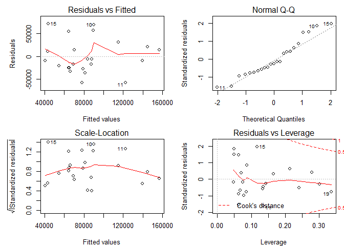<!-- -->

```r
# plot_model(model_dinoflag02, type = "diag")
# plot model estimates (neutral line; vertical intercept that indicates no effect)
# plot_model(model_dinoflag02, sort.est = TRUE)

#effektplot
# plot_model(model_dinoflag02, type = "slope", show.data = TRUE)
par(mfrow = c(2,3), mar = c(4,5,2,1))
visreg(model_dinoflag02,  points = list(cex = 1))


if(save_plots){
  png("Figures_rapp/Regressions_Plankton_dinoflag02.png", width = 25, height = 7.5, unit = "cm", res = 400)
  par(mfrow = c(1,3), mar = c(4,5,2,1), oma = c(0,3,0,0))
  visreg(model_dinoflag02,  points = list(cex = 1), ylab = "")
  mtext("Dinoflagellate abundance", 2, line = 1, outer = TRUE)
  dev.off()
}


tab_model (model_dinoflag02)
```

<table style="border-collapse:collapse; border:none;">
<tr>
<th style="border-top: double; text-align:center; font-style:normal; font-weight:bold; padding:0.2cm;  text-align:left; ">&nbsp;</th>
<th colspan="3" style="border-top: double; text-align:center; font-style:normal; font-weight:bold; padding:0.2cm; ">Plankton Dinoflagellates</th>
</tr>
<tr>
<td style=" text-align:center; border-bottom:1px solid; font-style:italic; font-weight:normal;  text-align:left; ">Predictors</td>
<td style=" text-align:center; border-bottom:1px solid; font-style:italic; font-weight:normal;  ">Estimates</td>
<td style=" text-align:center; border-bottom:1px solid; font-style:italic; font-weight:normal;  ">CI</td>
<td style=" text-align:center; border-bottom:1px solid; font-style:italic; font-weight:normal;  ">p</td>
</tr>
<tr>
<td style=" padding:0.2cm; text-align:left; vertical-align:top; text-align:left; ">(Intercept)</td>
<td style=" padding:0.2cm; text-align:left; vertical-align:top; text-align:center;  ">128732.03</td>
<td style=" padding:0.2cm; text-align:left; vertical-align:top; text-align:center;  ">-33784.32&nbsp;&ndash;&nbsp;291248.37</td>
<td style=" padding:0.2cm; text-align:left; vertical-align:top; text-align:center;  ">0.136</td>
</tr>
<tr>
<td style=" padding:0.2cm; text-align:left; vertical-align:top; text-align:left; ">Hydro DIN Surface</td>
<td style=" padding:0.2cm; text-align:left; vertical-align:top; text-align:center;  ">37822.50</td>
<td style=" padding:0.2cm; text-align:left; vertical-align:top; text-align:center;  ">18480.55&nbsp;&ndash;&nbsp;57164.45</td>
<td style=" padding:0.2cm; text-align:left; vertical-align:top; text-align:center;  "><strong>0.001</strong></td>
</tr>
<tr>
<td style=" padding:0.2cm; text-align:left; vertical-align:top; text-align:left; ">Hydro PO 4 Surface</td>
<td style=" padding:0.2cm; text-align:left; vertical-align:top; text-align:center;  ">-815739.15</td>
<td style=" padding:0.2cm; text-align:left; vertical-align:top; text-align:center;  ">-1648415.25&nbsp;&ndash;&nbsp;16936.96</td>
<td style=" padding:0.2cm; text-align:left; vertical-align:top; text-align:center;  ">0.069</td>
</tr>
<tr>
<td style=" padding:0.2cm; text-align:left; vertical-align:top; text-align:left; padding-top:0.1cm; padding-bottom:0.1cm; border-top:1px solid;">Observations</td>
<td style=" padding:0.2cm; text-align:left; vertical-align:top; padding-top:0.1cm; padding-bottom:0.1cm; text-align:left; border-top:1px solid;" colspan="3">23</td>
</tr>
<tr>
<td style=" padding:0.2cm; text-align:left; vertical-align:top; text-align:left; padding-top:0.1cm; padding-bottom:0.1cm;">R<sup>2</sup> / adjusted R<sup>2</sup></td>
<td style=" padding:0.2cm; text-align:left; vertical-align:top; padding-top:0.1cm; padding-bottom:0.1cm; text-align:left;" colspan="3">0.424 / 0.367</td>
</tr>

</table>
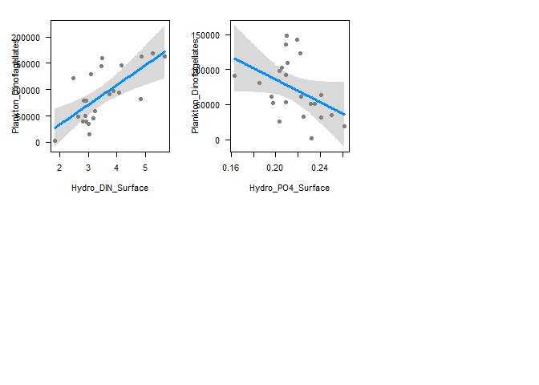<!-- -->


## c. Flagellates
### Including Hydro_Secchi_Surface

```r
# 1b
full_model <- lm(Plankton_Flagellates ~ River_TOC + River_SPM + Winter_NAO +
                   Hydro_Salinity_Surface + Hydro_POC_Surface + Hydro_DIN_Surface +
                   Hydro_PO4_Surface + Hydro_TotP_Surface + Hydro_TotN_Surface + 
                   Hydro_Temperature_Surface +
                   Hydro_Secchi_Surface, 
                  data = dat_sel2) 
# summary(full_model)
# finne min model
min_model <- dredge (full_model, rank = "BIC") 
```

```
## Fixed term is "(Intercept)"
```

```r
model_flag01 <- get.models(min_model, 1)[[1]]
summary (model_flag01)
```

```
## 
## Call:
## lm(formula = Plankton_Flagellates ~ Hydro_Secchi_Surface + Hydro_TotP_Surface + 
##     River_SPM + 1, data = dat_sel2)
## 
## Residuals:
##      Min       1Q   Median       3Q      Max 
## -1996362  -659785  -163252   835494  1790034 
## 
## Coefficients:
##                        Estimate Std. Error t value Pr(>|t|)   
## (Intercept)           2.268e+07  6.173e+06   3.674  0.00161 **
## Hydro_Secchi_Surface -7.963e+05  3.013e+05  -2.643  0.01604 * 
## Hydro_TotP_Surface   -2.394e+07  9.733e+06  -2.460  0.02366 * 
## River_SPM            -5.065e+00  2.143e+00  -2.363  0.02894 * 
## ---
## Signif. codes:  0 '***' 0.001 '**' 0.01 '*' 0.05 '.' 0.1 ' ' 1
## 
## Residual standard error: 1166000 on 19 degrees of freedom
## Multiple R-squared:  0.4361,	Adjusted R-squared:  0.3471 
## F-statistic: 4.899 on 3 and 19 DF,  p-value: 0.01093
```

```r
# Plot model
# model diagnostics
par(mfrow = c(2,2), mar = c(4,5,2,1))
plot(model_flag01)
```

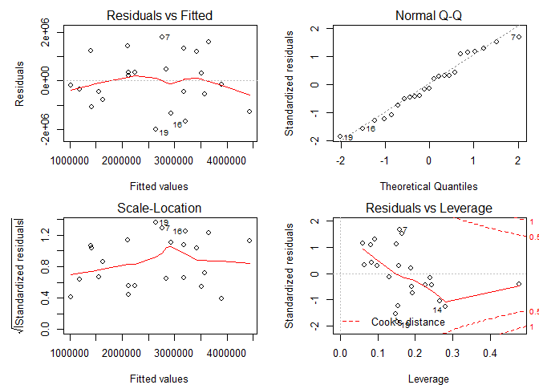<!-- -->

```r
# plot_model(model_flag01, type = "diag")
# plot model estimates (neutral line; vertical intercept that indicates no effect)
plot_model(model_flag01, sort.est = TRUE)
```

<!-- -->

```r
#effektplot
# plot_model(model_flag01, type = "slope", show.data = TRUE)
par(mfrow = c(2,3), mar = c(4,5,2,1))
visreg(model_flag01,  points = list(cex = 1))


if(save_plots){
  png("Figures_rapp/Regressions_Plankton_flag01.png", width = 18, height = 15, unit = "cm", res = 400)
  par(mfrow = c(2,2), mar = c(4,5,2,1), oma = c(0,3,0,0))
  visreg(model_flag01,  points = list(cex = 1), ylab = "")
  mtext("Flagellate abundance", 2, line = 1, outer = TRUE)
  dev.off()
}


tab_model (model_flag01)
```

<table style="border-collapse:collapse; border:none;">
<tr>
<th style="border-top: double; text-align:center; font-style:normal; font-weight:bold; padding:0.2cm;  text-align:left; ">&nbsp;</th>
<th colspan="3" style="border-top: double; text-align:center; font-style:normal; font-weight:bold; padding:0.2cm; ">Plankton Flagellates</th>
</tr>
<tr>
<td style=" text-align:center; border-bottom:1px solid; font-style:italic; font-weight:normal;  text-align:left; ">Predictors</td>
<td style=" text-align:center; border-bottom:1px solid; font-style:italic; font-weight:normal;  ">Estimates</td>
<td style=" text-align:center; border-bottom:1px solid; font-style:italic; font-weight:normal;  ">CI</td>
<td style=" text-align:center; border-bottom:1px solid; font-style:italic; font-weight:normal;  ">p</td>
</tr>
<tr>
<td style=" padding:0.2cm; text-align:left; vertical-align:top; text-align:left; ">(Intercept)</td>
<td style=" padding:0.2cm; text-align:left; vertical-align:top; text-align:center;  ">22675522.51</td>
<td style=" padding:0.2cm; text-align:left; vertical-align:top; text-align:center;  ">10577546.45&nbsp;&ndash;&nbsp;34773498.56</td>
<td style=" padding:0.2cm; text-align:left; vertical-align:top; text-align:center;  "><strong>0.002</strong></td>
</tr>
<tr>
<td style=" padding:0.2cm; text-align:left; vertical-align:top; text-align:left; ">Hydro Secchi Surface</td>
<td style=" padding:0.2cm; text-align:left; vertical-align:top; text-align:center;  ">-796306.00</td>
<td style=" padding:0.2cm; text-align:left; vertical-align:top; text-align:center;  ">-1386819.94&nbsp;&ndash;&nbsp;-205792.07</td>
<td style=" padding:0.2cm; text-align:left; vertical-align:top; text-align:center;  "><strong>0.016</strong></td>
</tr>
<tr>
<td style=" padding:0.2cm; text-align:left; vertical-align:top; text-align:left; ">Hydro Tot P Surface</td>
<td style=" padding:0.2cm; text-align:left; vertical-align:top; text-align:center;  ">-23940358.57</td>
<td style=" padding:0.2cm; text-align:left; vertical-align:top; text-align:center;  ">-43016438.66&nbsp;&ndash;&nbsp;-4864278.48</td>
<td style=" padding:0.2cm; text-align:left; vertical-align:top; text-align:center;  "><strong>0.024</strong></td>
</tr>
<tr>
<td style=" padding:0.2cm; text-align:left; vertical-align:top; text-align:left; ">River SPM</td>
<td style=" padding:0.2cm; text-align:left; vertical-align:top; text-align:center;  ">-5.07</td>
<td style=" padding:0.2cm; text-align:left; vertical-align:top; text-align:center;  ">-9.27&nbsp;&ndash;&nbsp;-0.86</td>
<td style=" padding:0.2cm; text-align:left; vertical-align:top; text-align:center;  "><strong>0.029</strong></td>
</tr>
<tr>
<td style=" padding:0.2cm; text-align:left; vertical-align:top; text-align:left; padding-top:0.1cm; padding-bottom:0.1cm; border-top:1px solid;">Observations</td>
<td style=" padding:0.2cm; text-align:left; vertical-align:top; padding-top:0.1cm; padding-bottom:0.1cm; text-align:left; border-top:1px solid;" colspan="3">23</td>
</tr>
<tr>
<td style=" padding:0.2cm; text-align:left; vertical-align:top; text-align:left; padding-top:0.1cm; padding-bottom:0.1cm;">R<sup>2</sup> / adjusted R<sup>2</sup></td>
<td style=" padding:0.2cm; text-align:left; vertical-align:top; padding-top:0.1cm; padding-bottom:0.1cm; text-align:left;" colspan="3">0.436 / 0.347</td>
</tr>

</table>
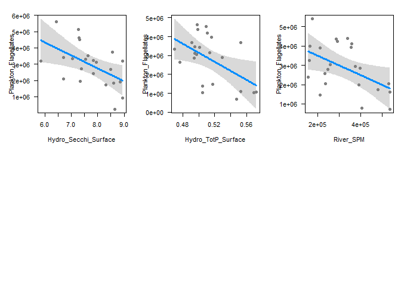<!-- -->

## d. Excluding Hydro_Chla_Surface + Hydro_Secchi_Surface

```r
# 1b
full_model <- lm(Plankton_Flagellates ~ River_TOC + River_SPM + Winter_NAO +
                   Hydro_Salinity_Surface + Hydro_POC_Surface + Hydro_DIN_Surface +
                   Hydro_PO4_Surface + Hydro_TotP_Surface + Hydro_TotN_Surface + 
                   Hydro_Temperature_Surface, 
                  data = dat_sel2) 
# summary(full_model)
# finne min model
min_model <- dredge (full_model, rank = "BIC") 
```

```
## Fixed term is "(Intercept)"
```

```r
model_flag02 <- get.models(min_model, 1)[[1]]
summary (model_flag02)
```

```
## 
## Call:
## lm(formula = Plankton_Flagellates ~ Hydro_TotN_Surface + Hydro_TotP_Surface + 
##     River_SPM + 1, data = dat_sel2)
## 
## Residuals:
##      Min       1Q   Median       3Q      Max 
## -1700676  -635908    31102   954355  2080453 
## 
## Coefficients:
##                      Estimate Std. Error t value Pr(>|t|)  
## (Intercept)         7.831e+06  5.715e+06   1.370   0.1866  
## Hydro_TotN_Surface  4.482e+05  1.796e+05   2.495   0.0220 *
## Hydro_TotP_Surface -2.195e+07  9.744e+06  -2.253   0.0363 *
## River_SPM          -5.359e+00  2.171e+00  -2.468   0.0233 *
## ---
## Signif. codes:  0 '***' 0.001 '**' 0.01 '*' 0.05 '.' 0.1 ' ' 1
## 
## Residual standard error: 1184000 on 19 degrees of freedom
## Multiple R-squared:  0.4192,	Adjusted R-squared:  0.3275 
## F-statistic: 4.571 on 3 and 19 DF,  p-value: 0.01425
```

```r
# Plot model
# model diagnostics
par(mfrow = c(2,2), mar = c(4,5,2,1))
plot(model_flag02)
```

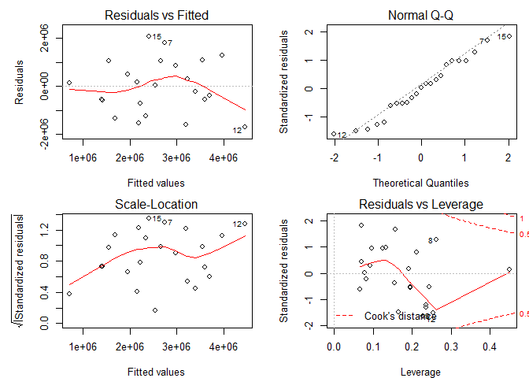<!-- -->

```r
# plot_model(model_flag02, type = "diag")
# plot model estimates (neutral line; vertical intercept that indicates no effect)
plot_model(model_flag02, sort.est = TRUE)
```

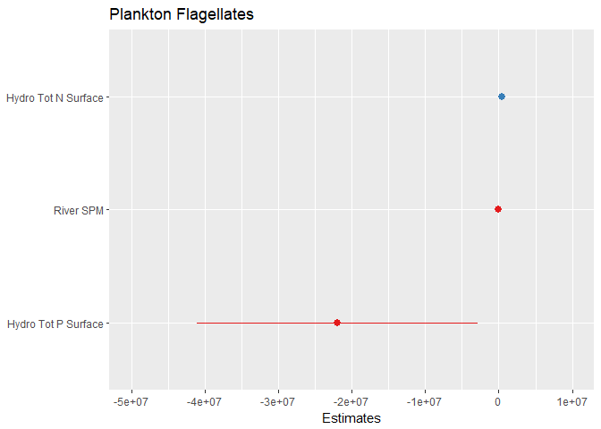<!-- -->

```r
#effektplot
# plot_model(model_flag02, type = "slope", show.data = TRUE)
par(mfrow = c(2,3), mar = c(4,5,2,1))
visreg(model_flag02,  points = list(cex = 1))


if(save_plots){
  png("Figures_rapp/Regressions_Plankton_flag02.png", width = 18, height = 15, unit = "cm", res = 400)
  par(mfrow = c(2,2), mar = c(4,5,2,1), oma = c(0,3,0,0))
  visreg(model_flag02,  points = list(cex = 1), ylab = "")
  mtext("Flagellate abundance", 2, line = 1, outer = TRUE)
  dev.off()
}

tab_model (model_flag02)
```

<table style="border-collapse:collapse; border:none;">
<tr>
<th style="border-top: double; text-align:center; font-style:normal; font-weight:bold; padding:0.2cm;  text-align:left; ">&nbsp;</th>
<th colspan="3" style="border-top: double; text-align:center; font-style:normal; font-weight:bold; padding:0.2cm; ">Plankton Flagellates</th>
</tr>
<tr>
<td style=" text-align:center; border-bottom:1px solid; font-style:italic; font-weight:normal;  text-align:left; ">Predictors</td>
<td style=" text-align:center; border-bottom:1px solid; font-style:italic; font-weight:normal;  ">Estimates</td>
<td style=" text-align:center; border-bottom:1px solid; font-style:italic; font-weight:normal;  ">CI</td>
<td style=" text-align:center; border-bottom:1px solid; font-style:italic; font-weight:normal;  ">p</td>
</tr>
<tr>
<td style=" padding:0.2cm; text-align:left; vertical-align:top; text-align:left; ">(Intercept)</td>
<td style=" padding:0.2cm; text-align:left; vertical-align:top; text-align:center;  ">7830501.19</td>
<td style=" padding:0.2cm; text-align:left; vertical-align:top; text-align:center;  ">-3371223.82&nbsp;&ndash;&nbsp;19032226.19</td>
<td style=" padding:0.2cm; text-align:left; vertical-align:top; text-align:center;  ">0.187</td>
</tr>
<tr>
<td style=" padding:0.2cm; text-align:left; vertical-align:top; text-align:left; ">Hydro Tot N Surface</td>
<td style=" padding:0.2cm; text-align:left; vertical-align:top; text-align:center;  ">448189.03</td>
<td style=" padding:0.2cm; text-align:left; vertical-align:top; text-align:center;  ">96136.93&nbsp;&ndash;&nbsp;800241.12</td>
<td style=" padding:0.2cm; text-align:left; vertical-align:top; text-align:center;  "><strong>0.022</strong></td>
</tr>
<tr>
<td style=" padding:0.2cm; text-align:left; vertical-align:top; text-align:left; ">Hydro Tot P Surface</td>
<td style=" padding:0.2cm; text-align:left; vertical-align:top; text-align:center;  ">-21951231.17</td>
<td style=" padding:0.2cm; text-align:left; vertical-align:top; text-align:center;  ">-41048589.25&nbsp;&ndash;&nbsp;-2853873.10</td>
<td style=" padding:0.2cm; text-align:left; vertical-align:top; text-align:center;  "><strong>0.036</strong></td>
</tr>
<tr>
<td style=" padding:0.2cm; text-align:left; vertical-align:top; text-align:left; ">River SPM</td>
<td style=" padding:0.2cm; text-align:left; vertical-align:top; text-align:center;  ">-5.36</td>
<td style=" padding:0.2cm; text-align:left; vertical-align:top; text-align:center;  ">-9.61&nbsp;&ndash;&nbsp;-1.10</td>
<td style=" padding:0.2cm; text-align:left; vertical-align:top; text-align:center;  "><strong>0.023</strong></td>
</tr>
<tr>
<td style=" padding:0.2cm; text-align:left; vertical-align:top; text-align:left; padding-top:0.1cm; padding-bottom:0.1cm; border-top:1px solid;">Observations</td>
<td style=" padding:0.2cm; text-align:left; vertical-align:top; padding-top:0.1cm; padding-bottom:0.1cm; text-align:left; border-top:1px solid;" colspan="3">23</td>
</tr>
<tr>
<td style=" padding:0.2cm; text-align:left; vertical-align:top; text-align:left; padding-top:0.1cm; padding-bottom:0.1cm;">R<sup>2</sup> / adjusted R<sup>2</sup></td>
<td style=" padding:0.2cm; text-align:left; vertical-align:top; padding-top:0.1cm; padding-bottom:0.1cm; text-align:left;" colspan="3">0.419 / 0.327</td>
</tr>

</table>
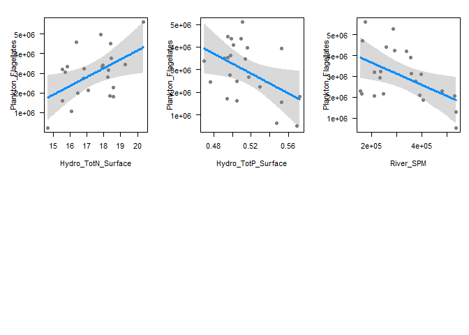<!-- -->


## e. Plankton including year effect (effectively like detrending data)

```r
#
### Diatoms
#
full_model <- lm(Plankton_Diatoms ~ River_TOC + River_SPM + Winter_NAO +
                   Hydro_Salinity_Surface + Hydro_POC_Surface + Hydro_DIN_Surface +
                   Hydro_PO4_Surface + Hydro_TotP_Surface + Hydro_TotN_Surface + 
                   Hydro_Temperature_Surface +
                   Hydro_Secchi_Surface +
                   Year, 
                  data = dat_sel2) 
# summary(full_model)
# finne min model
min_model <- dredge (full_model, fixed = "Year", rank = "BIC") 
```

```
## Fixed terms are "Year" and "(Intercept)"
```

```r
# All models with dBIC < 2

subset(min_model, delta <= 2)
```

<div data-pagedtable="false">
  <script data-pagedtable-source type="application/json">
{"columns":[{"label":[""],"name":["_rn_"],"type":[""],"align":["left"]},{"label":["(Intercept)"],"name":[1],"type":["dbl"],"align":["right"]},{"label":["Hydro_DIN_Surface"],"name":[2],"type":["dbl"],"align":["right"]},{"label":["Hydro_PO4_Surface"],"name":[3],"type":["dbl"],"align":["right"]},{"label":["Hydro_POC_Surface"],"name":[4],"type":["dbl"],"align":["right"]},{"label":["Hydro_Salinity_Surface"],"name":[5],"type":["dbl"],"align":["right"]},{"label":["Hydro_Secchi_Surface"],"name":[6],"type":["dbl"],"align":["right"]},{"label":["Hydro_Temperature_Surface"],"name":[7],"type":["dbl"],"align":["right"]},{"label":["Hydro_TotN_Surface"],"name":[8],"type":["dbl"],"align":["right"]},{"label":["Hydro_TotP_Surface"],"name":[9],"type":["dbl"],"align":["right"]},{"label":["River_SPM"],"name":[10],"type":["dbl"],"align":["right"]},{"label":["River_TOC"],"name":[11],"type":["dbl"],"align":["right"]},{"label":["Winter_NAO"],"name":[12],"type":["dbl"],"align":["right"]},{"label":["Year"],"name":[13],"type":["dbl"],"align":["right"]},{"label":["df"],"name":[14],"type":["int"],"align":["right"]},{"label":["logLik"],"name":[15],"type":["dbl"],"align":["right"]},{"label":["BIC"],"name":[16],"type":["dbl"],"align":["right"]},{"label":["delta"],"name":[17],"type":["dbl"],"align":["right"]},{"label":["weight"],"name":[18],"type":["S3: model.weights"],"align":["right"]}],"data":[{"1":"-5657599","2":"NA","3":"6480573","4":"NA","5":"NA","6":"NA","7":"NA","8":"NA","9":"NA","10":"NA","11":"NA","12":"NA","13":"2326.966","14":"4","15":"-317.1100","16":"646.7620","17":"0.00000","18":"0.6274084","_rn_":"3"},{"1":"-15413750","2":"NA","3":"6635790","4":"NA","5":"NA","6":"NA","7":"NA","8":"NA","9":"NA","10":"-0.6364763","11":"NA","12":"NA","13":"7277.652","14":"5","15":"-316.0634","16":"647.8042","17":"1.04223","18":"0.3725916","_rn_":"259"}],"options":{"columns":{"min":{},"max":[10]},"rows":{"min":[10],"max":[10]},"pages":{}}}
  </script>
</div>

```r
# Best model
get.models(min_model, 1)[[1]] %>% summary()
```

```
## 
## Call:
## lm(formula = Plankton_Diatoms ~ Hydro_PO4_Surface + 1 + Year, 
##     data = dat_sel2)
## 
## Residuals:
##     Min      1Q  Median      3Q     Max 
## -301788 -156749  -18668  121969  555850 
## 
## Coefficients:
##                   Estimate Std. Error t value Pr(>|t|)  
## (Intercept)       -5657599   16258361  -0.348    0.731  
## Hydro_PO4_Surface  6480573    2490230   2.602    0.017 *
## Year                  2327       8057   0.289    0.776  
## ---
## Signif. codes:  0 '***' 0.001 '**' 0.01 '*' 0.05 '.' 0.1 ' ' 1
## 
## Residual standard error: 252300 on 20 degrees of freedom
## Multiple R-squared:  0.2538,	Adjusted R-squared:  0.1792 
## F-statistic: 3.401 on 2 and 20 DF,  p-value: 0.05352
```

```r
#
### Plankton_Dinoflagellates
#
full_model <- lm(Plankton_Dinoflagellates ~ River_TOC + River_SPM + Winter_NAO +
                   Hydro_Salinity_Surface + Hydro_POC_Surface + Hydro_DIN_Surface +
                   Hydro_PO4_Surface + Hydro_TotP_Surface + Hydro_TotN_Surface + 
                   Hydro_Temperature_Surface +
                   Hydro_Secchi_Surface +
                   Year, 
                  data = dat_sel2) 
# summary(full_model)
# finne min model
min_model <- dredge (full_model, fixed = "Year", rank = "BIC") 
```

```
## Fixed terms are "Year" and "(Intercept)"
```

```r
# All models with dBIC < 2
subset(min_model, delta <= 2)
```

<div data-pagedtable="false">
  <script data-pagedtable-source type="application/json">
{"columns":[{"label":[""],"name":["_rn_"],"type":[""],"align":["left"]},{"label":["(Intercept)"],"name":[1],"type":["dbl"],"align":["right"]},{"label":["Hydro_DIN_Surface"],"name":[2],"type":["dbl"],"align":["right"]},{"label":["Hydro_PO4_Surface"],"name":[3],"type":["dbl"],"align":["right"]},{"label":["Hydro_POC_Surface"],"name":[4],"type":["dbl"],"align":["right"]},{"label":["Hydro_Salinity_Surface"],"name":[5],"type":["dbl"],"align":["right"]},{"label":["Hydro_Secchi_Surface"],"name":[6],"type":["dbl"],"align":["right"]},{"label":["Hydro_Temperature_Surface"],"name":[7],"type":["dbl"],"align":["right"]},{"label":["Hydro_TotN_Surface"],"name":[8],"type":["dbl"],"align":["right"]},{"label":["Hydro_TotP_Surface"],"name":[9],"type":["dbl"],"align":["right"]},{"label":["River_SPM"],"name":[10],"type":["dbl"],"align":["right"]},{"label":["River_TOC"],"name":[11],"type":["dbl"],"align":["right"]},{"label":["Winter_NAO"],"name":[12],"type":["dbl"],"align":["right"]},{"label":["Year"],"name":[13],"type":["dbl"],"align":["right"]},{"label":["df"],"name":[14],"type":["int"],"align":["right"]},{"label":["logLik"],"name":[15],"type":["dbl"],"align":["right"]},{"label":["BIC"],"name":[16],"type":["dbl"],"align":["right"]},{"label":["delta"],"name":[17],"type":["dbl"],"align":["right"]},{"label":["weight"],"name":[18],"type":["S3: model.weights"],"align":["right"]}],"data":[{"1":"11164998","2":"NA","3":"NA","4":"NA","5":"NA","6":"-17023.99","7":"NA","8":"NA","9":"-380835.0","10":"NA","11":"0.5066009","12":"NA","13":"-5410.380","14":"6","15":"-260.6546","16":"540.1221","17":"0.0000000","18":"0.4079295","_rn_":"657"},{"1":"11537953","2":"NA","3":"-440415.6","4":"NA","5":"NA","6":"-16588.15","7":"NA","8":"NA","9":"NA","10":"NA","11":"0.5151624","12":"NA","13":"-5648.878","14":"6","15":"-261.1413","16":"541.0955","17":"0.9734411","18":"0.2507293","_rn_":"531"},{"1":"11427298","2":"NA","3":"NA","4":"NA","5":"NA","6":"-13311.62","7":"NA","8":"NA","9":"NA","10":"NA","11":"0.5522844","12":"NA","13":"-5657.306","14":"5","15":"-263.0924","16":"541.8623","17":"1.7402146","18":"0.1708844","_rn_":"529"},{"1":"11037721","2":"NA","3":"NA","4":"NA","5":"NA","6":"-19575.37","7":"NA","8":"NA","9":"-402727.3","10":"NA","11":"0.5600435","12":"-2361.02","13":"-5335.734","14":"7","15":"-259.9594","16":"541.8673","17":"1.7452249","18":"0.1704568","_rn_":"1681"}],"options":{"columns":{"min":{},"max":[10]},"rows":{"min":[10],"max":[10]},"pages":{}}}
  </script>
</div>

```r
# Best model
get.models(min_model, 1)[[1]] %>% summary()
```

```
## 
## Call:
## lm(formula = Plankton_Dinoflagellates ~ Hydro_Secchi_Surface + 
##     Hydro_TotP_Surface + River_TOC + 1 + Year, data = dat_sel2)
## 
## Residuals:
##    Min     1Q Median     3Q    Max 
## -50949 -14235  -5263  14834  35311 
## 
## Coefficients:
##                        Estimate Std. Error t value Pr(>|t|)    
## (Intercept)           1.116e+07  1.671e+06   6.682 2.87e-06 ***
## Hydro_Secchi_Surface -1.702e+04  6.894e+03  -2.469  0.02377 *  
## Hydro_TotP_Surface   -3.808e+05  1.847e+05  -2.062  0.05399 .  
## River_TOC             5.066e-01  1.529e-01   3.313  0.00387 ** 
## Year                 -5.410e+03  8.535e+02  -6.339 5.67e-06 ***
## ---
## Signif. codes:  0 '***' 0.001 '**' 0.01 '*' 0.05 '.' 0.1 ' ' 1
## 
## Residual standard error: 22840 on 18 degrees of freedom
## Multiple R-squared:  0.823,	Adjusted R-squared:  0.7837 
## F-statistic: 20.93 on 4 and 18 DF,  p-value: 1.43e-06
```

```r
#
### Plankton_Flagellates
#
full_model <- lm(Plankton_Flagellates ~ River_TOC + River_SPM + Winter_NAO +
                   Hydro_Salinity_Surface + Hydro_POC_Surface + Hydro_DIN_Surface +
                   Hydro_PO4_Surface + Hydro_TotP_Surface + Hydro_TotN_Surface + 
                   Hydro_Temperature_Surface +
                   Hydro_Secchi_Surface +
                   Year, 
                  data = dat_sel2) 
# summary(full_model)
# finne min model
min_model <- dredge (full_model, fixed = "Year", rank = "BIC") 
```

```
## Fixed terms are "Year" and "(Intercept)"
```

```r
# All models with dBIC < 2
subset(min_model, delta <= 2)
```

<div data-pagedtable="false">
  <script data-pagedtable-source type="application/json">
{"columns":[{"label":[""],"name":["_rn_"],"type":[""],"align":["left"]},{"label":["(Intercept)"],"name":[1],"type":["dbl"],"align":["right"]},{"label":["Hydro_DIN_Surface"],"name":[2],"type":["dbl"],"align":["right"]},{"label":["Hydro_PO4_Surface"],"name":[3],"type":["dbl"],"align":["right"]},{"label":["Hydro_POC_Surface"],"name":[4],"type":["dbl"],"align":["right"]},{"label":["Hydro_Salinity_Surface"],"name":[5],"type":["dbl"],"align":["right"]},{"label":["Hydro_Secchi_Surface"],"name":[6],"type":["dbl"],"align":["right"]},{"label":["Hydro_Temperature_Surface"],"name":[7],"type":["dbl"],"align":["right"]},{"label":["Hydro_TotN_Surface"],"name":[8],"type":["dbl"],"align":["right"]},{"label":["Hydro_TotP_Surface"],"name":[9],"type":["dbl"],"align":["right"]},{"label":["River_SPM"],"name":[10],"type":["dbl"],"align":["right"]},{"label":["River_TOC"],"name":[11],"type":["dbl"],"align":["right"]},{"label":["Winter_NAO"],"name":[12],"type":["dbl"],"align":["right"]},{"label":["Year"],"name":[13],"type":["dbl"],"align":["right"]},{"label":["df"],"name":[14],"type":["int"],"align":["right"]},{"label":["logLik"],"name":[15],"type":["dbl"],"align":["right"]},{"label":["BIC"],"name":[16],"type":["dbl"],"align":["right"]},{"label":["delta"],"name":[17],"type":["dbl"],"align":["right"]},{"label":["weight"],"name":[18],"type":["S3: model.weights"],"align":["right"]}],"data":[{"1":"212589242","2":"NA","3":"NA","4":"NA","5":"NA","6":"NA","7":"NA","8":"NA","9":"NA","10":"NA","11":"NA","12":"NA","13":"-104727.69","14":"3","15":"-355.1337","16":"719.6738","17":"0.000000","18":"0.4500409","_rn_":"1"},{"1":"221377100","2":"NA","3":"NA","4":"NA","5":"NA","6":"NA","7":"NA","8":"NA","9":"-11120313","10":"NA","11":"NA","12":"NA","13":"-106261.31","14":"4","15":"-354.4183","16":"721.3785","17":"1.704727","18":"0.1919001","_rn_":"129"},{"1":"166220625","2":"NA","3":"NA","4":"NA","5":"NA","6":"NA","7":"NA","8":"238101.5","9":"NA","10":"NA","11":"NA","12":"NA","13":"-83660.25","14":"4","15":"-354.4212","16":"721.3845","17":"1.710656","18":"0.1913320","_rn_":"65"},{"1":"167604549","2":"NA","3":"NA","4":"NA","5":"NA","6":"-375375.8","7":"NA","8":"NA","9":"NA","10":"NA","11":"NA","12":"NA","13":"-80846.44","14":"4","15":"-354.5589","16":"721.6598","17":"1.985961","18":"0.1667270","_rn_":"17"}],"options":{"columns":{"min":{},"max":[10]},"rows":{"min":[10],"max":[10]},"pages":{}}}
  </script>
</div>

```r
# Best model
get.models(min_model, 1)[[1]] %>% summary()
```

```
## 
## Call:
## lm(formula = Plankton_Flagellates ~ 1 + Year, data = dat_sel2)
## 
## Residuals:
##      Min       1Q   Median       3Q      Max 
## -1623191 -1226043   -77633  1008784  2016051 
## 
## Coefficients:
##              Estimate Std. Error t value Pr(>|t|)  
## (Intercept) 212589242   81060333   2.623   0.0159 *
## Year          -104728      40429  -2.590   0.0171 *
## ---
## Signif. codes:  0 '***' 0.001 '**' 0.01 '*' 0.05 '.' 0.1 ' ' 1
## 
## Residual standard error: 1286000 on 21 degrees of freedom
## Multiple R-squared:  0.2422,	Adjusted R-squared:  0.2061 
## F-statistic:  6.71 on 1 and 21 DF,  p-value: 0.01707
```

