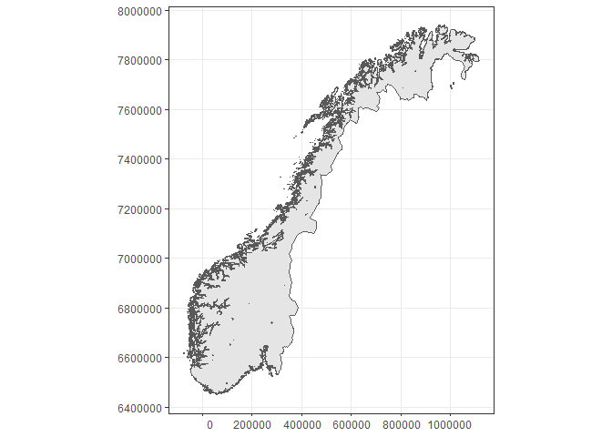
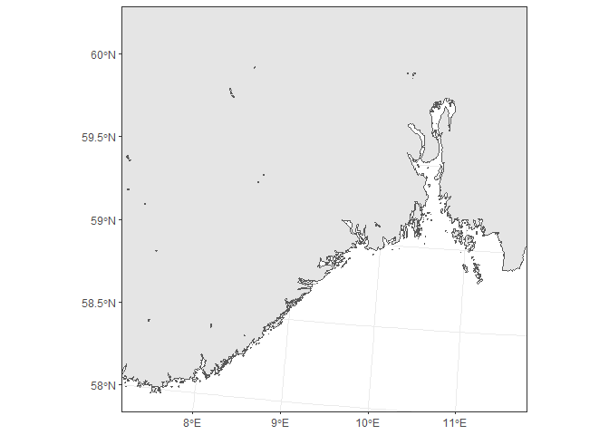
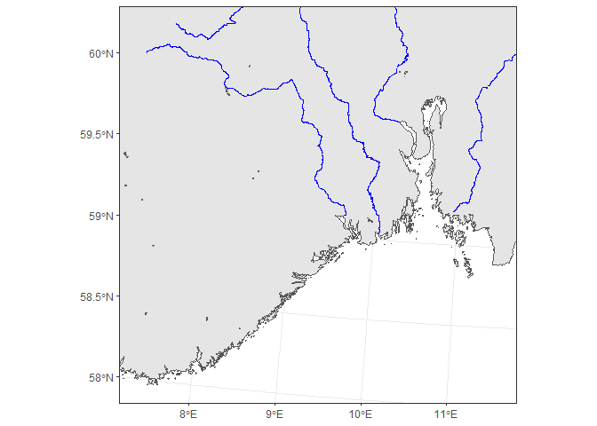
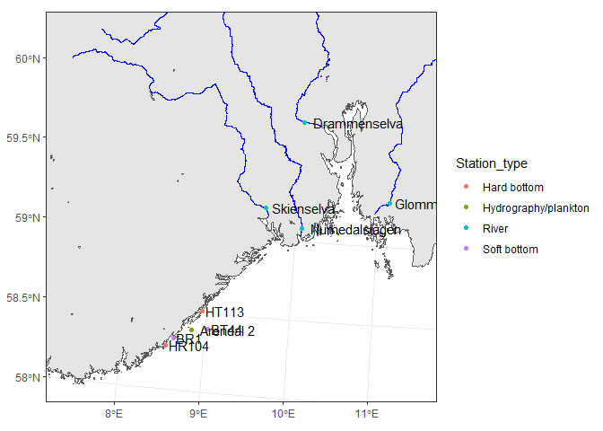
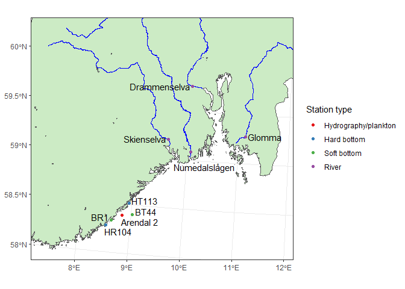
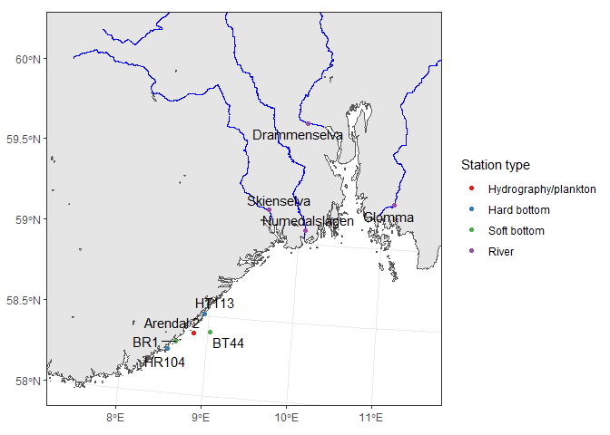

Makes overview map, using the map data in NIVA's "K:/Kart"  
The "second try" map is the one used   
  
This code uses the new _sf_ package (which supersedes _sp_). It works nicely together with ggplot2 (see below), but for the time being (Dec. 2018) you need the _development version_ of ggplot2. See code below for details.      
  
## Packages

```r
# Install
# install.packages("sf")

# Also needs the *development version* of ggplot2
# First, remove folders digest and ggplot2 in your Library folder (I needed to do that, at least)
# (Eh, I don't know where I store my packages? Run: .libPaths() )
# Then:
#   install.packages("digest")
#   devtools::install_github("tidyverse/ggplot2")


library(sf)
```

```
## Linking to GEOS 3.6.1, GDAL 2.2.3, PROJ 4.9.3
```

```r
library(ggplot2)
library(dplyr)
```

```
## 
## Attaching package: 'dplyr'
```

```
## The following objects are masked from 'package:stats':
## 
##     filter, lag
```

```
## The following objects are masked from 'package:base':
## 
##     intersect, setdiff, setequal, union
```

```r
library(ggrepel)

save_plot <- FALSE
```

## Load basemap

```r
nc_norway <- st_read("K:/Kart/N1000/norge2.shp")
```

```
## Reading layer `norge2' from data source `K:\Kart\N1000\norge2.shp' using driver `ESRI Shapefile'
## Simple feature collection with 2030 features and 4 fields
## geometry type:  POLYGON
## dimension:      XY
## bbox:           xmin: -75844 ymin: 6449504 xmax: 1114610 ymax: 7939790
## epsg (SRID):    NA
## proj4string:    NA
```

### Check coordinate system of the base map  
It is NA, so we have to set it manually   

```r
# Check
check <- st_crs(nc_norway)
check
```

```
## Coordinate Reference System: NA
```

```r
if (is.na(check)){
  cat("\nSet coordinate system:\n")
  st_crs(nc_norway) <- "+proj=utm +zone=33"
}
```

```
## 
## Set coordinate system:
```

### Test map  
In order to find values  xlim and ylim, use the map with 'datum' set to the 'native' coordinates  (ca. 20 seconds)   

```r
make_test_map <- TRUE

if (make_test_map){
  ggplot(nc_norway) + 
    geom_sf() + 
    theme_bw() +
    coord_sf(datum = st_crs("+proj=utm +zone=33"))
}
```

<!-- -->


### Check background map (ca. 20 seconds)  

```r
ggplot(nc_norway) + 
  geom_sf() + 
  theme_bw() +
  coord_sf(ylim = c(6.45, 6.7)*1E6, xlim = c(0.05, 0.3)*1E6)
```

<!-- -->

## Add rivers from the ELVIS base  

```r
nc_rivers <- st_read("K:\\Kart\\ELVIS\\Hovedelv\\elvis_hovedelv.shp")
```

```
## Reading layer `elvis_hovedelv' from data source `K:\Kart\ELVIS\Hovedelv\elvis_hovedelv.shp' using driver `ESRI Shapefile'
## Simple feature collection with 8229 features and 7 fields
## geometry type:  MULTILINESTRING
## dimension:      XY
## bbox:           xmin: -52024.51 ymin: 6455620 xmax: 1115094 ymax: 7935058
## epsg (SRID):    32633
## proj4string:    +proj=utm +zone=33 +datum=WGS84 +units=m +no_defs
```

### Various checks on river data  

```r
# Check variables:  
nc_rivers[1,]
```

<div data-pagedtable="false">
  <script data-pagedtable-source type="application/json">
{"columns":[{"label":[""],"name":["_rn_"],"type":[""],"align":["left"]},{"label":["VNR_NFELT"],"name":[1],"type":["fctr"],"align":["left"]},{"label":["ELVENAVN"],"name":[2],"type":["fctr"],"align":["left"]},{"label":["NAVNHIERAR"],"name":[3],"type":["fctr"],"align":["left"]},{"label":["AREALNFELT"],"name":[4],"type":["dbl"],"align":["right"]},{"label":["LENGDE"],"name":[5],"type":["dbl"],"align":["right"]},{"label":["STRAHLER"],"name":[6],"type":["int"],"align":["right"]},{"label":["DEL_LENGDE"],"name":[7],"type":["dbl"],"align":["right"]},{"label":["geometry"],"name":[8],"type":["S3: sfc_MULTILINESTRING"],"align":["right"]}],"data":[{"1":"113.71Z","2":"BJØRINGELVA","3":"BJØRINGELVA","4":"14.41","5":"13176","6":"5","7":"18","8":"<S3: sfc_MULTILINESTRING>","_rn_":"1"}],"options":{"columns":{"min":{},"max":[10]},"rows":{"min":[10],"max":[10]},"pages":{}}}
  </script>
</div>

```r
# Check STRAHLER klassification of river size  
cat("\n\nStrahler classification\n------------------------------\n")
```

```
## 
## 
## Strahler classification
## ------------------------------
```

```r
xtabs(~STRAHLER, nc_rivers)
```

```
## STRAHLER
##    1    2    3    4    5    6    7    8 
##  128  482 1512 2231 1845 1108  694  229
```

```r
# Check names of rivers   
cat("\n\nRiver names\n------------------------------\n")
```

```
## 
## 
## River names
## ------------------------------
```

```r
cat("Strahler = 8\n")
```

```
## Strahler = 8
```

```r
nc_rivers %>% filter(STRAHLER == 8) %>% xtabs(~ELVENAVN, ., drop = TRUE) %>% names() %>% dput()
```

```
## c("ALTAVASSDRAGET", "DRAMMENSVASSDRAGET", "GLOMMAVASSDRAGET", 
## "NAMSEN", "RANAVASSDRAGET", "SKIENSVASSDRAGET", "SNÅSAVASSDRAGET"
## )
```

```r
cat("Strahler = 7\n")
```

```
## Strahler = 7
```

```r
nc_rivers %>% filter(STRAHLER == 7) %>% xtabs(~ELVENAVN, ., drop = TRUE) %>% names() %>% dput()
```

```
## c("ARENDALSVASSDRAGET", "DOKKA", "DRIVA", "EIBYELVA", "EIDFJORDVASSDRAGET", 
## "ETNEVASSDRAGET", "FOLLA", "FORRA", "FUSTA", "GAULA", "HALLINGDALSVASSDRAGET", 
## "IESJÅKKA", "INNERDALSÅA", "KARASJÅKKA", "KRAGERØVASSDRAGET", 
## "LANGVASSÅGA", "MÅLSELVVASSDRAGET", "MÅR", "NIDELVVASSDRAGET", 
## "NITELVA", "NUMEDALSLÅGEN", "OGNA", "ORKLA", "OTRA", "OTTA", 
## "PASVIKELVA", "RANDSELVA", "RAUNDALSELVI", "RENA", "RETTÅNA", 
## "RØSSÅGA", "SALSVATNVASSDRAGET", "SALTDALSVASSDRAGET", "SANDDØLA", 
## "SIRA", "STJØRDALSVASSDRAGET", "SULDALSVASSDRAGET", "SØRLIVASSDRAGET", 
## "TANA", "TOVDALSVASSDRAGET", "TRYSILELVA", "TUNNSJØELVA", "VEFSNA", 
## "VERDALSVASSDRAGET", "VEST-VASSDRAGET", "VORMA-LÅGEN", "VOSSOVASSDRAGET"
## )
```


```r
# Pick rivers to show
rivers <- c("GLOMMAVASSDRAGET", "DRAMMENSVASSDRAGET", "SKIENSVASSDRAGET", "NUMEDALSLÅGEN")
sel <- with(nc_rivers, ELVENAVN %in% rivers); sum(sel)
```

```
## [1] 171
```

```r
ggplot(nc_norway) + 
  geom_sf() + 
  geom_sf(data = nc_rivers[sel,], color = "blue") + 
  theme_bw() +
  coord_sf(ylim = c(6.45, 6.7)*1E6, xlim = c(0.05, 0.3)*1E6)
```

<!-- -->

## Add sampling points  

```r
df_stations <- read.csv(textConnection("Station_type, Name, Lat, Long 
Hard bottom,HR104, 58.2732, 08.5372
Hard bottom,HT113, 58.5132, 08.9445
Soft bottom,BR1, 58.3253, 08.6295
Soft bottom,BT44, 58.4038, 09.0312
Hydrography/plankton, Arendal 2, 58.3870, 8.8330
River,Glomma, 59.278, 11.134
River,Drammenselva, 59.75399, 10.00903
River,Numedalslågen, 59.08627, 10.06962
River,Skienselva, 59.199, 9.611
"), stringsAsFactors = FALSE)

sf_stations <- st_as_sf(df_stations, coords = c("Long", "Lat"), crs = "+proj=longlat")
sf_stations[1,]
```

<div data-pagedtable="false">
  <script data-pagedtable-source type="application/json">
{"columns":[{"label":[""],"name":["_rn_"],"type":[""],"align":["left"]},{"label":["Station_type"],"name":[1],"type":["chr"],"align":["left"]},{"label":["Name"],"name":[2],"type":["chr"],"align":["left"]},{"label":["geometry"],"name":[3],"type":["S3: sfc_POINT"],"align":["right"]}],"data":[{"1":"Hard bottom","2":"HR104","3":"<S3: sfc_POINT>","_rn_":"1"}],"options":{"columns":{"min":{},"max":[10]},"rows":{"min":[10],"max":[10]},"pages":{}}}
  </script>
</div>

### Draw map, first try  

```r
# Even if the background map and nc_norway is in UTM coordinates and sf_stations is in long-lat, 
#   the points automatically adjust to the background map 

# However,
# - wasn't able to use geom_text_repel as in  https://www.r-spatial.org/r/2018/10/25/ggplot2-sf-2.html
# - wasn't able to make nudge_x working
# But check the last map
ggplot(nc_norway) + 
  geom_sf() + 
  geom_sf(data = nc_rivers[sel,], color = "blue") + 
  geom_sf(data = sf_stations, aes(color = Station_type), show.legend = "point") + 
  geom_sf_text(data = sf_stations, aes(label = Name), adj = -0.1) +
  theme_bw() +
  coord_sf(ylim = c(6.45, 6.7)*1E6, xlim = c(0.05, 0.3)*1E6) +
  theme(axis.title = element_blank())
```

<!-- -->


Hard bottom,HR104, 58.2732, 08.5372
Hard bottom,HT113, 58.5132, 08.9445
Soft bottom,BR1, 58.3253, 08.6295
Soft bottom,BT44, 58.4038, 09.0312
Hydrography/plankton, Arendal 2, 58.3870, 8.8330
River station,Glomma, 59.278, 11.134
River station,Drammenselva, 59.75399, 10.00903
River station,Numedalslågen, 59.08627, 10.06962
River station,Skienselva, 59.199, 9.611

### Draw map, second try   
Manual adjustment 

```r
# We make adjusted positions and a new sf object
# For longitude, note that they also are adjusted for being mostly left-adjusted 
#    (adj = 0 in geom_sf_text) but some are right-adjusted (adj = 1 in geom_sf_text)
df_stations$Lat2 <- df_stations$Lat + c(-0.07,0.03,0.03,0.03,-0.07,0,0,-0.15,0)
df_stations$Long2 <- df_stations$Long + 0.05 + c(-0.07, 0, -0.1, 0, -0.1, 0, -0.1, 0, -0.1)
sf_stations_lab <- st_as_sf(df_stations, coords = c("Long2", "Lat2"), crs = "+proj=longlat")

station_order <- c("Hydrography/plankton", "Hard bottom", "Soft bottom", "River")
sf_stations$Station_type <- factor(sf_stations$Station_type, levels = station_order)

gg <- ggplot(nc_norway) + 
  geom_sf(fill = RColorBrewer::brewer.pal(5, name = "Pastel1")[3]) + 
  geom_sf(data = nc_rivers[sel,], color = "blue") + 
  geom_sf(data = sf_stations, aes(color = Station_type), show.legend = "point") + 
  scale_color_brewer("Station type", palette = "Set1") +
  geom_sf_text(data = sf_stations_lab, aes(label = Name), adj = c(0,0,1,0,0,0,1,0.3,1)) +
  theme_bw() +
  coord_sf(ylim = c(6.45, 6.7)*1E6, xlim = c(0.05, 0.32)*1E6) +
  theme(axis.title = element_blank())

if (save_plot){
  ggsave("Figures_rapp/Oversiktskart.png", gg, dpi = 500)
} else {
  print(gg)
}
```

<!-- -->

### Draw map, using geom_text_repel  
geom_text_repel() needs to have x and y in the data set as 'explicit' variables on the 'native' scale.  
So we must first transform the data, then add coordinates as variables. 

```r
# Transform data set to the native scale, here: UTM
sf_stations_utm <- st_transform(sf_stations, "+proj=utm +zone=33")

# Function for extracting coordinates from one map feature   
get_coor <- function(i, sf){
  p <- as.numeric(sf$geometry[[i]])
  tibble(x = p[1], y = p[2])
}
# test
# get_coor(1, sf_stations)

# Extract all coordinates and add to the data set
coor <- 1:nrow(sf_stations) %>% purrr::map_df(~get_coor(., sf_stations_utm))
sf_stations_utm$x <- coor$x
sf_stations_utm$y <- coor$y

ggplot(nc_norway) + 
  geom_sf() + 
  geom_sf(data = nc_rivers[sel,], color = "blue") + 
  geom_sf(data = sf_stations, aes(color = Station_type), show.legend = "point") + 
  scale_color_brewer("Station type", palette = "Set1") +
  geom_text_repel(data = sf_stations_utm, aes(x = x, y = y, label = Name)) +
  theme_bw() +
  coord_sf(ylim = c(6.45, 6.7)*1E6, xlim = c(0.05, 0.3)*1E6) +
  theme(axis.title = element_blank())
```

<!-- -->
